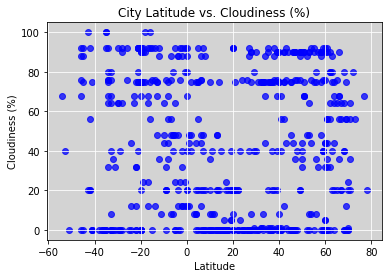

```python
import requests
import json
from pprint import pprint
from config import api_key
import random
from citipy import citipy
import pandas as pd
import numpy as np
import matplotlib.pyplot as plt

```


```python
df = pd.DataFrame()
lat = []
lng = []
for x in range(0,1700): #get 700 random numbers
    lat.append(random.randint(-90,90)) #random number from range -90 to 90
    lng.append(random.randint(-180,180)) #random number from range -180 to 180
df["Lat"] = lat
df["Lng"] = lng
df["City Name"] = ''
df["Country"] = ''
df.head()
df.count()
   
```


    Lat          1700
    Lng          1700
    City Name    1700
    Country      1700
    dtype: int64


```python
for index,row in df.iterrows():
    city = citipy.nearest_city(row["Lat"],row["Lng"])
    if " " in city.city_name:
        city.city_name = city.city_name.replace(" ", "%20") 
    df.set_value(index,"City Name",city.city_name)
    df.set_value(index,"Country",city.country_code)
    df["Temp"]=''
df = df.drop_duplicates(["City Name","Country"])#drop the duplicate values
df["Humidity"]=''
df["Cloudiness"]=''
df["Wind Speed"]=''
df.head()
df.count()
```


    Lat           666
    Lng           666
    City Name     666
    Country       666
    Temp          666
    Humidity      666
    Cloudiness    666
    Wind Speed    666
    dtype: int64


```python
cities = df["City Name"].tolist()
settings = {"units":"imperial","appid":api_key}
responses=[]
query = ["main.temp"]
urls = []

for index,row in df.iterrows():
    url = f"http://api.openweathermap.org/data/2.5/weather?units=Imperial&APPID={api_key}&q={row['City Name']},{row['Country']}"
    print(url)
    responses = requests.get(url).json()

    try:
        df.set_value(index,"Lat",responses["coord"]["lat"])
        df.set_value(index,"Lng",responses["coord"]["lon"])
        df.set_value(index,"Temp",responses["main"]["temp"])
        df.set_value(index,"Humidity",responses["main"]["humidity"])
        df.set_value(index,"Cloudiness",responses["clouds"]["all"])
        df.set_value(index,"Wind Speed",responses["wind"]["speed"])
        df.set_value(index, "City Name",responses["name"])
    except KeyError:
        df.set_value(index,"Temp",np.nan)


df.head()

        

    
  
```

    http://api.openweathermap.org/data/2.5/weather?units=Imperial&APPID=5addd7633b888ba2559a6ca22e961000&q=toora-khem,ru
    http://api.openweathermap.org/data/2.5/weather?units=Imperial&APPID=5addd7633b888ba2559a6ca22e961000&q=bluff,nz
    http://api.openweathermap.org/data/2.5/weather?units=Imperial&APPID=5addd7633b888ba2559a6ca22e961000&q=vorchdorf,at
    http://api.openweathermap.org/data/2.5/weather?units=Imperial&APPID=5addd7633b888ba2559a6ca22e961000&q=gold%20coast,au
    http://api.openweathermap.org/data/2.5/weather?units=Imperial&APPID=5addd7633b888ba2559a6ca22e961000&q=ushuaia,ar
    http://api.openweathermap.org/data/2.5/weather?units=Imperial&APPID=5addd7633b888ba2559a6ca22e961000&q=port%20elizabeth,za
    http://api.openweathermap.org/data/2.5/weather?units=Imperial&APPID=5addd7633b888ba2559a6ca22e961000&q=fort%20saint%20john,ca
    http://api.openweathermap.org/data/2.5/weather?units=Imperial&APPID=5addd7633b888ba2559a6ca22e961000&q=manokwari,id
    http://api.openweathermap.org/data/2.5/weather?units=Imperial&APPID=5addd7633b888ba2559a6ca22e961000&q=yar-sale,ru
    http://api.openweathermap.org/data/2.5/weather?units=Imperial&APPID=5addd7633b888ba2559a6ca22e961000&q=kapaa,us
    http://api.openweathermap.org/data/2.5/weather?units=Imperial&APPID=5addd7633b888ba2559a6ca22e961000&q=gibara,cu
    http://api.openweathermap.org/data/2.5/weather?units=Imperial&APPID=5addd7633b888ba2559a6ca22e961000&q=albany,au
    http://api.openweathermap.org/data/2.5/weather?units=Imperial&APPID=5addd7633b888ba2559a6ca22e961000&q=artyk,ru
    http://api.openweathermap.org/data/2.5/weather?units=Imperial&APPID=5addd7633b888ba2559a6ca22e961000&q=kavieng,pg
    http://api.openweathermap.org/data/2.5/weather?units=Imperial&APPID=5addd7633b888ba2559a6ca22e961000&q=ejea%20de%20los%20caballeros,es
    http://api.openweathermap.org/data/2.5/weather?units=Imperial&APPID=5addd7633b888ba2559a6ca22e961000&q=punta%20arenas,cl
    http://api.openweathermap.org/data/2.5/weather?units=Imperial&APPID=5addd7633b888ba2559a6ca22e961000&q=busselton,au
    http://api.openweathermap.org/data/2.5/weather?units=Imperial&APPID=5addd7633b888ba2559a6ca22e961000&q=rikitea,pf
    http://api.openweathermap.org/data/2.5/weather?units=Imperial&APPID=5addd7633b888ba2559a6ca22e961000&q=cortez,us
    http://api.openweathermap.org/data/2.5/weather?units=Imperial&APPID=5addd7633b888ba2559a6ca22e961000&q=lagoa,pt
    http://api.openweathermap.org/data/2.5/weather?units=Imperial&APPID=5addd7633b888ba2559a6ca22e961000&q=belaya%20gora,ru
    http://api.openweathermap.org/data/2.5/weather?units=Imperial&APPID=5addd7633b888ba2559a6ca22e961000&q=libenge,cd
    http://api.openweathermap.org/data/2.5/weather?units=Imperial&APPID=5addd7633b888ba2559a6ca22e961000&q=tsihombe,mg
    http://api.openweathermap.org/data/2.5/weather?units=Imperial&APPID=5addd7633b888ba2559a6ca22e961000&q=hibbing,us
    http://api.openweathermap.org/data/2.5/weather?units=Imperial&APPID=5addd7633b888ba2559a6ca22e961000&q=meylan,fr
    http://api.openweathermap.org/data/2.5/weather?units=Imperial&APPID=5addd7633b888ba2559a6ca22e961000&q=maniitsoq,gl
    http://api.openweathermap.org/data/2.5/weather?units=Imperial&APPID=5addd7633b888ba2559a6ca22e961000&q=oum%20hadjer,td
    http://api.openweathermap.org/data/2.5/weather?units=Imperial&APPID=5addd7633b888ba2559a6ca22e961000&q=san%20quintin,mx
    http://api.openweathermap.org/data/2.5/weather?units=Imperial&APPID=5addd7633b888ba2559a6ca22e961000&q=cape%20town,za
    http://api.openweathermap.org/data/2.5/weather?units=Imperial&APPID=5addd7633b888ba2559a6ca22e961000&q=imbituba,br
    http://api.openweathermap.org/data/2.5/weather?units=Imperial&APPID=5addd7633b888ba2559a6ca22e961000&q=parfino,ru
    http://api.openweathermap.org/data/2.5/weather?units=Imperial&APPID=5addd7633b888ba2559a6ca22e961000&q=camacha,pt
    http://api.openweathermap.org/data/2.5/weather?units=Imperial&APPID=5addd7633b888ba2559a6ca22e961000&q=mantua,cu
    http://api.openweathermap.org/data/2.5/weather?units=Imperial&APPID=5addd7633b888ba2559a6ca22e961000&q=kampot,kh
    http://api.openweathermap.org/data/2.5/weather?units=Imperial&APPID=5addd7633b888ba2559a6ca22e961000&q=hobart,au
    http://api.openweathermap.org/data/2.5/weather?units=Imperial&APPID=5addd7633b888ba2559a6ca22e961000&q=mataura,pf
    http://api.openweathermap.org/data/2.5/weather?units=Imperial&APPID=5addd7633b888ba2559a6ca22e961000&q=warren,us
    http://api.openweathermap.org/data/2.5/weather?units=Imperial&APPID=5addd7633b888ba2559a6ca22e961000&q=amderma,ru
    http://api.openweathermap.org/data/2.5/weather?units=Imperial&APPID=5addd7633b888ba2559a6ca22e961000&q=provideniya,ru
    http://api.openweathermap.org/data/2.5/weather?units=Imperial&APPID=5addd7633b888ba2559a6ca22e961000&q=puerto%20ayora,ec
    http://api.openweathermap.org/data/2.5/weather?units=Imperial&APPID=5addd7633b888ba2559a6ca22e961000&q=avarua,ck
    http://api.openweathermap.org/data/2.5/weather?units=Imperial&APPID=5addd7633b888ba2559a6ca22e961000&q=port%20alfred,za
    http://api.openweathermap.org/data/2.5/weather?units=Imperial&APPID=5addd7633b888ba2559a6ca22e961000&q=burnie,au
    http://api.openweathermap.org/data/2.5/weather?units=Imperial&APPID=5addd7633b888ba2559a6ca22e961000&q=khani,ru
    http://api.openweathermap.org/data/2.5/weather?units=Imperial&APPID=5addd7633b888ba2559a6ca22e961000&q=aykhal,ru
    http://api.openweathermap.org/data/2.5/weather?units=Imperial&APPID=5addd7633b888ba2559a6ca22e961000&q=yellowknife,ca
    http://api.openweathermap.org/data/2.5/weather?units=Imperial&APPID=5addd7633b888ba2559a6ca22e961000&q=fortuna,us
    http://api.openweathermap.org/data/2.5/weather?units=Imperial&APPID=5addd7633b888ba2559a6ca22e961000&q=sonoita,mx
    http://api.openweathermap.org/data/2.5/weather?units=Imperial&APPID=5addd7633b888ba2559a6ca22e961000&q=isangel,vu
    http://api.openweathermap.org/data/2.5/weather?units=Imperial&APPID=5addd7633b888ba2559a6ca22e961000&q=thompson,ca
    http://api.openweathermap.org/data/2.5/weather?units=Imperial&APPID=5addd7633b888ba2559a6ca22e961000&q=los%20llanos%20de%20aridane,es
    http://api.openweathermap.org/data/2.5/weather?units=Imperial&APPID=5addd7633b888ba2559a6ca22e961000&q=padre%20bernardo,br
    http://api.openweathermap.org/data/2.5/weather?units=Imperial&APPID=5addd7633b888ba2559a6ca22e961000&q=aklavik,ca
    http://api.openweathermap.org/data/2.5/weather?units=Imperial&APPID=5addd7633b888ba2559a6ca22e961000&q=iqaluit,ca
    http://api.openweathermap.org/data/2.5/weather?units=Imperial&APPID=5addd7633b888ba2559a6ca22e961000&q=hermanus,za
    http://api.openweathermap.org/data/2.5/weather?units=Imperial&APPID=5addd7633b888ba2559a6ca22e961000&q=saint-philippe,re
    http://api.openweathermap.org/data/2.5/weather?units=Imperial&APPID=5addd7633b888ba2559a6ca22e961000&q=natal,br
    http://api.openweathermap.org/data/2.5/weather?units=Imperial&APPID=5addd7633b888ba2559a6ca22e961000&q=airai,pw
    http://api.openweathermap.org/data/2.5/weather?units=Imperial&APPID=5addd7633b888ba2559a6ca22e961000&q=faanui,pf
    http://api.openweathermap.org/data/2.5/weather?units=Imperial&APPID=5addd7633b888ba2559a6ca22e961000&q=hokitika,nz
    http://api.openweathermap.org/data/2.5/weather?units=Imperial&APPID=5addd7633b888ba2559a6ca22e961000&q=torbay,ca
    http://api.openweathermap.org/data/2.5/weather?units=Imperial&APPID=5addd7633b888ba2559a6ca22e961000&q=butaritari,ki
    http://api.openweathermap.org/data/2.5/weather?units=Imperial&APPID=5addd7633b888ba2559a6ca22e961000&q=eureka,us
    http://api.openweathermap.org/data/2.5/weather?units=Imperial&APPID=5addd7633b888ba2559a6ca22e961000&q=cap%20malheureux,mu
    http://api.openweathermap.org/data/2.5/weather?units=Imperial&APPID=5addd7633b888ba2559a6ca22e961000&q=umzimvubu,za
    http://api.openweathermap.org/data/2.5/weather?units=Imperial&APPID=5addd7633b888ba2559a6ca22e961000&q=hithadhoo,mv
    http://api.openweathermap.org/data/2.5/weather?units=Imperial&APPID=5addd7633b888ba2559a6ca22e961000&q=neustadt,de
    http://api.openweathermap.org/data/2.5/weather?units=Imperial&APPID=5addd7633b888ba2559a6ca22e961000&q=norman%20wells,ca
    http://api.openweathermap.org/data/2.5/weather?units=Imperial&APPID=5addd7633b888ba2559a6ca22e961000&q=hasaki,jp
    http://api.openweathermap.org/data/2.5/weather?units=Imperial&APPID=5addd7633b888ba2559a6ca22e961000&q=big%20rapids,us
    http://api.openweathermap.org/data/2.5/weather?units=Imperial&APPID=5addd7633b888ba2559a6ca22e961000&q=grand%20gaube,mu
    http://api.openweathermap.org/data/2.5/weather?units=Imperial&APPID=5addd7633b888ba2559a6ca22e961000&q=tawzar,tn
    http://api.openweathermap.org/data/2.5/weather?units=Imperial&APPID=5addd7633b888ba2559a6ca22e961000&q=saravan,la
    http://api.openweathermap.org/data/2.5/weather?units=Imperial&APPID=5addd7633b888ba2559a6ca22e961000&q=kodiak,us
    http://api.openweathermap.org/data/2.5/weather?units=Imperial&APPID=5addd7633b888ba2559a6ca22e961000&q=hilo,us
    http://api.openweathermap.org/data/2.5/weather?units=Imperial&APPID=5addd7633b888ba2559a6ca22e961000&q=khatanga,ru
    http://api.openweathermap.org/data/2.5/weather?units=Imperial&APPID=5addd7633b888ba2559a6ca22e961000&q=neuquen,ar
    http://api.openweathermap.org/data/2.5/weather?units=Imperial&APPID=5addd7633b888ba2559a6ca22e961000&q=cherskiy,ru
    http://api.openweathermap.org/data/2.5/weather?units=Imperial&APPID=5addd7633b888ba2559a6ca22e961000&q=san%20cristobal,ec
    http://api.openweathermap.org/data/2.5/weather?units=Imperial&APPID=5addd7633b888ba2559a6ca22e961000&q=todos%20santos,mx
    http://api.openweathermap.org/data/2.5/weather?units=Imperial&APPID=5addd7633b888ba2559a6ca22e961000&q=bjelovar,hr
    http://api.openweathermap.org/data/2.5/weather?units=Imperial&APPID=5addd7633b888ba2559a6ca22e961000&q=ribeira%20grande,pt
    http://api.openweathermap.org/data/2.5/weather?units=Imperial&APPID=5addd7633b888ba2559a6ca22e961000&q=lima,pe
    http://api.openweathermap.org/data/2.5/weather?units=Imperial&APPID=5addd7633b888ba2559a6ca22e961000&q=ask,no
    http://api.openweathermap.org/data/2.5/weather?units=Imperial&APPID=5addd7633b888ba2559a6ca22e961000&q=mecca,sa
    http://api.openweathermap.org/data/2.5/weather?units=Imperial&APPID=5addd7633b888ba2559a6ca22e961000&q=vila%20velha,br
    http://api.openweathermap.org/data/2.5/weather?units=Imperial&APPID=5addd7633b888ba2559a6ca22e961000&q=ixtapa,mx
    http://api.openweathermap.org/data/2.5/weather?units=Imperial&APPID=5addd7633b888ba2559a6ca22e961000&q=port%20lincoln,au
    http://api.openweathermap.org/data/2.5/weather?units=Imperial&APPID=5addd7633b888ba2559a6ca22e961000&q=kavaratti,in
    http://api.openweathermap.org/data/2.5/weather?units=Imperial&APPID=5addd7633b888ba2559a6ca22e961000&q=rzhaksa,ru
    http://api.openweathermap.org/data/2.5/weather?units=Imperial&APPID=5addd7633b888ba2559a6ca22e961000&q=eyl,so
    http://api.openweathermap.org/data/2.5/weather?units=Imperial&APPID=5addd7633b888ba2559a6ca22e961000&q=quelimane,mz
    http://api.openweathermap.org/data/2.5/weather?units=Imperial&APPID=5addd7633b888ba2559a6ca22e961000&q=mae%20sai,th
    http://api.openweathermap.org/data/2.5/weather?units=Imperial&APPID=5addd7633b888ba2559a6ca22e961000&q=arauca,co
    http://api.openweathermap.org/data/2.5/weather?units=Imperial&APPID=5addd7633b888ba2559a6ca22e961000&q=tasiilaq,gl
    http://api.openweathermap.org/data/2.5/weather?units=Imperial&APPID=5addd7633b888ba2559a6ca22e961000&q=coahuayana,mx
    http://api.openweathermap.org/data/2.5/weather?units=Imperial&APPID=5addd7633b888ba2559a6ca22e961000&q=lebu,cl
    http://api.openweathermap.org/data/2.5/weather?units=Imperial&APPID=5addd7633b888ba2559a6ca22e961000&q=new%20norfolk,au
    http://api.openweathermap.org/data/2.5/weather?units=Imperial&APPID=5addd7633b888ba2559a6ca22e961000&q=munster,de
    http://api.openweathermap.org/data/2.5/weather?units=Imperial&APPID=5addd7633b888ba2559a6ca22e961000&q=shelburne,ca
    http://api.openweathermap.org/data/2.5/weather?units=Imperial&APPID=5addd7633b888ba2559a6ca22e961000&q=victoria,sc
    http://api.openweathermap.org/data/2.5/weather?units=Imperial&APPID=5addd7633b888ba2559a6ca22e961000&q=barentsburg,sj
    http://api.openweathermap.org/data/2.5/weather?units=Imperial&APPID=5addd7633b888ba2559a6ca22e961000&q=arraial%20do%20cabo,br
    http://api.openweathermap.org/data/2.5/weather?units=Imperial&APPID=5addd7633b888ba2559a6ca22e961000&q=tazovskiy,ru
    http://api.openweathermap.org/data/2.5/weather?units=Imperial&APPID=5addd7633b888ba2559a6ca22e961000&q=pangnirtung,ca
    http://api.openweathermap.org/data/2.5/weather?units=Imperial&APPID=5addd7633b888ba2559a6ca22e961000&q=castro,cl
    http://api.openweathermap.org/data/2.5/weather?units=Imperial&APPID=5addd7633b888ba2559a6ca22e961000&q=orgun,af
    http://api.openweathermap.org/data/2.5/weather?units=Imperial&APPID=5addd7633b888ba2559a6ca22e961000&q=asau,tv
    http://api.openweathermap.org/data/2.5/weather?units=Imperial&APPID=5addd7633b888ba2559a6ca22e961000&q=narsaq,gl
    http://api.openweathermap.org/data/2.5/weather?units=Imperial&APPID=5addd7633b888ba2559a6ca22e961000&q=east%20london,za
    http://api.openweathermap.org/data/2.5/weather?units=Imperial&APPID=5addd7633b888ba2559a6ca22e961000&q=ranong,th
    http://api.openweathermap.org/data/2.5/weather?units=Imperial&APPID=5addd7633b888ba2559a6ca22e961000&q=palmer,us
    http://api.openweathermap.org/data/2.5/weather?units=Imperial&APPID=5addd7633b888ba2559a6ca22e961000&q=tumannyy,ru
    http://api.openweathermap.org/data/2.5/weather?units=Imperial&APPID=5addd7633b888ba2559a6ca22e961000&q=omsukchan,ru
    http://api.openweathermap.org/data/2.5/weather?units=Imperial&APPID=5addd7633b888ba2559a6ca22e961000&q=taolanaro,mg
    http://api.openweathermap.org/data/2.5/weather?units=Imperial&APPID=5addd7633b888ba2559a6ca22e961000&q=diffa,ne
    http://api.openweathermap.org/data/2.5/weather?units=Imperial&APPID=5addd7633b888ba2559a6ca22e961000&q=ponta%20do%20sol,cv
    http://api.openweathermap.org/data/2.5/weather?units=Imperial&APPID=5addd7633b888ba2559a6ca22e961000&q=ambilobe,mg
    http://api.openweathermap.org/data/2.5/weather?units=Imperial&APPID=5addd7633b888ba2559a6ca22e961000&q=mar%20del%20plata,ar
    http://api.openweathermap.org/data/2.5/weather?units=Imperial&APPID=5addd7633b888ba2559a6ca22e961000&q=davila,ph
    http://api.openweathermap.org/data/2.5/weather?units=Imperial&APPID=5addd7633b888ba2559a6ca22e961000&q=lebedinyy,ru
    http://api.openweathermap.org/data/2.5/weather?units=Imperial&APPID=5addd7633b888ba2559a6ca22e961000&q=chokurdakh,ru
    http://api.openweathermap.org/data/2.5/weather?units=Imperial&APPID=5addd7633b888ba2559a6ca22e961000&q=dingle,ie
    http://api.openweathermap.org/data/2.5/weather?units=Imperial&APPID=5addd7633b888ba2559a6ca22e961000&q=macroom,ie
    http://api.openweathermap.org/data/2.5/weather?units=Imperial&APPID=5addd7633b888ba2559a6ca22e961000&q=salinas,ec
    http://api.openweathermap.org/data/2.5/weather?units=Imperial&APPID=5addd7633b888ba2559a6ca22e961000&q=pemangkat,id
    http://api.openweathermap.org/data/2.5/weather?units=Imperial&APPID=5addd7633b888ba2559a6ca22e961000&q=vaini,to
    http://api.openweathermap.org/data/2.5/weather?units=Imperial&APPID=5addd7633b888ba2559a6ca22e961000&q=miranorte,br
    http://api.openweathermap.org/data/2.5/weather?units=Imperial&APPID=5addd7633b888ba2559a6ca22e961000&q=tingi,tz
    http://api.openweathermap.org/data/2.5/weather?units=Imperial&APPID=5addd7633b888ba2559a6ca22e961000&q=jamestown,sh
    http://api.openweathermap.org/data/2.5/weather?units=Imperial&APPID=5addd7633b888ba2559a6ca22e961000&q=haines%20junction,ca
    http://api.openweathermap.org/data/2.5/weather?units=Imperial&APPID=5addd7633b888ba2559a6ca22e961000&q=ancud,cl
    http://api.openweathermap.org/data/2.5/weather?units=Imperial&APPID=5addd7633b888ba2559a6ca22e961000&q=toftir,fo
    http://api.openweathermap.org/data/2.5/weather?units=Imperial&APPID=5addd7633b888ba2559a6ca22e961000&q=gopalpur,in
    http://api.openweathermap.org/data/2.5/weather?units=Imperial&APPID=5addd7633b888ba2559a6ca22e961000&q=cidreira,br
    http://api.openweathermap.org/data/2.5/weather?units=Imperial&APPID=5addd7633b888ba2559a6ca22e961000&q=almansa,es
    http://api.openweathermap.org/data/2.5/weather?units=Imperial&APPID=5addd7633b888ba2559a6ca22e961000&q=placido%20de%20castro,br
    http://api.openweathermap.org/data/2.5/weather?units=Imperial&APPID=5addd7633b888ba2559a6ca22e961000&q=takoradi,gh
    http://api.openweathermap.org/data/2.5/weather?units=Imperial&APPID=5addd7633b888ba2559a6ca22e961000&q=georgetown,sh
    http://api.openweathermap.org/data/2.5/weather?units=Imperial&APPID=5addd7633b888ba2559a6ca22e961000&q=kumluca,tr
    http://api.openweathermap.org/data/2.5/weather?units=Imperial&APPID=5addd7633b888ba2559a6ca22e961000&q=batagay,ru
    http://api.openweathermap.org/data/2.5/weather?units=Imperial&APPID=5addd7633b888ba2559a6ca22e961000&q=jiddah,sa
    http://api.openweathermap.org/data/2.5/weather?units=Imperial&APPID=5addd7633b888ba2559a6ca22e961000&q=kousseri,cm
    http://api.openweathermap.org/data/2.5/weather?units=Imperial&APPID=5addd7633b888ba2559a6ca22e961000&q=kedougou,sn
    http://api.openweathermap.org/data/2.5/weather?units=Imperial&APPID=5addd7633b888ba2559a6ca22e961000&q=saleaula,ws
    http://api.openweathermap.org/data/2.5/weather?units=Imperial&APPID=5addd7633b888ba2559a6ca22e961000&q=cooma,au
    http://api.openweathermap.org/data/2.5/weather?units=Imperial&APPID=5addd7633b888ba2559a6ca22e961000&q=chuy,uy
    http://api.openweathermap.org/data/2.5/weather?units=Imperial&APPID=5addd7633b888ba2559a6ca22e961000&q=geraldton,au
    http://api.openweathermap.org/data/2.5/weather?units=Imperial&APPID=5addd7633b888ba2559a6ca22e961000&q=shitanjing,cn
    http://api.openweathermap.org/data/2.5/weather?units=Imperial&APPID=5addd7633b888ba2559a6ca22e961000&q=husavik,is
    http://api.openweathermap.org/data/2.5/weather?units=Imperial&APPID=5addd7633b888ba2559a6ca22e961000&q=dikson,ru
    http://api.openweathermap.org/data/2.5/weather?units=Imperial&APPID=5addd7633b888ba2559a6ca22e961000&q=lodja,cd
    http://api.openweathermap.org/data/2.5/weather?units=Imperial&APPID=5addd7633b888ba2559a6ca22e961000&q=upernavik,gl
    http://api.openweathermap.org/data/2.5/weather?units=Imperial&APPID=5addd7633b888ba2559a6ca22e961000&q=gairo,tz
    http://api.openweathermap.org/data/2.5/weather?units=Imperial&APPID=5addd7633b888ba2559a6ca22e961000&q=tuktoyaktuk,ca
    http://api.openweathermap.org/data/2.5/weather?units=Imperial&APPID=5addd7633b888ba2559a6ca22e961000&q=hervey%20bay,au
    http://api.openweathermap.org/data/2.5/weather?units=Imperial&APPID=5addd7633b888ba2559a6ca22e961000&q=itupiranga,br
    http://api.openweathermap.org/data/2.5/weather?units=Imperial&APPID=5addd7633b888ba2559a6ca22e961000&q=oranjemund,na
    http://api.openweathermap.org/data/2.5/weather?units=Imperial&APPID=5addd7633b888ba2559a6ca22e961000&q=nalut,ly
    http://api.openweathermap.org/data/2.5/weather?units=Imperial&APPID=5addd7633b888ba2559a6ca22e961000&q=saskylakh,ru
    http://api.openweathermap.org/data/2.5/weather?units=Imperial&APPID=5addd7633b888ba2559a6ca22e961000&q=jalu,ly
    http://api.openweathermap.org/data/2.5/weather?units=Imperial&APPID=5addd7633b888ba2559a6ca22e961000&q=colares,pt
    http://api.openweathermap.org/data/2.5/weather?units=Imperial&APPID=5addd7633b888ba2559a6ca22e961000&q=warqla,dz
    http://api.openweathermap.org/data/2.5/weather?units=Imperial&APPID=5addd7633b888ba2559a6ca22e961000&q=wabana,ca
    http://api.openweathermap.org/data/2.5/weather?units=Imperial&APPID=5addd7633b888ba2559a6ca22e961000&q=las%20choapas,mx
    http://api.openweathermap.org/data/2.5/weather?units=Imperial&APPID=5addd7633b888ba2559a6ca22e961000&q=dunedin,nz
    http://api.openweathermap.org/data/2.5/weather?units=Imperial&APPID=5addd7633b888ba2559a6ca22e961000&q=nara,ml
    http://api.openweathermap.org/data/2.5/weather?units=Imperial&APPID=5addd7633b888ba2559a6ca22e961000&q=fayaoue,nc
    http://api.openweathermap.org/data/2.5/weather?units=Imperial&APPID=5addd7633b888ba2559a6ca22e961000&q=grand%20river%20south%20east,mu
    http://api.openweathermap.org/data/2.5/weather?units=Imperial&APPID=5addd7633b888ba2559a6ca22e961000&q=cayenne,gf
    http://api.openweathermap.org/data/2.5/weather?units=Imperial&APPID=5addd7633b888ba2559a6ca22e961000&q=muravlenko,ru
    http://api.openweathermap.org/data/2.5/weather?units=Imperial&APPID=5addd7633b888ba2559a6ca22e961000&q=belushya%20guba,ru
    http://api.openweathermap.org/data/2.5/weather?units=Imperial&APPID=5addd7633b888ba2559a6ca22e961000&q=klaksvik,fo
    http://api.openweathermap.org/data/2.5/weather?units=Imperial&APPID=5addd7633b888ba2559a6ca22e961000&q=nehalim,il
    http://api.openweathermap.org/data/2.5/weather?units=Imperial&APPID=5addd7633b888ba2559a6ca22e961000&q=zhigansk,ru
    http://api.openweathermap.org/data/2.5/weather?units=Imperial&APPID=5addd7633b888ba2559a6ca22e961000&q=thinadhoo,mv
    http://api.openweathermap.org/data/2.5/weather?units=Imperial&APPID=5addd7633b888ba2559a6ca22e961000&q=sentyabrskiy,ru
    http://api.openweathermap.org/data/2.5/weather?units=Imperial&APPID=5addd7633b888ba2559a6ca22e961000&q=coquimbo,cl
    http://api.openweathermap.org/data/2.5/weather?units=Imperial&APPID=5addd7633b888ba2559a6ca22e961000&q=bengkulu,id
    http://api.openweathermap.org/data/2.5/weather?units=Imperial&APPID=5addd7633b888ba2559a6ca22e961000&q=balkanabat,tm
    http://api.openweathermap.org/data/2.5/weather?units=Imperial&APPID=5addd7633b888ba2559a6ca22e961000&q=floro,no
    http://api.openweathermap.org/data/2.5/weather?units=Imperial&APPID=5addd7633b888ba2559a6ca22e961000&q=roros,no
    http://api.openweathermap.org/data/2.5/weather?units=Imperial&APPID=5addd7633b888ba2559a6ca22e961000&q=san%20ramon,bo
    http://api.openweathermap.org/data/2.5/weather?units=Imperial&APPID=5addd7633b888ba2559a6ca22e961000&q=alghero,it
    http://api.openweathermap.org/data/2.5/weather?units=Imperial&APPID=5addd7633b888ba2559a6ca22e961000&q=dirba,in
    http://api.openweathermap.org/data/2.5/weather?units=Imperial&APPID=5addd7633b888ba2559a6ca22e961000&q=nanortalik,gl
    http://api.openweathermap.org/data/2.5/weather?units=Imperial&APPID=5addd7633b888ba2559a6ca22e961000&q=abnub,eg
    http://api.openweathermap.org/data/2.5/weather?units=Imperial&APPID=5addd7633b888ba2559a6ca22e961000&q=arman,ru
    http://api.openweathermap.org/data/2.5/weather?units=Imperial&APPID=5addd7633b888ba2559a6ca22e961000&q=tarudant,ma
    http://api.openweathermap.org/data/2.5/weather?units=Imperial&APPID=5addd7633b888ba2559a6ca22e961000&q=tabiauea,ki
    http://api.openweathermap.org/data/2.5/weather?units=Imperial&APPID=5addd7633b888ba2559a6ca22e961000&q=carnarvon,au
    http://api.openweathermap.org/data/2.5/weather?units=Imperial&APPID=5addd7633b888ba2559a6ca22e961000&q=abdanan,ir
    http://api.openweathermap.org/data/2.5/weather?units=Imperial&APPID=5addd7633b888ba2559a6ca22e961000&q=sorland,no
    http://api.openweathermap.org/data/2.5/weather?units=Imperial&APPID=5addd7633b888ba2559a6ca22e961000&q=padang,id
    http://api.openweathermap.org/data/2.5/weather?units=Imperial&APPID=5addd7633b888ba2559a6ca22e961000&q=nam%20tha,la
    http://api.openweathermap.org/data/2.5/weather?units=Imperial&APPID=5addd7633b888ba2559a6ca22e961000&q=caramay,ph
    http://api.openweathermap.org/data/2.5/weather?units=Imperial&APPID=5addd7633b888ba2559a6ca22e961000&q=aginskoye,ru
    http://api.openweathermap.org/data/2.5/weather?units=Imperial&APPID=5addd7633b888ba2559a6ca22e961000&q=prince%20rupert,ca
    http://api.openweathermap.org/data/2.5/weather?units=Imperial&APPID=5addd7633b888ba2559a6ca22e961000&q=gangotri,in
    http://api.openweathermap.org/data/2.5/weather?units=Imperial&APPID=5addd7633b888ba2559a6ca22e961000&q=cockburn%20town,bs
    http://api.openweathermap.org/data/2.5/weather?units=Imperial&APPID=5addd7633b888ba2559a6ca22e961000&q=anaconda,us
    http://api.openweathermap.org/data/2.5/weather?units=Imperial&APPID=5addd7633b888ba2559a6ca22e961000&q=gwadar,pk
    http://api.openweathermap.org/data/2.5/weather?units=Imperial&APPID=5addd7633b888ba2559a6ca22e961000&q=tual,id
    http://api.openweathermap.org/data/2.5/weather?units=Imperial&APPID=5addd7633b888ba2559a6ca22e961000&q=vardo,no
    http://api.openweathermap.org/data/2.5/weather?units=Imperial&APPID=5addd7633b888ba2559a6ca22e961000&q=escanaba,us
    http://api.openweathermap.org/data/2.5/weather?units=Imperial&APPID=5addd7633b888ba2559a6ca22e961000&q=surat,in
    http://api.openweathermap.org/data/2.5/weather?units=Imperial&APPID=5addd7633b888ba2559a6ca22e961000&q=brigantine,us
    http://api.openweathermap.org/data/2.5/weather?units=Imperial&APPID=5addd7633b888ba2559a6ca22e961000&q=rosetta,eg
    http://api.openweathermap.org/data/2.5/weather?units=Imperial&APPID=5addd7633b888ba2559a6ca22e961000&q=san%20jose%20de%20buan,ph
    http://api.openweathermap.org/data/2.5/weather?units=Imperial&APPID=5addd7633b888ba2559a6ca22e961000&q=vaitupu,wf
    http://api.openweathermap.org/data/2.5/weather?units=Imperial&APPID=5addd7633b888ba2559a6ca22e961000&q=vega%20de%20alatorre,mx
    http://api.openweathermap.org/data/2.5/weather?units=Imperial&APPID=5addd7633b888ba2559a6ca22e961000&q=dogondoutchi,ne
    http://api.openweathermap.org/data/2.5/weather?units=Imperial&APPID=5addd7633b888ba2559a6ca22e961000&q=talnakh,ru
    http://api.openweathermap.org/data/2.5/weather?units=Imperial&APPID=5addd7633b888ba2559a6ca22e961000&q=mrirt,ma
    http://api.openweathermap.org/data/2.5/weather?units=Imperial&APPID=5addd7633b888ba2559a6ca22e961000&q=malwan,in
    http://api.openweathermap.org/data/2.5/weather?units=Imperial&APPID=5addd7633b888ba2559a6ca22e961000&q=kruisfontein,za
    http://api.openweathermap.org/data/2.5/weather?units=Imperial&APPID=5addd7633b888ba2559a6ca22e961000&q=souillac,mu
    http://api.openweathermap.org/data/2.5/weather?units=Imperial&APPID=5addd7633b888ba2559a6ca22e961000&q=ankara,tr
    http://api.openweathermap.org/data/2.5/weather?units=Imperial&APPID=5addd7633b888ba2559a6ca22e961000&q=deputatskiy,ru
    http://api.openweathermap.org/data/2.5/weather?units=Imperial&APPID=5addd7633b888ba2559a6ca22e961000&q=sitka,us
    http://api.openweathermap.org/data/2.5/weather?units=Imperial&APPID=5addd7633b888ba2559a6ca22e961000&q=morehead,pg
    http://api.openweathermap.org/data/2.5/weather?units=Imperial&APPID=5addd7633b888ba2559a6ca22e961000&q=irece,br
    http://api.openweathermap.org/data/2.5/weather?units=Imperial&APPID=5addd7633b888ba2559a6ca22e961000&q=korla,cn
    http://api.openweathermap.org/data/2.5/weather?units=Imperial&APPID=5addd7633b888ba2559a6ca22e961000&q=gimli,ca
    http://api.openweathermap.org/data/2.5/weather?units=Imperial&APPID=5addd7633b888ba2559a6ca22e961000&q=emerald,au
    http://api.openweathermap.org/data/2.5/weather?units=Imperial&APPID=5addd7633b888ba2559a6ca22e961000&q=portland,au
    http://api.openweathermap.org/data/2.5/weather?units=Imperial&APPID=5addd7633b888ba2559a6ca22e961000&q=flin%20flon,ca
    http://api.openweathermap.org/data/2.5/weather?units=Imperial&APPID=5addd7633b888ba2559a6ca22e961000&q=mys%20shmidta,ru
    http://api.openweathermap.org/data/2.5/weather?units=Imperial&APPID=5addd7633b888ba2559a6ca22e961000&q=constitucion,mx
    http://api.openweathermap.org/data/2.5/weather?units=Imperial&APPID=5addd7633b888ba2559a6ca22e961000&q=baixa%20grande,br
    http://api.openweathermap.org/data/2.5/weather?units=Imperial&APPID=5addd7633b888ba2559a6ca22e961000&q=mattru,sl
    http://api.openweathermap.org/data/2.5/weather?units=Imperial&APPID=5addd7633b888ba2559a6ca22e961000&q=mahebourg,mu
    http://api.openweathermap.org/data/2.5/weather?units=Imperial&APPID=5addd7633b888ba2559a6ca22e961000&q=coihaique,cl
    http://api.openweathermap.org/data/2.5/weather?units=Imperial&APPID=5addd7633b888ba2559a6ca22e961000&q=labuhan,id
    http://api.openweathermap.org/data/2.5/weather?units=Imperial&APPID=5addd7633b888ba2559a6ca22e961000&q=bolonchen,mx
    http://api.openweathermap.org/data/2.5/weather?units=Imperial&APPID=5addd7633b888ba2559a6ca22e961000&q=esso,ru
    http://api.openweathermap.org/data/2.5/weather?units=Imperial&APPID=5addd7633b888ba2559a6ca22e961000&q=aguimes,es
    http://api.openweathermap.org/data/2.5/weather?units=Imperial&APPID=5addd7633b888ba2559a6ca22e961000&q=palabuhanratu,id
    http://api.openweathermap.org/data/2.5/weather?units=Imperial&APPID=5addd7633b888ba2559a6ca22e961000&q=luderitz,na
    http://api.openweathermap.org/data/2.5/weather?units=Imperial&APPID=5addd7633b888ba2559a6ca22e961000&q=doha,qa
    http://api.openweathermap.org/data/2.5/weather?units=Imperial&APPID=5addd7633b888ba2559a6ca22e961000&q=severo-yeniseyskiy,ru
    http://api.openweathermap.org/data/2.5/weather?units=Imperial&APPID=5addd7633b888ba2559a6ca22e961000&q=barrow,us
    http://api.openweathermap.org/data/2.5/weather?units=Imperial&APPID=5addd7633b888ba2559a6ca22e961000&q=nha%20trang,vn
    http://api.openweathermap.org/data/2.5/weather?units=Imperial&APPID=5addd7633b888ba2559a6ca22e961000&q=hamilton,bm
    http://api.openweathermap.org/data/2.5/weather?units=Imperial&APPID=5addd7633b888ba2559a6ca22e961000&q=attawapiskat,ca
    http://api.openweathermap.org/data/2.5/weather?units=Imperial&APPID=5addd7633b888ba2559a6ca22e961000&q=turukhansk,ru
    http://api.openweathermap.org/data/2.5/weather?units=Imperial&APPID=5addd7633b888ba2559a6ca22e961000&q=mudgee,au
    http://api.openweathermap.org/data/2.5/weather?units=Imperial&APPID=5addd7633b888ba2559a6ca22e961000&q=carauari,br
    http://api.openweathermap.org/data/2.5/weather?units=Imperial&APPID=5addd7633b888ba2559a6ca22e961000&q=saint%20george,bm
    http://api.openweathermap.org/data/2.5/weather?units=Imperial&APPID=5addd7633b888ba2559a6ca22e961000&q=atuona,pf
    http://api.openweathermap.org/data/2.5/weather?units=Imperial&APPID=5addd7633b888ba2559a6ca22e961000&q=three%20hills,ca
    http://api.openweathermap.org/data/2.5/weather?units=Imperial&APPID=5addd7633b888ba2559a6ca22e961000&q=casino,au
    http://api.openweathermap.org/data/2.5/weather?units=Imperial&APPID=5addd7633b888ba2559a6ca22e961000&q=palana,ru
    http://api.openweathermap.org/data/2.5/weather?units=Imperial&APPID=5addd7633b888ba2559a6ca22e961000&q=bereda,so
    http://api.openweathermap.org/data/2.5/weather?units=Imperial&APPID=5addd7633b888ba2559a6ca22e961000&q=seoul,kr
    http://api.openweathermap.org/data/2.5/weather?units=Imperial&APPID=5addd7633b888ba2559a6ca22e961000&q=kargasok,ru
    http://api.openweathermap.org/data/2.5/weather?units=Imperial&APPID=5addd7633b888ba2559a6ca22e961000&q=north%20bend,us
    http://api.openweathermap.org/data/2.5/weather?units=Imperial&APPID=5addd7633b888ba2559a6ca22e961000&q=bredasdorp,za
    http://api.openweathermap.org/data/2.5/weather?units=Imperial&APPID=5addd7633b888ba2559a6ca22e961000&q=port%20hedland,au
    http://api.openweathermap.org/data/2.5/weather?units=Imperial&APPID=5addd7633b888ba2559a6ca22e961000&q=kahului,us
    http://api.openweathermap.org/data/2.5/weather?units=Imperial&APPID=5addd7633b888ba2559a6ca22e961000&q=kamenka,ru
    http://api.openweathermap.org/data/2.5/weather?units=Imperial&APPID=5addd7633b888ba2559a6ca22e961000&q=new%20richmond,ca
    http://api.openweathermap.org/data/2.5/weather?units=Imperial&APPID=5addd7633b888ba2559a6ca22e961000&q=abapo,bo
    http://api.openweathermap.org/data/2.5/weather?units=Imperial&APPID=5addd7633b888ba2559a6ca22e961000&q=pisco,pe
    http://api.openweathermap.org/data/2.5/weather?units=Imperial&APPID=5addd7633b888ba2559a6ca22e961000&q=qaanaaq,gl
    http://api.openweathermap.org/data/2.5/weather?units=Imperial&APPID=5addd7633b888ba2559a6ca22e961000&q=karratha,au
    http://api.openweathermap.org/data/2.5/weather?units=Imperial&APPID=5addd7633b888ba2559a6ca22e961000&q=general%20roca,ar
    http://api.openweathermap.org/data/2.5/weather?units=Imperial&APPID=5addd7633b888ba2559a6ca22e961000&q=sechura,pe
    http://api.openweathermap.org/data/2.5/weather?units=Imperial&APPID=5addd7633b888ba2559a6ca22e961000&q=bekasi,id
    http://api.openweathermap.org/data/2.5/weather?units=Imperial&APPID=5addd7633b888ba2559a6ca22e961000&q=bur%20gabo,so
    http://api.openweathermap.org/data/2.5/weather?units=Imperial&APPID=5addd7633b888ba2559a6ca22e961000&q=shimoda,jp
    http://api.openweathermap.org/data/2.5/weather?units=Imperial&APPID=5addd7633b888ba2559a6ca22e961000&q=san%20rafael,ar
    http://api.openweathermap.org/data/2.5/weather?units=Imperial&APPID=5addd7633b888ba2559a6ca22e961000&q=somerset,us
    http://api.openweathermap.org/data/2.5/weather?units=Imperial&APPID=5addd7633b888ba2559a6ca22e961000&q=illoqqortoormiut,gl
    http://api.openweathermap.org/data/2.5/weather?units=Imperial&APPID=5addd7633b888ba2559a6ca22e961000&q=abu%20kamal,sy
    http://api.openweathermap.org/data/2.5/weather?units=Imperial&APPID=5addd7633b888ba2559a6ca22e961000&q=amahai,id
    http://api.openweathermap.org/data/2.5/weather?units=Imperial&APPID=5addd7633b888ba2559a6ca22e961000&q=sao%20filipe,cv
    http://api.openweathermap.org/data/2.5/weather?units=Imperial&APPID=5addd7633b888ba2559a6ca22e961000&q=lebanon,us
    http://api.openweathermap.org/data/2.5/weather?units=Imperial&APPID=5addd7633b888ba2559a6ca22e961000&q=antalaha,mg
    http://api.openweathermap.org/data/2.5/weather?units=Imperial&APPID=5addd7633b888ba2559a6ca22e961000&q=grand-santi,gf
    http://api.openweathermap.org/data/2.5/weather?units=Imperial&APPID=5addd7633b888ba2559a6ca22e961000&q=ouadda,cf
    http://api.openweathermap.org/data/2.5/weather?units=Imperial&APPID=5addd7633b888ba2559a6ca22e961000&q=quang%20ngai,vn
    http://api.openweathermap.org/data/2.5/weather?units=Imperial&APPID=5addd7633b888ba2559a6ca22e961000&q=tuatapere,nz
    http://api.openweathermap.org/data/2.5/weather?units=Imperial&APPID=5addd7633b888ba2559a6ca22e961000&q=nizhneyansk,ru
    http://api.openweathermap.org/data/2.5/weather?units=Imperial&APPID=5addd7633b888ba2559a6ca22e961000&q=sonipat,in
    http://api.openweathermap.org/data/2.5/weather?units=Imperial&APPID=5addd7633b888ba2559a6ca22e961000&q=nouadhibou,mr
    http://api.openweathermap.org/data/2.5/weather?units=Imperial&APPID=5addd7633b888ba2559a6ca22e961000&q=shirvan,ir
    http://api.openweathermap.org/data/2.5/weather?units=Imperial&APPID=5addd7633b888ba2559a6ca22e961000&q=mikhaylovka,kz
    http://api.openweathermap.org/data/2.5/weather?units=Imperial&APPID=5addd7633b888ba2559a6ca22e961000&q=havoysund,no
    http://api.openweathermap.org/data/2.5/weather?units=Imperial&APPID=5addd7633b888ba2559a6ca22e961000&q=beloha,mg
    http://api.openweathermap.org/data/2.5/weather?units=Imperial&APPID=5addd7633b888ba2559a6ca22e961000&q=dalvik,is
    http://api.openweathermap.org/data/2.5/weather?units=Imperial&APPID=5addd7633b888ba2559a6ca22e961000&q=ilulissat,gl
    http://api.openweathermap.org/data/2.5/weather?units=Imperial&APPID=5addd7633b888ba2559a6ca22e961000&q=ode,ng
    http://api.openweathermap.org/data/2.5/weather?units=Imperial&APPID=5addd7633b888ba2559a6ca22e961000&q=taltal,cl
    http://api.openweathermap.org/data/2.5/weather?units=Imperial&APPID=5addd7633b888ba2559a6ca22e961000&q=bambous%20virieux,mu
    http://api.openweathermap.org/data/2.5/weather?units=Imperial&APPID=5addd7633b888ba2559a6ca22e961000&q=ewa%20beach,us
    http://api.openweathermap.org/data/2.5/weather?units=Imperial&APPID=5addd7633b888ba2559a6ca22e961000&q=mudon,mm
    http://api.openweathermap.org/data/2.5/weather?units=Imperial&APPID=5addd7633b888ba2559a6ca22e961000&q=kyabram,au
    http://api.openweathermap.org/data/2.5/weather?units=Imperial&APPID=5addd7633b888ba2559a6ca22e961000&q=esperance,au
    http://api.openweathermap.org/data/2.5/weather?units=Imperial&APPID=5addd7633b888ba2559a6ca22e961000&q=tianpeng,cn
    http://api.openweathermap.org/data/2.5/weather?units=Imperial&APPID=5addd7633b888ba2559a6ca22e961000&q=sangmelima,cm
    http://api.openweathermap.org/data/2.5/weather?units=Imperial&APPID=5addd7633b888ba2559a6ca22e961000&q=constitucion,cl
    http://api.openweathermap.org/data/2.5/weather?units=Imperial&APPID=5addd7633b888ba2559a6ca22e961000&q=binga,cd
    http://api.openweathermap.org/data/2.5/weather?units=Imperial&APPID=5addd7633b888ba2559a6ca22e961000&q=nikolskoye,ru
    http://api.openweathermap.org/data/2.5/weather?units=Imperial&APPID=5addd7633b888ba2559a6ca22e961000&q=banatski%20karlovac,rs
    http://api.openweathermap.org/data/2.5/weather?units=Imperial&APPID=5addd7633b888ba2559a6ca22e961000&q=alice%20springs,au
    http://api.openweathermap.org/data/2.5/weather?units=Imperial&APPID=5addd7633b888ba2559a6ca22e961000&q=meulaboh,id
    http://api.openweathermap.org/data/2.5/weather?units=Imperial&APPID=5addd7633b888ba2559a6ca22e961000&q=laguna,br
    http://api.openweathermap.org/data/2.5/weather?units=Imperial&APPID=5addd7633b888ba2559a6ca22e961000&q=biltine,td
    http://api.openweathermap.org/data/2.5/weather?units=Imperial&APPID=5addd7633b888ba2559a6ca22e961000&q=verkhnyaya%20inta,ru
    http://api.openweathermap.org/data/2.5/weather?units=Imperial&APPID=5addd7633b888ba2559a6ca22e961000&q=kirakira,sb
    http://api.openweathermap.org/data/2.5/weather?units=Imperial&APPID=5addd7633b888ba2559a6ca22e961000&q=saint-francois,gp
    http://api.openweathermap.org/data/2.5/weather?units=Imperial&APPID=5addd7633b888ba2559a6ca22e961000&q=tommot,ru
    http://api.openweathermap.org/data/2.5/weather?units=Imperial&APPID=5addd7633b888ba2559a6ca22e961000&q=ormara,pk
    http://api.openweathermap.org/data/2.5/weather?units=Imperial&APPID=5addd7633b888ba2559a6ca22e961000&q=belyy%20yar,ru
    http://api.openweathermap.org/data/2.5/weather?units=Imperial&APPID=5addd7633b888ba2559a6ca22e961000&q=taoudenni,ml
    http://api.openweathermap.org/data/2.5/weather?units=Imperial&APPID=5addd7633b888ba2559a6ca22e961000&q=caravelas,br
    http://api.openweathermap.org/data/2.5/weather?units=Imperial&APPID=5addd7633b888ba2559a6ca22e961000&q=praia%20da%20vitoria,pt
    http://api.openweathermap.org/data/2.5/weather?units=Imperial&APPID=5addd7633b888ba2559a6ca22e961000&q=talcahuano,cl
    http://api.openweathermap.org/data/2.5/weather?units=Imperial&APPID=5addd7633b888ba2559a6ca22e961000&q=chernyshevskiy,ru
    http://api.openweathermap.org/data/2.5/weather?units=Imperial&APPID=5addd7633b888ba2559a6ca22e961000&q=hirado,jp
    http://api.openweathermap.org/data/2.5/weather?units=Imperial&APPID=5addd7633b888ba2559a6ca22e961000&q=byron%20bay,au
    http://api.openweathermap.org/data/2.5/weather?units=Imperial&APPID=5addd7633b888ba2559a6ca22e961000&q=gravdal,no
    http://api.openweathermap.org/data/2.5/weather?units=Imperial&APPID=5addd7633b888ba2559a6ca22e961000&q=lavrentiya,ru
    http://api.openweathermap.org/data/2.5/weather?units=Imperial&APPID=5addd7633b888ba2559a6ca22e961000&q=te%20anau,nz
    http://api.openweathermap.org/data/2.5/weather?units=Imperial&APPID=5addd7633b888ba2559a6ca22e961000&q=sinnamary,gf
    http://api.openweathermap.org/data/2.5/weather?units=Imperial&APPID=5addd7633b888ba2559a6ca22e961000&q=touros,br
    http://api.openweathermap.org/data/2.5/weather?units=Imperial&APPID=5addd7633b888ba2559a6ca22e961000&q=lasa,cn
    http://api.openweathermap.org/data/2.5/weather?units=Imperial&APPID=5addd7633b888ba2559a6ca22e961000&q=sambava,mg
    http://api.openweathermap.org/data/2.5/weather?units=Imperial&APPID=5addd7633b888ba2559a6ca22e961000&q=fort%20nelson,ca
    http://api.openweathermap.org/data/2.5/weather?units=Imperial&APPID=5addd7633b888ba2559a6ca22e961000&q=atar,mr
    http://api.openweathermap.org/data/2.5/weather?units=Imperial&APPID=5addd7633b888ba2559a6ca22e961000&q=mankato,us
    http://api.openweathermap.org/data/2.5/weather?units=Imperial&APPID=5addd7633b888ba2559a6ca22e961000&q=tezu,in
    http://api.openweathermap.org/data/2.5/weather?units=Imperial&APPID=5addd7633b888ba2559a6ca22e961000&q=abomsa,et
    http://api.openweathermap.org/data/2.5/weather?units=Imperial&APPID=5addd7633b888ba2559a6ca22e961000&q=santa%20cruz%20de%20tenerife,es
    http://api.openweathermap.org/data/2.5/weather?units=Imperial&APPID=5addd7633b888ba2559a6ca22e961000&q=bogorodskoye,ru
    http://api.openweathermap.org/data/2.5/weather?units=Imperial&APPID=5addd7633b888ba2559a6ca22e961000&q=muroto,jp
    http://api.openweathermap.org/data/2.5/weather?units=Imperial&APPID=5addd7633b888ba2559a6ca22e961000&q=ambanja,mg
    http://api.openweathermap.org/data/2.5/weather?units=Imperial&APPID=5addd7633b888ba2559a6ca22e961000&q=caribou,us
    http://api.openweathermap.org/data/2.5/weather?units=Imperial&APPID=5addd7633b888ba2559a6ca22e961000&q=cabo%20san%20lucas,mx
    http://api.openweathermap.org/data/2.5/weather?units=Imperial&APPID=5addd7633b888ba2559a6ca22e961000&q=lorengau,pg
    http://api.openweathermap.org/data/2.5/weather?units=Imperial&APPID=5addd7633b888ba2559a6ca22e961000&q=hobyo,so
    http://api.openweathermap.org/data/2.5/weather?units=Imperial&APPID=5addd7633b888ba2559a6ca22e961000&q=mayo,ca
    http://api.openweathermap.org/data/2.5/weather?units=Imperial&APPID=5addd7633b888ba2559a6ca22e961000&q=sainte-suzanne,re
    http://api.openweathermap.org/data/2.5/weather?units=Imperial&APPID=5addd7633b888ba2559a6ca22e961000&q=gat,ly
    http://api.openweathermap.org/data/2.5/weather?units=Imperial&APPID=5addd7633b888ba2559a6ca22e961000&q=bajil,ye
    http://api.openweathermap.org/data/2.5/weather?units=Imperial&APPID=5addd7633b888ba2559a6ca22e961000&q=am%20timan,td
    http://api.openweathermap.org/data/2.5/weather?units=Imperial&APPID=5addd7633b888ba2559a6ca22e961000&q=gambela,et
    http://api.openweathermap.org/data/2.5/weather?units=Imperial&APPID=5addd7633b888ba2559a6ca22e961000&q=katobu,id
    http://api.openweathermap.org/data/2.5/weather?units=Imperial&APPID=5addd7633b888ba2559a6ca22e961000&q=fairbanks,us
    http://api.openweathermap.org/data/2.5/weather?units=Imperial&APPID=5addd7633b888ba2559a6ca22e961000&q=kholtoson,ru
    http://api.openweathermap.org/data/2.5/weather?units=Imperial&APPID=5addd7633b888ba2559a6ca22e961000&q=chongwe,zm
    http://api.openweathermap.org/data/2.5/weather?units=Imperial&APPID=5addd7633b888ba2559a6ca22e961000&q=wajid,so
    http://api.openweathermap.org/data/2.5/weather?units=Imperial&APPID=5addd7633b888ba2559a6ca22e961000&q=lompoc,us
    http://api.openweathermap.org/data/2.5/weather?units=Imperial&APPID=5addd7633b888ba2559a6ca22e961000&q=russell,nz
    http://api.openweathermap.org/data/2.5/weather?units=Imperial&APPID=5addd7633b888ba2559a6ca22e961000&q=beringovskiy,ru
    http://api.openweathermap.org/data/2.5/weather?units=Imperial&APPID=5addd7633b888ba2559a6ca22e961000&q=vieira%20de%20leiria,pt
    http://api.openweathermap.org/data/2.5/weather?units=Imperial&APPID=5addd7633b888ba2559a6ca22e961000&q=pemba,mz
    http://api.openweathermap.org/data/2.5/weather?units=Imperial&APPID=5addd7633b888ba2559a6ca22e961000&q=waipawa,nz
    http://api.openweathermap.org/data/2.5/weather?units=Imperial&APPID=5addd7633b888ba2559a6ca22e961000&q=umm%20lajj,sa
    http://api.openweathermap.org/data/2.5/weather?units=Imperial&APPID=5addd7633b888ba2559a6ca22e961000&q=pamanukan,id
    http://api.openweathermap.org/data/2.5/weather?units=Imperial&APPID=5addd7633b888ba2559a6ca22e961000&q=dzilam%20gonzalez,mx
    http://api.openweathermap.org/data/2.5/weather?units=Imperial&APPID=5addd7633b888ba2559a6ca22e961000&q=trapani,it
    http://api.openweathermap.org/data/2.5/weather?units=Imperial&APPID=5addd7633b888ba2559a6ca22e961000&q=sungaipenuh,id
    http://api.openweathermap.org/data/2.5/weather?units=Imperial&APPID=5addd7633b888ba2559a6ca22e961000&q=lolua,tv
    http://api.openweathermap.org/data/2.5/weather?units=Imperial&APPID=5addd7633b888ba2559a6ca22e961000&q=banepa,np
    http://api.openweathermap.org/data/2.5/weather?units=Imperial&APPID=5addd7633b888ba2559a6ca22e961000&q=kiunga,pg
    http://api.openweathermap.org/data/2.5/weather?units=Imperial&APPID=5addd7633b888ba2559a6ca22e961000&q=berlevag,no
    http://api.openweathermap.org/data/2.5/weather?units=Imperial&APPID=5addd7633b888ba2559a6ca22e961000&q=skjervoy,no
    http://api.openweathermap.org/data/2.5/weather?units=Imperial&APPID=5addd7633b888ba2559a6ca22e961000&q=lerwick,gb
    http://api.openweathermap.org/data/2.5/weather?units=Imperial&APPID=5addd7633b888ba2559a6ca22e961000&q=axim,gh
    http://api.openweathermap.org/data/2.5/weather?units=Imperial&APPID=5addd7633b888ba2559a6ca22e961000&q=rocha,uy
    http://api.openweathermap.org/data/2.5/weather?units=Imperial&APPID=5addd7633b888ba2559a6ca22e961000&q=yulara,au
    http://api.openweathermap.org/data/2.5/weather?units=Imperial&APPID=5addd7633b888ba2559a6ca22e961000&q=sakakah,sa
    http://api.openweathermap.org/data/2.5/weather?units=Imperial&APPID=5addd7633b888ba2559a6ca22e961000&q=longyearbyen,sj
    http://api.openweathermap.org/data/2.5/weather?units=Imperial&APPID=5addd7633b888ba2559a6ca22e961000&q=hami,cn
    http://api.openweathermap.org/data/2.5/weather?units=Imperial&APPID=5addd7633b888ba2559a6ca22e961000&q=kalmunai,lk
    http://api.openweathermap.org/data/2.5/weather?units=Imperial&APPID=5addd7633b888ba2559a6ca22e961000&q=acapulco,mx
    http://api.openweathermap.org/data/2.5/weather?units=Imperial&APPID=5addd7633b888ba2559a6ca22e961000&q=ngukurr,au
    http://api.openweathermap.org/data/2.5/weather?units=Imperial&APPID=5addd7633b888ba2559a6ca22e961000&q=leningradskiy,ru
    http://api.openweathermap.org/data/2.5/weather?units=Imperial&APPID=5addd7633b888ba2559a6ca22e961000&q=huilong,cn
    http://api.openweathermap.org/data/2.5/weather?units=Imperial&APPID=5addd7633b888ba2559a6ca22e961000&q=meadow%20lake,ca
    http://api.openweathermap.org/data/2.5/weather?units=Imperial&APPID=5addd7633b888ba2559a6ca22e961000&q=adrar,dz
    http://api.openweathermap.org/data/2.5/weather?units=Imperial&APPID=5addd7633b888ba2559a6ca22e961000&q=valladolid,es
    http://api.openweathermap.org/data/2.5/weather?units=Imperial&APPID=5addd7633b888ba2559a6ca22e961000&q=luanda,ao
    http://api.openweathermap.org/data/2.5/weather?units=Imperial&APPID=5addd7633b888ba2559a6ca22e961000&q=pevek,ru
    http://api.openweathermap.org/data/2.5/weather?units=Imperial&APPID=5addd7633b888ba2559a6ca22e961000&q=ulaangom,mn
    http://api.openweathermap.org/data/2.5/weather?units=Imperial&APPID=5addd7633b888ba2559a6ca22e961000&q=casian,ph
    http://api.openweathermap.org/data/2.5/weather?units=Imperial&APPID=5addd7633b888ba2559a6ca22e961000&q=northam,au
    http://api.openweathermap.org/data/2.5/weather?units=Imperial&APPID=5addd7633b888ba2559a6ca22e961000&q=sinjai,id
    http://api.openweathermap.org/data/2.5/weather?units=Imperial&APPID=5addd7633b888ba2559a6ca22e961000&q=krasnoselkup,ru
    http://api.openweathermap.org/data/2.5/weather?units=Imperial&APPID=5addd7633b888ba2559a6ca22e961000&q=zyryanka,ru
    http://api.openweathermap.org/data/2.5/weather?units=Imperial&APPID=5addd7633b888ba2559a6ca22e961000&q=bend,us
    http://api.openweathermap.org/data/2.5/weather?units=Imperial&APPID=5addd7633b888ba2559a6ca22e961000&q=clyde%20river,ca
    http://api.openweathermap.org/data/2.5/weather?units=Imperial&APPID=5addd7633b888ba2559a6ca22e961000&q=raudeberg,no
    http://api.openweathermap.org/data/2.5/weather?units=Imperial&APPID=5addd7633b888ba2559a6ca22e961000&q=dakar,sn
    http://api.openweathermap.org/data/2.5/weather?units=Imperial&APPID=5addd7633b888ba2559a6ca22e961000&q=dudinka,ru
    http://api.openweathermap.org/data/2.5/weather?units=Imperial&APPID=5addd7633b888ba2559a6ca22e961000&q=henties%20bay,na
    http://api.openweathermap.org/data/2.5/weather?units=Imperial&APPID=5addd7633b888ba2559a6ca22e961000&q=puerto%20escondido,mx
    http://api.openweathermap.org/data/2.5/weather?units=Imperial&APPID=5addd7633b888ba2559a6ca22e961000&q=magistralnyy,ru
    http://api.openweathermap.org/data/2.5/weather?units=Imperial&APPID=5addd7633b888ba2559a6ca22e961000&q=salinopolis,br
    http://api.openweathermap.org/data/2.5/weather?units=Imperial&APPID=5addd7633b888ba2559a6ca22e961000&q=katsuura,jp
    http://api.openweathermap.org/data/2.5/weather?units=Imperial&APPID=5addd7633b888ba2559a6ca22e961000&q=yenagoa,ng
    http://api.openweathermap.org/data/2.5/weather?units=Imperial&APPID=5addd7633b888ba2559a6ca22e961000&q=guerrero%20negro,mx
    http://api.openweathermap.org/data/2.5/weather?units=Imperial&APPID=5addd7633b888ba2559a6ca22e961000&q=fevralsk,ru
    http://api.openweathermap.org/data/2.5/weather?units=Imperial&APPID=5addd7633b888ba2559a6ca22e961000&q=zhangye,cn
    http://api.openweathermap.org/data/2.5/weather?units=Imperial&APPID=5addd7633b888ba2559a6ca22e961000&q=fukuma,jp
    http://api.openweathermap.org/data/2.5/weather?units=Imperial&APPID=5addd7633b888ba2559a6ca22e961000&q=marzuq,ly
    http://api.openweathermap.org/data/2.5/weather?units=Imperial&APPID=5addd7633b888ba2559a6ca22e961000&q=abu%20jubayhah,sd
    http://api.openweathermap.org/data/2.5/weather?units=Imperial&APPID=5addd7633b888ba2559a6ca22e961000&q=kamaishi,jp
    http://api.openweathermap.org/data/2.5/weather?units=Imperial&APPID=5addd7633b888ba2559a6ca22e961000&q=seymchan,ru
    http://api.openweathermap.org/data/2.5/weather?units=Imperial&APPID=5addd7633b888ba2559a6ca22e961000&q=broome,au
    http://api.openweathermap.org/data/2.5/weather?units=Imperial&APPID=5addd7633b888ba2559a6ca22e961000&q=harper,lr
    http://api.openweathermap.org/data/2.5/weather?units=Imperial&APPID=5addd7633b888ba2559a6ca22e961000&q=waitati,nz
    http://api.openweathermap.org/data/2.5/weather?units=Imperial&APPID=5addd7633b888ba2559a6ca22e961000&q=otavi,na
    http://api.openweathermap.org/data/2.5/weather?units=Imperial&APPID=5addd7633b888ba2559a6ca22e961000&q=auki,sb
    http://api.openweathermap.org/data/2.5/weather?units=Imperial&APPID=5addd7633b888ba2559a6ca22e961000&q=sagua%20la%20grande,cu
    http://api.openweathermap.org/data/2.5/weather?units=Imperial&APPID=5addd7633b888ba2559a6ca22e961000&q=kirkwall,gb
    http://api.openweathermap.org/data/2.5/weather?units=Imperial&APPID=5addd7633b888ba2559a6ca22e961000&q=san%20patricio,mx
    http://api.openweathermap.org/data/2.5/weather?units=Imperial&APPID=5addd7633b888ba2559a6ca22e961000&q=okandja,ga
    http://api.openweathermap.org/data/2.5/weather?units=Imperial&APPID=5addd7633b888ba2559a6ca22e961000&q=samalaeulu,ws
    http://api.openweathermap.org/data/2.5/weather?units=Imperial&APPID=5addd7633b888ba2559a6ca22e961000&q=porto%20santo,pt
    http://api.openweathermap.org/data/2.5/weather?units=Imperial&APPID=5addd7633b888ba2559a6ca22e961000&q=buariki,ki
    http://api.openweathermap.org/data/2.5/weather?units=Imperial&APPID=5addd7633b888ba2559a6ca22e961000&q=port%20hardy,ca
    http://api.openweathermap.org/data/2.5/weather?units=Imperial&APPID=5addd7633b888ba2559a6ca22e961000&q=college,us
    http://api.openweathermap.org/data/2.5/weather?units=Imperial&APPID=5addd7633b888ba2559a6ca22e961000&q=luancheng,cn
    http://api.openweathermap.org/data/2.5/weather?units=Imperial&APPID=5addd7633b888ba2559a6ca22e961000&q=srirampur,in
    http://api.openweathermap.org/data/2.5/weather?units=Imperial&APPID=5addd7633b888ba2559a6ca22e961000&q=herat,af
    http://api.openweathermap.org/data/2.5/weather?units=Imperial&APPID=5addd7633b888ba2559a6ca22e961000&q=inta,ru
    http://api.openweathermap.org/data/2.5/weather?units=Imperial&APPID=5addd7633b888ba2559a6ca22e961000&q=namatanai,pg
    http://api.openweathermap.org/data/2.5/weather?units=Imperial&APPID=5addd7633b888ba2559a6ca22e961000&q=georgetown,gy
    http://api.openweathermap.org/data/2.5/weather?units=Imperial&APPID=5addd7633b888ba2559a6ca22e961000&q=tiksi,ru
    http://api.openweathermap.org/data/2.5/weather?units=Imperial&APPID=5addd7633b888ba2559a6ca22e961000&q=vila,vu
    http://api.openweathermap.org/data/2.5/weather?units=Imperial&APPID=5addd7633b888ba2559a6ca22e961000&q=shkotovo-22,ru
    http://api.openweathermap.org/data/2.5/weather?units=Imperial&APPID=5addd7633b888ba2559a6ca22e961000&q=comodoro%20rivadavia,ar
    http://api.openweathermap.org/data/2.5/weather?units=Imperial&APPID=5addd7633b888ba2559a6ca22e961000&q=bilma,ne
    http://api.openweathermap.org/data/2.5/weather?units=Imperial&APPID=5addd7633b888ba2559a6ca22e961000&q=merritt%20island,us
    http://api.openweathermap.org/data/2.5/weather?units=Imperial&APPID=5addd7633b888ba2559a6ca22e961000&q=komsomolskiy,ru
    http://api.openweathermap.org/data/2.5/weather?units=Imperial&APPID=5addd7633b888ba2559a6ca22e961000&q=severo-kurilsk,ru
    http://api.openweathermap.org/data/2.5/weather?units=Imperial&APPID=5addd7633b888ba2559a6ca22e961000&q=uyskoye,ru
    http://api.openweathermap.org/data/2.5/weather?units=Imperial&APPID=5addd7633b888ba2559a6ca22e961000&q=jieshou,cn
    http://api.openweathermap.org/data/2.5/weather?units=Imperial&APPID=5addd7633b888ba2559a6ca22e961000&q=navahrudak,by
    http://api.openweathermap.org/data/2.5/weather?units=Imperial&APPID=5addd7633b888ba2559a6ca22e961000&q=srikakulam,in
    http://api.openweathermap.org/data/2.5/weather?units=Imperial&APPID=5addd7633b888ba2559a6ca22e961000&q=san%20borja,bo
    http://api.openweathermap.org/data/2.5/weather?units=Imperial&APPID=5addd7633b888ba2559a6ca22e961000&q=roald,no
    http://api.openweathermap.org/data/2.5/weather?units=Imperial&APPID=5addd7633b888ba2559a6ca22e961000&q=olafsvik,is
    http://api.openweathermap.org/data/2.5/weather?units=Imperial&APPID=5addd7633b888ba2559a6ca22e961000&q=belmonte,br
    http://api.openweathermap.org/data/2.5/weather?units=Imperial&APPID=5addd7633b888ba2559a6ca22e961000&q=nedjo,et
    http://api.openweathermap.org/data/2.5/weather?units=Imperial&APPID=5addd7633b888ba2559a6ca22e961000&q=vaitape,pf
    http://api.openweathermap.org/data/2.5/weather?units=Imperial&APPID=5addd7633b888ba2559a6ca22e961000&q=kyle,us
    http://api.openweathermap.org/data/2.5/weather?units=Imperial&APPID=5addd7633b888ba2559a6ca22e961000&q=mehamn,no
    http://api.openweathermap.org/data/2.5/weather?units=Imperial&APPID=5addd7633b888ba2559a6ca22e961000&q=lamu,ke
    http://api.openweathermap.org/data/2.5/weather?units=Imperial&APPID=5addd7633b888ba2559a6ca22e961000&q=nouna,bf
    http://api.openweathermap.org/data/2.5/weather?units=Imperial&APPID=5addd7633b888ba2559a6ca22e961000&q=praya,id
    http://api.openweathermap.org/data/2.5/weather?units=Imperial&APPID=5addd7633b888ba2559a6ca22e961000&q=kismayo,so
    http://api.openweathermap.org/data/2.5/weather?units=Imperial&APPID=5addd7633b888ba2559a6ca22e961000&q=cernat,ro
    http://api.openweathermap.org/data/2.5/weather?units=Imperial&APPID=5addd7633b888ba2559a6ca22e961000&q=cabras,it
    http://api.openweathermap.org/data/2.5/weather?units=Imperial&APPID=5addd7633b888ba2559a6ca22e961000&q=coolum%20beach,au
    http://api.openweathermap.org/data/2.5/weather?units=Imperial&APPID=5addd7633b888ba2559a6ca22e961000&q=idukki,in
    http://api.openweathermap.org/data/2.5/weather?units=Imperial&APPID=5addd7633b888ba2559a6ca22e961000&q=sorong,id
    http://api.openweathermap.org/data/2.5/weather?units=Imperial&APPID=5addd7633b888ba2559a6ca22e961000&q=tagusao,ph
    http://api.openweathermap.org/data/2.5/weather?units=Imperial&APPID=5addd7633b888ba2559a6ca22e961000&q=rio%20gallegos,ar
    http://api.openweathermap.org/data/2.5/weather?units=Imperial&APPID=5addd7633b888ba2559a6ca22e961000&q=bokoro,td
    http://api.openweathermap.org/data/2.5/weather?units=Imperial&APPID=5addd7633b888ba2559a6ca22e961000&q=meyungs,pw
    http://api.openweathermap.org/data/2.5/weather?units=Imperial&APPID=5addd7633b888ba2559a6ca22e961000&q=rio%20grande,br
    http://api.openweathermap.org/data/2.5/weather?units=Imperial&APPID=5addd7633b888ba2559a6ca22e961000&q=wajima,jp
    http://api.openweathermap.org/data/2.5/weather?units=Imperial&APPID=5addd7633b888ba2559a6ca22e961000&q=lysva,ru
    http://api.openweathermap.org/data/2.5/weather?units=Imperial&APPID=5addd7633b888ba2559a6ca22e961000&q=sorvag,fo
    http://api.openweathermap.org/data/2.5/weather?units=Imperial&APPID=5addd7633b888ba2559a6ca22e961000&q=nguiu,au
    http://api.openweathermap.org/data/2.5/weather?units=Imperial&APPID=5addd7633b888ba2559a6ca22e961000&q=grindavik,is
    http://api.openweathermap.org/data/2.5/weather?units=Imperial&APPID=5addd7633b888ba2559a6ca22e961000&q=nelson%20bay,au
    http://api.openweathermap.org/data/2.5/weather?units=Imperial&APPID=5addd7633b888ba2559a6ca22e961000&q=liverpool,ca
    http://api.openweathermap.org/data/2.5/weather?units=Imperial&APPID=5addd7633b888ba2559a6ca22e961000&q=lahij,ye
    http://api.openweathermap.org/data/2.5/weather?units=Imperial&APPID=5addd7633b888ba2559a6ca22e961000&q=cabra,ph
    http://api.openweathermap.org/data/2.5/weather?units=Imperial&APPID=5addd7633b888ba2559a6ca22e961000&q=omboue,ga
    http://api.openweathermap.org/data/2.5/weather?units=Imperial&APPID=5addd7633b888ba2559a6ca22e961000&q=micheweni,tz
    http://api.openweathermap.org/data/2.5/weather?units=Imperial&APPID=5addd7633b888ba2559a6ca22e961000&q=la%20ronge,ca
    http://api.openweathermap.org/data/2.5/weather?units=Imperial&APPID=5addd7633b888ba2559a6ca22e961000&q=sao%20joao%20da%20barra,br
    http://api.openweathermap.org/data/2.5/weather?units=Imperial&APPID=5addd7633b888ba2559a6ca22e961000&q=kuryk,kz
    http://api.openweathermap.org/data/2.5/weather?units=Imperial&APPID=5addd7633b888ba2559a6ca22e961000&q=tidore,id
    http://api.openweathermap.org/data/2.5/weather?units=Imperial&APPID=5addd7633b888ba2559a6ca22e961000&q=dargaville,nz
    http://api.openweathermap.org/data/2.5/weather?units=Imperial&APPID=5addd7633b888ba2559a6ca22e961000&q=la%20rioja,ar
    http://api.openweathermap.org/data/2.5/weather?units=Imperial&APPID=5addd7633b888ba2559a6ca22e961000&q=kirya,ru
    http://api.openweathermap.org/data/2.5/weather?units=Imperial&APPID=5addd7633b888ba2559a6ca22e961000&q=andenes,no
    http://api.openweathermap.org/data/2.5/weather?units=Imperial&APPID=5addd7633b888ba2559a6ca22e961000&q=tura,ru
    http://api.openweathermap.org/data/2.5/weather?units=Imperial&APPID=5addd7633b888ba2559a6ca22e961000&q=poum,nc
    http://api.openweathermap.org/data/2.5/weather?units=Imperial&APPID=5addd7633b888ba2559a6ca22e961000&q=kaitangata,nz
    http://api.openweathermap.org/data/2.5/weather?units=Imperial&APPID=5addd7633b888ba2559a6ca22e961000&q=ballina,au
    http://api.openweathermap.org/data/2.5/weather?units=Imperial&APPID=5addd7633b888ba2559a6ca22e961000&q=ankazobe,mg
    http://api.openweathermap.org/data/2.5/weather?units=Imperial&APPID=5addd7633b888ba2559a6ca22e961000&q=vilhena,br
    http://api.openweathermap.org/data/2.5/weather?units=Imperial&APPID=5addd7633b888ba2559a6ca22e961000&q=ahipara,nz
    http://api.openweathermap.org/data/2.5/weather?units=Imperial&APPID=5addd7633b888ba2559a6ca22e961000&q=bubaque,gw
    http://api.openweathermap.org/data/2.5/weather?units=Imperial&APPID=5addd7633b888ba2559a6ca22e961000&q=samusu,ws
    http://api.openweathermap.org/data/2.5/weather?units=Imperial&APPID=5addd7633b888ba2559a6ca22e961000&q=fiche,et
    http://api.openweathermap.org/data/2.5/weather?units=Imperial&APPID=5addd7633b888ba2559a6ca22e961000&q=mukhen,ru
    http://api.openweathermap.org/data/2.5/weather?units=Imperial&APPID=5addd7633b888ba2559a6ca22e961000&q=mogadishu,so
    http://api.openweathermap.org/data/2.5/weather?units=Imperial&APPID=5addd7633b888ba2559a6ca22e961000&q=taree,au
    http://api.openweathermap.org/data/2.5/weather?units=Imperial&APPID=5addd7633b888ba2559a6ca22e961000&q=urdzhar,kz
    http://api.openweathermap.org/data/2.5/weather?units=Imperial&APPID=5addd7633b888ba2559a6ca22e961000&q=ferrol,es
    http://api.openweathermap.org/data/2.5/weather?units=Imperial&APPID=5addd7633b888ba2559a6ca22e961000&q=falealupo,ws
    http://api.openweathermap.org/data/2.5/weather?units=Imperial&APPID=5addd7633b888ba2559a6ca22e961000&q=sonari,in
    http://api.openweathermap.org/data/2.5/weather?units=Imperial&APPID=5addd7633b888ba2559a6ca22e961000&q=mareeba,au
    http://api.openweathermap.org/data/2.5/weather?units=Imperial&APPID=5addd7633b888ba2559a6ca22e961000&q=krasnoborsk,ru
    http://api.openweathermap.org/data/2.5/weather?units=Imperial&APPID=5addd7633b888ba2559a6ca22e961000&q=haukipudas,fi
    http://api.openweathermap.org/data/2.5/weather?units=Imperial&APPID=5addd7633b888ba2559a6ca22e961000&q=ortona,it
    http://api.openweathermap.org/data/2.5/weather?units=Imperial&APPID=5addd7633b888ba2559a6ca22e961000&q=samarai,pg
    http://api.openweathermap.org/data/2.5/weather?units=Imperial&APPID=5addd7633b888ba2559a6ca22e961000&q=kaspiyskiy,ru
    http://api.openweathermap.org/data/2.5/weather?units=Imperial&APPID=5addd7633b888ba2559a6ca22e961000&q=agua%20branca,br
    http://api.openweathermap.org/data/2.5/weather?units=Imperial&APPID=5addd7633b888ba2559a6ca22e961000&q=ciudad%20bolivar,ve
    http://api.openweathermap.org/data/2.5/weather?units=Imperial&APPID=5addd7633b888ba2559a6ca22e961000&q=la%20palma,pa
    http://api.openweathermap.org/data/2.5/weather?units=Imperial&APPID=5addd7633b888ba2559a6ca22e961000&q=francistown,bw
    http://api.openweathermap.org/data/2.5/weather?units=Imperial&APPID=5addd7633b888ba2559a6ca22e961000&q=shingu,jp
    http://api.openweathermap.org/data/2.5/weather?units=Imperial&APPID=5addd7633b888ba2559a6ca22e961000&q=yangliuqing,cn
    http://api.openweathermap.org/data/2.5/weather?units=Imperial&APPID=5addd7633b888ba2559a6ca22e961000&q=kasongo-lunda,cd
    http://api.openweathermap.org/data/2.5/weather?units=Imperial&APPID=5addd7633b888ba2559a6ca22e961000&q=saint%20andrews,ca
    http://api.openweathermap.org/data/2.5/weather?units=Imperial&APPID=5addd7633b888ba2559a6ca22e961000&q=uusikaupunki,fi
    http://api.openweathermap.org/data/2.5/weather?units=Imperial&APPID=5addd7633b888ba2559a6ca22e961000&q=hammerfest,no
    http://api.openweathermap.org/data/2.5/weather?units=Imperial&APPID=5addd7633b888ba2559a6ca22e961000&q=piacabucu,br
    http://api.openweathermap.org/data/2.5/weather?units=Imperial&APPID=5addd7633b888ba2559a6ca22e961000&q=diamantino,br
    http://api.openweathermap.org/data/2.5/weather?units=Imperial&APPID=5addd7633b888ba2559a6ca22e961000&q=charlottetown,ca
    http://api.openweathermap.org/data/2.5/weather?units=Imperial&APPID=5addd7633b888ba2559a6ca22e961000&q=ragama,lk
    http://api.openweathermap.org/data/2.5/weather?units=Imperial&APPID=5addd7633b888ba2559a6ca22e961000&q=plettenberg%20bay,za
    http://api.openweathermap.org/data/2.5/weather?units=Imperial&APPID=5addd7633b888ba2559a6ca22e961000&q=phan%20thiet,vn
    http://api.openweathermap.org/data/2.5/weather?units=Imperial&APPID=5addd7633b888ba2559a6ca22e961000&q=sola,vu
    http://api.openweathermap.org/data/2.5/weather?units=Imperial&APPID=5addd7633b888ba2559a6ca22e961000&q=jacareacanga,br
    http://api.openweathermap.org/data/2.5/weather?units=Imperial&APPID=5addd7633b888ba2559a6ca22e961000&q=najran,sa
    http://api.openweathermap.org/data/2.5/weather?units=Imperial&APPID=5addd7633b888ba2559a6ca22e961000&q=linares,cl
    http://api.openweathermap.org/data/2.5/weather?units=Imperial&APPID=5addd7633b888ba2559a6ca22e961000&q=yongzhou,cn
    http://api.openweathermap.org/data/2.5/weather?units=Imperial&APPID=5addd7633b888ba2559a6ca22e961000&q=tsienyane,bw
    http://api.openweathermap.org/data/2.5/weather?units=Imperial&APPID=5addd7633b888ba2559a6ca22e961000&q=sinjah,sd
    http://api.openweathermap.org/data/2.5/weather?units=Imperial&APPID=5addd7633b888ba2559a6ca22e961000&q=cabedelo,br
    http://api.openweathermap.org/data/2.5/weather?units=Imperial&APPID=5addd7633b888ba2559a6ca22e961000&q=xuanzhou,cn
    http://api.openweathermap.org/data/2.5/weather?units=Imperial&APPID=5addd7633b888ba2559a6ca22e961000&q=rheden,nl
    http://api.openweathermap.org/data/2.5/weather?units=Imperial&APPID=5addd7633b888ba2559a6ca22e961000&q=barroualie,vc
    http://api.openweathermap.org/data/2.5/weather?units=Imperial&APPID=5addd7633b888ba2559a6ca22e961000&q=angoram,pg
    http://api.openweathermap.org/data/2.5/weather?units=Imperial&APPID=5addd7633b888ba2559a6ca22e961000&q=sabang,id
    http://api.openweathermap.org/data/2.5/weather?units=Imperial&APPID=5addd7633b888ba2559a6ca22e961000&q=bathsheba,bb
    http://api.openweathermap.org/data/2.5/weather?units=Imperial&APPID=5addd7633b888ba2559a6ca22e961000&q=abha,sa
    http://api.openweathermap.org/data/2.5/weather?units=Imperial&APPID=5addd7633b888ba2559a6ca22e961000&q=gazanjyk,tm
    http://api.openweathermap.org/data/2.5/weather?units=Imperial&APPID=5addd7633b888ba2559a6ca22e961000&q=aketi,cd
    http://api.openweathermap.org/data/2.5/weather?units=Imperial&APPID=5addd7633b888ba2559a6ca22e961000&q=roura,gf
    http://api.openweathermap.org/data/2.5/weather?units=Imperial&APPID=5addd7633b888ba2559a6ca22e961000&q=kununurra,au
    http://api.openweathermap.org/data/2.5/weather?units=Imperial&APPID=5addd7633b888ba2559a6ca22e961000&q=saint-pierre,pm
    http://api.openweathermap.org/data/2.5/weather?units=Imperial&APPID=5addd7633b888ba2559a6ca22e961000&q=helong,cn
    http://api.openweathermap.org/data/2.5/weather?units=Imperial&APPID=5addd7633b888ba2559a6ca22e961000&q=lively,ca
    http://api.openweathermap.org/data/2.5/weather?units=Imperial&APPID=5addd7633b888ba2559a6ca22e961000&q=voskevan,am
    http://api.openweathermap.org/data/2.5/weather?units=Imperial&APPID=5addd7633b888ba2559a6ca22e961000&q=anzio,it
    http://api.openweathermap.org/data/2.5/weather?units=Imperial&APPID=5addd7633b888ba2559a6ca22e961000&q=mangrol,in
    http://api.openweathermap.org/data/2.5/weather?units=Imperial&APPID=5addd7633b888ba2559a6ca22e961000&q=duz,tn
    http://api.openweathermap.org/data/2.5/weather?units=Imperial&APPID=5addd7633b888ba2559a6ca22e961000&q=cambara,br
    http://api.openweathermap.org/data/2.5/weather?units=Imperial&APPID=5addd7633b888ba2559a6ca22e961000&q=jumla,np
    http://api.openweathermap.org/data/2.5/weather?units=Imperial&APPID=5addd7633b888ba2559a6ca22e961000&q=buncrana,ie
    http://api.openweathermap.org/data/2.5/weather?units=Imperial&APPID=5addd7633b888ba2559a6ca22e961000&q=gamba,ga
    http://api.openweathermap.org/data/2.5/weather?units=Imperial&APPID=5addd7633b888ba2559a6ca22e961000&q=baykit,ru
    http://api.openweathermap.org/data/2.5/weather?units=Imperial&APPID=5addd7633b888ba2559a6ca22e961000&q=lata,sb
    http://api.openweathermap.org/data/2.5/weather?units=Imperial&APPID=5addd7633b888ba2559a6ca22e961000&q=viedma,ar
    http://api.openweathermap.org/data/2.5/weather?units=Imperial&APPID=5addd7633b888ba2559a6ca22e961000&q=cambrai,fr
    http://api.openweathermap.org/data/2.5/weather?units=Imperial&APPID=5addd7633b888ba2559a6ca22e961000&q=heyang,cn
    http://api.openweathermap.org/data/2.5/weather?units=Imperial&APPID=5addd7633b888ba2559a6ca22e961000&q=egersund,no
    http://api.openweathermap.org/data/2.5/weather?units=Imperial&APPID=5addd7633b888ba2559a6ca22e961000&q=cartagena,co
    http://api.openweathermap.org/data/2.5/weather?units=Imperial&APPID=5addd7633b888ba2559a6ca22e961000&q=beyneu,kz
    http://api.openweathermap.org/data/2.5/weather?units=Imperial&APPID=5addd7633b888ba2559a6ca22e961000&q=tabou,ci
    http://api.openweathermap.org/data/2.5/weather?units=Imperial&APPID=5addd7633b888ba2559a6ca22e961000&q=kamina,cd
    http://api.openweathermap.org/data/2.5/weather?units=Imperial&APPID=5addd7633b888ba2559a6ca22e961000&q=westport,nz
    http://api.openweathermap.org/data/2.5/weather?units=Imperial&APPID=5addd7633b888ba2559a6ca22e961000&q=gurskoye,ru
    http://api.openweathermap.org/data/2.5/weather?units=Imperial&APPID=5addd7633b888ba2559a6ca22e961000&q=olyka,ua
    http://api.openweathermap.org/data/2.5/weather?units=Imperial&APPID=5addd7633b888ba2559a6ca22e961000&q=piopio,nz
    http://api.openweathermap.org/data/2.5/weather?units=Imperial&APPID=5addd7633b888ba2559a6ca22e961000&q=brownwood,us
    http://api.openweathermap.org/data/2.5/weather?units=Imperial&APPID=5addd7633b888ba2559a6ca22e961000&q=jaque,pa
    http://api.openweathermap.org/data/2.5/weather?units=Imperial&APPID=5addd7633b888ba2559a6ca22e961000&q=pitimbu,br
    http://api.openweathermap.org/data/2.5/weather?units=Imperial&APPID=5addd7633b888ba2559a6ca22e961000&q=tooele,us
    http://api.openweathermap.org/data/2.5/weather?units=Imperial&APPID=5addd7633b888ba2559a6ca22e961000&q=robertsport,lr
    http://api.openweathermap.org/data/2.5/weather?units=Imperial&APPID=5addd7633b888ba2559a6ca22e961000&q=sangar,ru
    http://api.openweathermap.org/data/2.5/weather?units=Imperial&APPID=5addd7633b888ba2559a6ca22e961000&q=porbandar,in
    http://api.openweathermap.org/data/2.5/weather?units=Imperial&APPID=5addd7633b888ba2559a6ca22e961000&q=ucluelet,ca
    http://api.openweathermap.org/data/2.5/weather?units=Imperial&APPID=5addd7633b888ba2559a6ca22e961000&q=parras,mx
    http://api.openweathermap.org/data/2.5/weather?units=Imperial&APPID=5addd7633b888ba2559a6ca22e961000&q=sistranda,no
    http://api.openweathermap.org/data/2.5/weather?units=Imperial&APPID=5addd7633b888ba2559a6ca22e961000&q=buala,sb
    http://api.openweathermap.org/data/2.5/weather?units=Imperial&APPID=5addd7633b888ba2559a6ca22e961000&q=singanallur,in
    http://api.openweathermap.org/data/2.5/weather?units=Imperial&APPID=5addd7633b888ba2559a6ca22e961000&q=richards%20bay,za
    http://api.openweathermap.org/data/2.5/weather?units=Imperial&APPID=5addd7633b888ba2559a6ca22e961000&q=marystown,ca
    http://api.openweathermap.org/data/2.5/weather?units=Imperial&APPID=5addd7633b888ba2559a6ca22e961000&q=filadelfia,py
    http://api.openweathermap.org/data/2.5/weather?units=Imperial&APPID=5addd7633b888ba2559a6ca22e961000&q=mahibadhoo,mv
    http://api.openweathermap.org/data/2.5/weather?units=Imperial&APPID=5addd7633b888ba2559a6ca22e961000&q=maghama,mr
    http://api.openweathermap.org/data/2.5/weather?units=Imperial&APPID=5addd7633b888ba2559a6ca22e961000&q=lahat,id
    http://api.openweathermap.org/data/2.5/weather?units=Imperial&APPID=5addd7633b888ba2559a6ca22e961000&q=yingcheng,cn
    http://api.openweathermap.org/data/2.5/weather?units=Imperial&APPID=5addd7633b888ba2559a6ca22e961000&q=tarakan,id
    http://api.openweathermap.org/data/2.5/weather?units=Imperial&APPID=5addd7633b888ba2559a6ca22e961000&q=maningrida,au
    http://api.openweathermap.org/data/2.5/weather?units=Imperial&APPID=5addd7633b888ba2559a6ca22e961000&q=handwara,in
    http://api.openweathermap.org/data/2.5/weather?units=Imperial&APPID=5addd7633b888ba2559a6ca22e961000&q=bilibino,ru
    http://api.openweathermap.org/data/2.5/weather?units=Imperial&APPID=5addd7633b888ba2559a6ca22e961000&q=vila%20franca%20do%20campo,pt
    http://api.openweathermap.org/data/2.5/weather?units=Imperial&APPID=5addd7633b888ba2559a6ca22e961000&q=kjollefjord,no
    http://api.openweathermap.org/data/2.5/weather?units=Imperial&APPID=5addd7633b888ba2559a6ca22e961000&q=matamoros,mx
    http://api.openweathermap.org/data/2.5/weather?units=Imperial&APPID=5addd7633b888ba2559a6ca22e961000&q=guadalupe%20y%20calvo,mx
    http://api.openweathermap.org/data/2.5/weather?units=Imperial&APPID=5addd7633b888ba2559a6ca22e961000&q=moranbah,au
    http://api.openweathermap.org/data/2.5/weather?units=Imperial&APPID=5addd7633b888ba2559a6ca22e961000&q=kungurtug,ru
    http://api.openweathermap.org/data/2.5/weather?units=Imperial&APPID=5addd7633b888ba2559a6ca22e961000&q=ponta%20do%20sol,pt
    http://api.openweathermap.org/data/2.5/weather?units=Imperial&APPID=5addd7633b888ba2559a6ca22e961000&q=shaunavon,ca
    http://api.openweathermap.org/data/2.5/weather?units=Imperial&APPID=5addd7633b888ba2559a6ca22e961000&q=geraldton,ca
    http://api.openweathermap.org/data/2.5/weather?units=Imperial&APPID=5addd7633b888ba2559a6ca22e961000&q=hecelchakan,mx
    http://api.openweathermap.org/data/2.5/weather?units=Imperial&APPID=5addd7633b888ba2559a6ca22e961000&q=price,us
    http://api.openweathermap.org/data/2.5/weather?units=Imperial&APPID=5addd7633b888ba2559a6ca22e961000&q=bindura,zw
    http://api.openweathermap.org/data/2.5/weather?units=Imperial&APPID=5addd7633b888ba2559a6ca22e961000&q=erzin,ru
    http://api.openweathermap.org/data/2.5/weather?units=Imperial&APPID=5addd7633b888ba2559a6ca22e961000&q=kristianstad,se
    http://api.openweathermap.org/data/2.5/weather?units=Imperial&APPID=5addd7633b888ba2559a6ca22e961000&q=sibut,cf
    http://api.openweathermap.org/data/2.5/weather?units=Imperial&APPID=5addd7633b888ba2559a6ca22e961000&q=nortelandia,br
    http://api.openweathermap.org/data/2.5/weather?units=Imperial&APPID=5addd7633b888ba2559a6ca22e961000&q=faya,td
    http://api.openweathermap.org/data/2.5/weather?units=Imperial&APPID=5addd7633b888ba2559a6ca22e961000&q=inirida,co
    http://api.openweathermap.org/data/2.5/weather?units=Imperial&APPID=5addd7633b888ba2559a6ca22e961000&q=denizli,tr
    http://api.openweathermap.org/data/2.5/weather?units=Imperial&APPID=5addd7633b888ba2559a6ca22e961000&q=bud,no
    http://api.openweathermap.org/data/2.5/weather?units=Imperial&APPID=5addd7633b888ba2559a6ca22e961000&q=chifeng,cn
    http://api.openweathermap.org/data/2.5/weather?units=Imperial&APPID=5addd7633b888ba2559a6ca22e961000&q=ketchikan,us
    http://api.openweathermap.org/data/2.5/weather?units=Imperial&APPID=5addd7633b888ba2559a6ca22e961000&q=east%20stroudsburg,us
    http://api.openweathermap.org/data/2.5/weather?units=Imperial&APPID=5addd7633b888ba2559a6ca22e961000&q=shagonar,ru
    http://api.openweathermap.org/data/2.5/weather?units=Imperial&APPID=5addd7633b888ba2559a6ca22e961000&q=sao%20jose%20da%20coroa%20grande,br
    http://api.openweathermap.org/data/2.5/weather?units=Imperial&APPID=5addd7633b888ba2559a6ca22e961000&q=slave%20lake,ca
    http://api.openweathermap.org/data/2.5/weather?units=Imperial&APPID=5addd7633b888ba2559a6ca22e961000&q=langham,ca
    http://api.openweathermap.org/data/2.5/weather?units=Imperial&APPID=5addd7633b888ba2559a6ca22e961000&q=gollere,sn
    http://api.openweathermap.org/data/2.5/weather?units=Imperial&APPID=5addd7633b888ba2559a6ca22e961000&q=guelengdeng,td
    http://api.openweathermap.org/data/2.5/weather?units=Imperial&APPID=5addd7633b888ba2559a6ca22e961000&q=merauke,id
    http://api.openweathermap.org/data/2.5/weather?units=Imperial&APPID=5addd7633b888ba2559a6ca22e961000&q=olinda,br
    http://api.openweathermap.org/data/2.5/weather?units=Imperial&APPID=5addd7633b888ba2559a6ca22e961000&q=port-gentil,ga
    http://api.openweathermap.org/data/2.5/weather?units=Imperial&APPID=5addd7633b888ba2559a6ca22e961000&q=sergeyevka,kz
    http://api.openweathermap.org/data/2.5/weather?units=Imperial&APPID=5addd7633b888ba2559a6ca22e961000&q=stornoway,gb
    http://api.openweathermap.org/data/2.5/weather?units=Imperial&APPID=5addd7633b888ba2559a6ca22e961000&q=port%20blair,in
    http://api.openweathermap.org/data/2.5/weather?units=Imperial&APPID=5addd7633b888ba2559a6ca22e961000&q=nishihara,jp
    http://api.openweathermap.org/data/2.5/weather?units=Imperial&APPID=5addd7633b888ba2559a6ca22e961000&q=balakhninskiy,ru
    http://api.openweathermap.org/data/2.5/weather?units=Imperial&APPID=5addd7633b888ba2559a6ca22e961000&q=bull%20savanna,jm
    http://api.openweathermap.org/data/2.5/weather?units=Imperial&APPID=5addd7633b888ba2559a6ca22e961000&q=kunya,ru
    http://api.openweathermap.org/data/2.5/weather?units=Imperial&APPID=5addd7633b888ba2559a6ca22e961000&q=caboolture,au
    http://api.openweathermap.org/data/2.5/weather?units=Imperial&APPID=5addd7633b888ba2559a6ca22e961000&q=ugoofaaru,mv
    http://api.openweathermap.org/data/2.5/weather?units=Imperial&APPID=5addd7633b888ba2559a6ca22e961000&q=santo%20antonio%20do%20amparo,br
    http://api.openweathermap.org/data/2.5/weather?units=Imperial&APPID=5addd7633b888ba2559a6ca22e961000&q=saint%20anthony,ca
    http://api.openweathermap.org/data/2.5/weather?units=Imperial&APPID=5addd7633b888ba2559a6ca22e961000&q=zhangjiakou,cn
    http://api.openweathermap.org/data/2.5/weather?units=Imperial&APPID=5addd7633b888ba2559a6ca22e961000&q=hofn,is
    http://api.openweathermap.org/data/2.5/weather?units=Imperial&APPID=5addd7633b888ba2559a6ca22e961000&q=aksarka,ru
    http://api.openweathermap.org/data/2.5/weather?units=Imperial&APPID=5addd7633b888ba2559a6ca22e961000&q=port%20macquarie,au
    http://api.openweathermap.org/data/2.5/weather?units=Imperial&APPID=5addd7633b888ba2559a6ca22e961000&q=yerbogachen,ru
    http://api.openweathermap.org/data/2.5/weather?units=Imperial&APPID=5addd7633b888ba2559a6ca22e961000&q=mount%20gambier,au
    http://api.openweathermap.org/data/2.5/weather?units=Imperial&APPID=5addd7633b888ba2559a6ca22e961000&q=kudahuvadhoo,mv
    http://api.openweathermap.org/data/2.5/weather?units=Imperial&APPID=5addd7633b888ba2559a6ca22e961000&q=broken%20hill,au
    http://api.openweathermap.org/data/2.5/weather?units=Imperial&APPID=5addd7633b888ba2559a6ca22e961000&q=yueyang,cn
    http://api.openweathermap.org/data/2.5/weather?units=Imperial&APPID=5addd7633b888ba2559a6ca22e961000&q=mount%20isa,au
    http://api.openweathermap.org/data/2.5/weather?units=Imperial&APPID=5addd7633b888ba2559a6ca22e961000&q=north%20battleford,ca
    http://api.openweathermap.org/data/2.5/weather?units=Imperial&APPID=5addd7633b888ba2559a6ca22e961000&q=gromiljak,ba
    http://api.openweathermap.org/data/2.5/weather?units=Imperial&APPID=5addd7633b888ba2559a6ca22e961000&q=san%20andres,co
    http://api.openweathermap.org/data/2.5/weather?units=Imperial&APPID=5addd7633b888ba2559a6ca22e961000&q=uporovo,ru
    http://api.openweathermap.org/data/2.5/weather?units=Imperial&APPID=5addd7633b888ba2559a6ca22e961000&q=alugan,ph
    http://api.openweathermap.org/data/2.5/weather?units=Imperial&APPID=5addd7633b888ba2559a6ca22e961000&q=samfya,zm
    http://api.openweathermap.org/data/2.5/weather?units=Imperial&APPID=5addd7633b888ba2559a6ca22e961000&q=tiznit,ma
    http://api.openweathermap.org/data/2.5/weather?units=Imperial&APPID=5addd7633b888ba2559a6ca22e961000&q=bethel,us
    http://api.openweathermap.org/data/2.5/weather?units=Imperial&APPID=5addd7633b888ba2559a6ca22e961000&q=noumea,nc
    http://api.openweathermap.org/data/2.5/weather?units=Imperial&APPID=5addd7633b888ba2559a6ca22e961000&q=necochea,ar
    http://api.openweathermap.org/data/2.5/weather?units=Imperial&APPID=5addd7633b888ba2559a6ca22e961000&q=erie,us
    http://api.openweathermap.org/data/2.5/weather?units=Imperial&APPID=5addd7633b888ba2559a6ca22e961000&q=izhmorskiy,ru
    http://api.openweathermap.org/data/2.5/weather?units=Imperial&APPID=5addd7633b888ba2559a6ca22e961000&q=mokhsogollokh,ru
    http://api.openweathermap.org/data/2.5/weather?units=Imperial&APPID=5addd7633b888ba2559a6ca22e961000&q=tshane,bw
    http://api.openweathermap.org/data/2.5/weather?units=Imperial&APPID=5addd7633b888ba2559a6ca22e961000&q=mao,td
    http://api.openweathermap.org/data/2.5/weather?units=Imperial&APPID=5addd7633b888ba2559a6ca22e961000&q=zirandaro,mx
    http://api.openweathermap.org/data/2.5/weather?units=Imperial&APPID=5addd7633b888ba2559a6ca22e961000&q=puli,tw
    http://api.openweathermap.org/data/2.5/weather?units=Imperial&APPID=5addd7633b888ba2559a6ca22e961000&q=oranjestad,aw
    http://api.openweathermap.org/data/2.5/weather?units=Imperial&APPID=5addd7633b888ba2559a6ca22e961000&q=south%20yuba%20city,us
    http://api.openweathermap.org/data/2.5/weather?units=Imperial&APPID=5addd7633b888ba2559a6ca22e961000&q=strezhevoy,ru
    http://api.openweathermap.org/data/2.5/weather?units=Imperial&APPID=5addd7633b888ba2559a6ca22e961000&q=griffith,au
    http://api.openweathermap.org/data/2.5/weather?units=Imperial&APPID=5addd7633b888ba2559a6ca22e961000&q=teya,ru
    http://api.openweathermap.org/data/2.5/weather?units=Imperial&APPID=5addd7633b888ba2559a6ca22e961000&q=matara,lk


<div>
<style>
    .dataframe thead tr:only-child th {
        text-align: right;
    }

    .dataframe thead th {
        text-align: left;
    }

    .dataframe tbody tr th {
        vertical-align: top;
    }
</style>
<table border="1" class="dataframe">
  <thead>
    <tr style="text-align: right;">
      <th></th>
      <th>Lat</th>
      <th>Lng</th>
      <th>City Name</th>
      <th>Country</th>
      <th>Temp</th>
      <th>Humidity</th>
      <th>Cloudiness</th>
      <th>Wind Speed</th>
    </tr>
  </thead>
  <tbody>
    <tr>
      <th>0</th>
      <td>52</td>
      <td>96</td>
      <td>Toora-Khem</td>
      <td>ru</td>
      <td>0.58</td>
      <td>72</td>
      <td>80</td>
      <td>3.15</td>
    </tr>
    <tr>
      <th>1</th>
      <td>-46</td>
      <td>168</td>
      <td>Bluff</td>
      <td>nz</td>
      <td>56.02</td>
      <td>100</td>
      <td>88</td>
      <td>15.12</td>
    </tr>
    <tr>
      <th>2</th>
      <td>48</td>
      <td>13</td>
      <td>Vorchdorf</td>
      <td>at</td>
      <td>30.2</td>
      <td>86</td>
      <td>20</td>
      <td>6.93</td>
    </tr>
    <tr>
      <th>3</th>
      <td>-28</td>
      <td>153</td>
      <td>Gold Coast</td>
      <td>au</td>
      <td>71.6</td>
      <td>94</td>
      <td>90</td>
      <td>5.82</td>
    </tr>
    <tr>
      <th>4</th>
      <td>-54</td>
      <td>-68</td>
      <td>Ushuaia</td>
      <td>ar</td>
      <td>47.51</td>
      <td>97</td>
      <td>80</td>
      <td>18.92</td>
    </tr>
  </tbody>
</table>
</div>


```python
df_pd = df.dropna(how='any')
df_pd.head()

```


<div>
<style>
    .dataframe thead tr:only-child th {
        text-align: right;
    }

    .dataframe thead th {
        text-align: left;
    }

    .dataframe tbody tr th {
        vertical-align: top;
    }
</style>
<table border="1" class="dataframe">
  <thead>
    <tr style="text-align: right;">
      <th></th>
      <th>Lat</th>
      <th>Lng</th>
      <th>City Name</th>
      <th>Country</th>
      <th>Temp</th>
      <th>Humidity</th>
      <th>Cloudiness</th>
      <th>Wind Speed</th>
    </tr>
  </thead>
  <tbody>
    <tr>
      <th>0</th>
      <td>52</td>
      <td>96</td>
      <td>Toora-Khem</td>
      <td>ru</td>
      <td>0.58</td>
      <td>72</td>
      <td>80</td>
      <td>3.15</td>
    </tr>
    <tr>
      <th>1</th>
      <td>-46</td>
      <td>168</td>
      <td>Bluff</td>
      <td>nz</td>
      <td>56.02</td>
      <td>100</td>
      <td>88</td>
      <td>15.12</td>
    </tr>
    <tr>
      <th>2</th>
      <td>48</td>
      <td>13</td>
      <td>Vorchdorf</td>
      <td>at</td>
      <td>30.2</td>
      <td>86</td>
      <td>20</td>
      <td>6.93</td>
    </tr>
    <tr>
      <th>3</th>
      <td>-28</td>
      <td>153</td>
      <td>Gold Coast</td>
      <td>au</td>
      <td>71.6</td>
      <td>94</td>
      <td>90</td>
      <td>5.82</td>
    </tr>
    <tr>
      <th>4</th>
      <td>-54</td>
      <td>-68</td>
      <td>Ushuaia</td>
      <td>ar</td>
      <td>47.51</td>
      <td>97</td>
      <td>80</td>
      <td>18.92</td>
    </tr>
  </tbody>
</table>
</div>


```python
df_pd.count()
df_pd.to_csv("Output.csv",index = False)
```


```python
plt.scatter(df_pd["Lat"],df_pd["Temp"],color="blue",alpha = "0.75")
plt.title("City Latitude vs. Temperature")
plt.xlabel("Latitude")
plt.ylabel("Temperature (F)")
plt.grid(True,color = "white")
plt.rcParams['axes.facecolor'] = 'lightgrey'
plt.show()
```


```python
plt.scatter(df_pd["Lat"],df_pd["Humidity"],color="blue",alpha = "0.75")
plt.title("City Latitude vs. Humidity (%)")
plt.xlabel("Latitude")
plt.ylabel("Humimdity (%)")
plt.grid(True,color = "white")
plt.rcParams['axes.facecolor'] = 'lightgrey'
plt.show()
```


```python
plt.scatter(df_pd["Lat"],df_pd["Cloudiness"],color="blue",alpha = "0.75")
plt.title("City Latitude vs. Cloudiness (%)")
plt.xlabel("Latitude")
plt.ylabel("Cloudiness (%)")
plt.grid(True,color = "white")
plt.rcParams['axes.facecolor'] = 'lightgrey'
plt.show()
```





```python
plt.scatter(df_pd["Lat"],df_pd["Wind Speed"],color="blue",alpha = "0.75")
plt.title("City Latitude vs. Wind Speed (mph)")
plt.xlabel("Latitude")
plt.ylabel("Wind Speed (mph)")
plt.grid(True,color = "white")
plt.rcParams['axes.facecolor'] = 'lightgrey'
plt.show()
```


