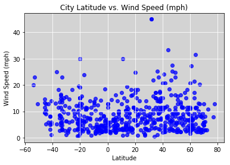

```python
import requests
import json
from pprint import pprint
from config import api_key
from gkey import gkey
import random
from citipy import citipy
import pandas as pd
import numpy as np
import matplotlib.pyplot as plt

```


```python
df = pd.DataFrame()
lat = []
lng = []
for x in range(0,1700): #get 700 random numbers
    lat.append(random.randint(-90,90)) #random number from range -90 to 90
    lng.append(random.randint(-180,180)) #random number from range -180 to 180
df["Lat"] = lat
df["Lng"] = lng
df["City Name"] = ''
df["Country"] = ''
df.head()
df.count()
   
```


    Lat          1700
    Lng          1700
    City Name    1700
    Country      1700
    dtype: int64


```python
for index,row in df.iterrows():
    city = citipy.nearest_city(row["Lat"],row["Lng"])
    if " " in city.city_name:
        city.city_name = city.city_name.replace(" ", "%20") 
    df.set_value(index,"City Name",city.city_name)
    df.set_value(index,"Country",city.country_code)
    df["Temp"]=''
df = df.drop_duplicates(["City Name","Country"])#drop the duplicate values
df["Humidity"]=''
df["Cloudiness"]=''
df["Wind Speed"]=''
df.head()
df.count()
```


    Lat           665
    Lng           665
    City Name     665
    Country       665
    Temp          665
    Humidity      665
    Cloudiness    665
    Wind Speed    665
    dtype: int64


```python
cities = df["City Name"].tolist()
settings = {"units":"imperial","appid":api_key}
responses=[]
query = ["main.temp"]
urls = []

for index,row in df.iterrows():
    url = f"http://api.openweathermap.org/data/2.5/weather?units=Imperial&APPID={api_key}&q={row['City Name']},{row['Country']}"
    print(url)
    responses = requests.get(url).json()

    try:
        df.set_value(index,"Lat",responses["coord"]["lat"])
        df.set_value(index,"Lng",responses["coord"]["lon"])
        df.set_value(index,"Temp",responses["main"]["temp"])
        df.set_value(index,"Humidity",responses["main"]["humidity"])
        df.set_value(index,"Cloudiness",responses["clouds"]["all"])
        df.set_value(index,"Wind Speed",responses["wind"]["speed"])
        df.set_value(index, "City Name",responses["name"])
    except KeyError:
        df.set_value(index,"Temp",np.nan)


df.head()

        

    
  
```

    http://api.openweathermap.org/data/2.5/weather?units=Imperial&APPID=5addd7633b888ba2559a6ca22e961000&q=atuona,pf
    http://api.openweathermap.org/data/2.5/weather?units=Imperial&APPID=5addd7633b888ba2559a6ca22e961000&q=bridlington,gb
    http://api.openweathermap.org/data/2.5/weather?units=Imperial&APPID=5addd7633b888ba2559a6ca22e961000&q=alyangula,au
    http://api.openweathermap.org/data/2.5/weather?units=Imperial&APPID=5addd7633b888ba2559a6ca22e961000&q=birao,cf
    http://api.openweathermap.org/data/2.5/weather?units=Imperial&APPID=5addd7633b888ba2559a6ca22e961000&q=nisia%20floresta,br
    http://api.openweathermap.org/data/2.5/weather?units=Imperial&APPID=5addd7633b888ba2559a6ca22e961000&q=hermanus,za
    http://api.openweathermap.org/data/2.5/weather?units=Imperial&APPID=5addd7633b888ba2559a6ca22e961000&q=cape%20town,za
    http://api.openweathermap.org/data/2.5/weather?units=Imperial&APPID=5addd7633b888ba2559a6ca22e961000&q=qaanaaq,gl
    http://api.openweathermap.org/data/2.5/weather?units=Imperial&APPID=5addd7633b888ba2559a6ca22e961000&q=arraial%20do%20cabo,br
    http://api.openweathermap.org/data/2.5/weather?units=Imperial&APPID=5addd7633b888ba2559a6ca22e961000&q=illoqqortoormiut,gl
    http://api.openweathermap.org/data/2.5/weather?units=Imperial&APPID=5addd7633b888ba2559a6ca22e961000&q=busselton,au
    http://api.openweathermap.org/data/2.5/weather?units=Imperial&APPID=5addd7633b888ba2559a6ca22e961000&q=cherskiy,ru
    http://api.openweathermap.org/data/2.5/weather?units=Imperial&APPID=5addd7633b888ba2559a6ca22e961000&q=kyle,us
    http://api.openweathermap.org/data/2.5/weather?units=Imperial&APPID=5addd7633b888ba2559a6ca22e961000&q=kalga,ru
    http://api.openweathermap.org/data/2.5/weather?units=Imperial&APPID=5addd7633b888ba2559a6ca22e961000&q=taolanaro,mg
    http://api.openweathermap.org/data/2.5/weather?units=Imperial&APPID=5addd7633b888ba2559a6ca22e961000&q=chokurdakh,ru
    http://api.openweathermap.org/data/2.5/weather?units=Imperial&APPID=5addd7633b888ba2559a6ca22e961000&q=barrow,us
    http://api.openweathermap.org/data/2.5/weather?units=Imperial&APPID=5addd7633b888ba2559a6ca22e961000&q=mataura,pf
    http://api.openweathermap.org/data/2.5/weather?units=Imperial&APPID=5addd7633b888ba2559a6ca22e961000&q=bambous%20virieux,mu
    http://api.openweathermap.org/data/2.5/weather?units=Imperial&APPID=5addd7633b888ba2559a6ca22e961000&q=vaitupu,wf
    http://api.openweathermap.org/data/2.5/weather?units=Imperial&APPID=5addd7633b888ba2559a6ca22e961000&q=saleaula,ws
    http://api.openweathermap.org/data/2.5/weather?units=Imperial&APPID=5addd7633b888ba2559a6ca22e961000&q=port%20blair,in
    http://api.openweathermap.org/data/2.5/weather?units=Imperial&APPID=5addd7633b888ba2559a6ca22e961000&q=souillac,mu
    http://api.openweathermap.org/data/2.5/weather?units=Imperial&APPID=5addd7633b888ba2559a6ca22e961000&q=katherine,au
    http://api.openweathermap.org/data/2.5/weather?units=Imperial&APPID=5addd7633b888ba2559a6ca22e961000&q=clyde%20river,ca
    http://api.openweathermap.org/data/2.5/weather?units=Imperial&APPID=5addd7633b888ba2559a6ca22e961000&q=hualmay,pe
    http://api.openweathermap.org/data/2.5/weather?units=Imperial&APPID=5addd7633b888ba2559a6ca22e961000&q=jamestown,sh
    http://api.openweathermap.org/data/2.5/weather?units=Imperial&APPID=5addd7633b888ba2559a6ca22e961000&q=vitim,ru
    http://api.openweathermap.org/data/2.5/weather?units=Imperial&APPID=5addd7633b888ba2559a6ca22e961000&q=ushuaia,ar
    http://api.openweathermap.org/data/2.5/weather?units=Imperial&APPID=5addd7633b888ba2559a6ca22e961000&q=esmeraldas,ec
    http://api.openweathermap.org/data/2.5/weather?units=Imperial&APPID=5addd7633b888ba2559a6ca22e961000&q=east%20london,za
    http://api.openweathermap.org/data/2.5/weather?units=Imperial&APPID=5addd7633b888ba2559a6ca22e961000&q=cabo%20san%20lucas,mx
    http://api.openweathermap.org/data/2.5/weather?units=Imperial&APPID=5addd7633b888ba2559a6ca22e961000&q=esperance,au
    http://api.openweathermap.org/data/2.5/weather?units=Imperial&APPID=5addd7633b888ba2559a6ca22e961000&q=alofi,nu
    http://api.openweathermap.org/data/2.5/weather?units=Imperial&APPID=5addd7633b888ba2559a6ca22e961000&q=huarmey,pe
    http://api.openweathermap.org/data/2.5/weather?units=Imperial&APPID=5addd7633b888ba2559a6ca22e961000&q=mys%20shmidta,ru
    http://api.openweathermap.org/data/2.5/weather?units=Imperial&APPID=5addd7633b888ba2559a6ca22e961000&q=attawapiskat,ca
    http://api.openweathermap.org/data/2.5/weather?units=Imperial&APPID=5addd7633b888ba2559a6ca22e961000&q=port%20lincoln,au
    http://api.openweathermap.org/data/2.5/weather?units=Imperial&APPID=5addd7633b888ba2559a6ca22e961000&q=tuktoyaktuk,ca
    http://api.openweathermap.org/data/2.5/weather?units=Imperial&APPID=5addd7633b888ba2559a6ca22e961000&q=albany,au
    http://api.openweathermap.org/data/2.5/weather?units=Imperial&APPID=5addd7633b888ba2559a6ca22e961000&q=meulaboh,id
    http://api.openweathermap.org/data/2.5/weather?units=Imperial&APPID=5addd7633b888ba2559a6ca22e961000&q=muravlenko,ru
    http://api.openweathermap.org/data/2.5/weather?units=Imperial&APPID=5addd7633b888ba2559a6ca22e961000&q=kaitangata,nz
    http://api.openweathermap.org/data/2.5/weather?units=Imperial&APPID=5addd7633b888ba2559a6ca22e961000&q=puerto%20escondido,mx
    http://api.openweathermap.org/data/2.5/weather?units=Imperial&APPID=5addd7633b888ba2559a6ca22e961000&q=akyab,mm
    http://api.openweathermap.org/data/2.5/weather?units=Imperial&APPID=5addd7633b888ba2559a6ca22e961000&q=bethel,us
    http://api.openweathermap.org/data/2.5/weather?units=Imperial&APPID=5addd7633b888ba2559a6ca22e961000&q=palmas,br
    http://api.openweathermap.org/data/2.5/weather?units=Imperial&APPID=5addd7633b888ba2559a6ca22e961000&q=takoradi,gh
    http://api.openweathermap.org/data/2.5/weather?units=Imperial&APPID=5addd7633b888ba2559a6ca22e961000&q=nyurba,ru
    http://api.openweathermap.org/data/2.5/weather?units=Imperial&APPID=5addd7633b888ba2559a6ca22e961000&q=san%20cristobal,ec
    http://api.openweathermap.org/data/2.5/weather?units=Imperial&APPID=5addd7633b888ba2559a6ca22e961000&q=sentyabrskiy,ru
    http://api.openweathermap.org/data/2.5/weather?units=Imperial&APPID=5addd7633b888ba2559a6ca22e961000&q=new%20norfolk,au
    http://api.openweathermap.org/data/2.5/weather?units=Imperial&APPID=5addd7633b888ba2559a6ca22e961000&q=nikolskoye,ru
    http://api.openweathermap.org/data/2.5/weather?units=Imperial&APPID=5addd7633b888ba2559a6ca22e961000&q=khatanga,ru
    http://api.openweathermap.org/data/2.5/weather?units=Imperial&APPID=5addd7633b888ba2559a6ca22e961000&q=sao%20jose%20da%20coroa%20grande,br
    http://api.openweathermap.org/data/2.5/weather?units=Imperial&APPID=5addd7633b888ba2559a6ca22e961000&q=pevek,ru
    http://api.openweathermap.org/data/2.5/weather?units=Imperial&APPID=5addd7633b888ba2559a6ca22e961000&q=boa%20vista,br
    http://api.openweathermap.org/data/2.5/weather?units=Imperial&APPID=5addd7633b888ba2559a6ca22e961000&q=butaritari,ki
    http://api.openweathermap.org/data/2.5/weather?units=Imperial&APPID=5addd7633b888ba2559a6ca22e961000&q=vallenar,cl
    http://api.openweathermap.org/data/2.5/weather?units=Imperial&APPID=5addd7633b888ba2559a6ca22e961000&q=quatre%20cocos,mu
    http://api.openweathermap.org/data/2.5/weather?units=Imperial&APPID=5addd7633b888ba2559a6ca22e961000&q=mokhotlong,ls
    http://api.openweathermap.org/data/2.5/weather?units=Imperial&APPID=5addd7633b888ba2559a6ca22e961000&q=bonthe,sl
    http://api.openweathermap.org/data/2.5/weather?units=Imperial&APPID=5addd7633b888ba2559a6ca22e961000&q=bluff,nz
    http://api.openweathermap.org/data/2.5/weather?units=Imperial&APPID=5addd7633b888ba2559a6ca22e961000&q=sergeyevka,kz
    http://api.openweathermap.org/data/2.5/weather?units=Imperial&APPID=5addd7633b888ba2559a6ca22e961000&q=belaya%20gora,ru
    http://api.openweathermap.org/data/2.5/weather?units=Imperial&APPID=5addd7633b888ba2559a6ca22e961000&q=andra,ru
    http://api.openweathermap.org/data/2.5/weather?units=Imperial&APPID=5addd7633b888ba2559a6ca22e961000&q=ponta%20do%20sol,cv
    http://api.openweathermap.org/data/2.5/weather?units=Imperial&APPID=5addd7633b888ba2559a6ca22e961000&q=tombouctou,ml
    http://api.openweathermap.org/data/2.5/weather?units=Imperial&APPID=5addd7633b888ba2559a6ca22e961000&q=moron,mn
    http://api.openweathermap.org/data/2.5/weather?units=Imperial&APPID=5addd7633b888ba2559a6ca22e961000&q=hilo,us
    http://api.openweathermap.org/data/2.5/weather?units=Imperial&APPID=5addd7633b888ba2559a6ca22e961000&q=miramar,mx
    http://api.openweathermap.org/data/2.5/weather?units=Imperial&APPID=5addd7633b888ba2559a6ca22e961000&q=leningradskiy,ru
    http://api.openweathermap.org/data/2.5/weather?units=Imperial&APPID=5addd7633b888ba2559a6ca22e961000&q=umm%20lajj,sa
    http://api.openweathermap.org/data/2.5/weather?units=Imperial&APPID=5addd7633b888ba2559a6ca22e961000&q=old%20road,ag
    http://api.openweathermap.org/data/2.5/weather?units=Imperial&APPID=5addd7633b888ba2559a6ca22e961000&q=cabedelo,br
    http://api.openweathermap.org/data/2.5/weather?units=Imperial&APPID=5addd7633b888ba2559a6ca22e961000&q=provideniya,ru
    http://api.openweathermap.org/data/2.5/weather?units=Imperial&APPID=5addd7633b888ba2559a6ca22e961000&q=punta%20arenas,cl
    http://api.openweathermap.org/data/2.5/weather?units=Imperial&APPID=5addd7633b888ba2559a6ca22e961000&q=kimberley,za
    http://api.openweathermap.org/data/2.5/weather?units=Imperial&APPID=5addd7633b888ba2559a6ca22e961000&q=chengde,cn
    http://api.openweathermap.org/data/2.5/weather?units=Imperial&APPID=5addd7633b888ba2559a6ca22e961000&q=ilulissat,gl
    http://api.openweathermap.org/data/2.5/weather?units=Imperial&APPID=5addd7633b888ba2559a6ca22e961000&q=cayenne,gf
    http://api.openweathermap.org/data/2.5/weather?units=Imperial&APPID=5addd7633b888ba2559a6ca22e961000&q=mirabad,af
    http://api.openweathermap.org/data/2.5/weather?units=Imperial&APPID=5addd7633b888ba2559a6ca22e961000&q=longyearbyen,sj
    http://api.openweathermap.org/data/2.5/weather?units=Imperial&APPID=5addd7633b888ba2559a6ca22e961000&q=cidreira,br
    http://api.openweathermap.org/data/2.5/weather?units=Imperial&APPID=5addd7633b888ba2559a6ca22e961000&q=puerto%20madryn,ar
    http://api.openweathermap.org/data/2.5/weather?units=Imperial&APPID=5addd7633b888ba2559a6ca22e961000&q=ruatoria,nz
    http://api.openweathermap.org/data/2.5/weather?units=Imperial&APPID=5addd7633b888ba2559a6ca22e961000&q=thompson,ca
    http://api.openweathermap.org/data/2.5/weather?units=Imperial&APPID=5addd7633b888ba2559a6ca22e961000&q=klaksvik,fo
    http://api.openweathermap.org/data/2.5/weather?units=Imperial&APPID=5addd7633b888ba2559a6ca22e961000&q=angangxi,cn
    http://api.openweathermap.org/data/2.5/weather?units=Imperial&APPID=5addd7633b888ba2559a6ca22e961000&q=georgetown,sh
    http://api.openweathermap.org/data/2.5/weather?units=Imperial&APPID=5addd7633b888ba2559a6ca22e961000&q=bay%20roberts,ca
    http://api.openweathermap.org/data/2.5/weather?units=Imperial&APPID=5addd7633b888ba2559a6ca22e961000&q=kodiak,us
    http://api.openweathermap.org/data/2.5/weather?units=Imperial&APPID=5addd7633b888ba2559a6ca22e961000&q=bolungarvik,is
    http://api.openweathermap.org/data/2.5/weather?units=Imperial&APPID=5addd7633b888ba2559a6ca22e961000&q=kyaikto,mm
    http://api.openweathermap.org/data/2.5/weather?units=Imperial&APPID=5addd7633b888ba2559a6ca22e961000&q=ulaanbaatar,mn
    http://api.openweathermap.org/data/2.5/weather?units=Imperial&APPID=5addd7633b888ba2559a6ca22e961000&q=kavaratti,in
    http://api.openweathermap.org/data/2.5/weather?units=Imperial&APPID=5addd7633b888ba2559a6ca22e961000&q=port%20elizabeth,za
    http://api.openweathermap.org/data/2.5/weather?units=Imperial&APPID=5addd7633b888ba2559a6ca22e961000&q=poplar%20bluff,us
    http://api.openweathermap.org/data/2.5/weather?units=Imperial&APPID=5addd7633b888ba2559a6ca22e961000&q=kapaa,us
    http://api.openweathermap.org/data/2.5/weather?units=Imperial&APPID=5addd7633b888ba2559a6ca22e961000&q=waddan,ly
    http://api.openweathermap.org/data/2.5/weather?units=Imperial&APPID=5addd7633b888ba2559a6ca22e961000&q=okhotsk,ru
    http://api.openweathermap.org/data/2.5/weather?units=Imperial&APPID=5addd7633b888ba2559a6ca22e961000&q=mount%20gambier,au
    http://api.openweathermap.org/data/2.5/weather?units=Imperial&APPID=5addd7633b888ba2559a6ca22e961000&q=vaini,to
    http://api.openweathermap.org/data/2.5/weather?units=Imperial&APPID=5addd7633b888ba2559a6ca22e961000&q=samusu,ws
    http://api.openweathermap.org/data/2.5/weather?units=Imperial&APPID=5addd7633b888ba2559a6ca22e961000&q=severo-kurilsk,ru
    http://api.openweathermap.org/data/2.5/weather?units=Imperial&APPID=5addd7633b888ba2559a6ca22e961000&q=barentsburg,sj
    http://api.openweathermap.org/data/2.5/weather?units=Imperial&APPID=5addd7633b888ba2559a6ca22e961000&q=high%20level,ca
    http://api.openweathermap.org/data/2.5/weather?units=Imperial&APPID=5addd7633b888ba2559a6ca22e961000&q=taoudenni,ml
    http://api.openweathermap.org/data/2.5/weather?units=Imperial&APPID=5addd7633b888ba2559a6ca22e961000&q=tilichiki,ru
    http://api.openweathermap.org/data/2.5/weather?units=Imperial&APPID=5addd7633b888ba2559a6ca22e961000&q=bredasdorp,za
    http://api.openweathermap.org/data/2.5/weather?units=Imperial&APPID=5addd7633b888ba2559a6ca22e961000&q=douglas,us
    http://api.openweathermap.org/data/2.5/weather?units=Imperial&APPID=5addd7633b888ba2559a6ca22e961000&q=victoria,sc
    http://api.openweathermap.org/data/2.5/weather?units=Imperial&APPID=5addd7633b888ba2559a6ca22e961000&q=tacuarembo,uy
    http://api.openweathermap.org/data/2.5/weather?units=Imperial&APPID=5addd7633b888ba2559a6ca22e961000&q=lorengau,pg
    http://api.openweathermap.org/data/2.5/weather?units=Imperial&APPID=5addd7633b888ba2559a6ca22e961000&q=arkansas%20city,us
    http://api.openweathermap.org/data/2.5/weather?units=Imperial&APPID=5addd7633b888ba2559a6ca22e961000&q=rikitea,pf
    http://api.openweathermap.org/data/2.5/weather?units=Imperial&APPID=5addd7633b888ba2559a6ca22e961000&q=pisco,pe
    http://api.openweathermap.org/data/2.5/weather?units=Imperial&APPID=5addd7633b888ba2559a6ca22e961000&q=korla,cn
    http://api.openweathermap.org/data/2.5/weather?units=Imperial&APPID=5addd7633b888ba2559a6ca22e961000&q=tarudant,ma
    http://api.openweathermap.org/data/2.5/weather?units=Imperial&APPID=5addd7633b888ba2559a6ca22e961000&q=puerto%20ayora,ec
    http://api.openweathermap.org/data/2.5/weather?units=Imperial&APPID=5addd7633b888ba2559a6ca22e961000&q=burley,us
    http://api.openweathermap.org/data/2.5/weather?units=Imperial&APPID=5addd7633b888ba2559a6ca22e961000&q=angra,pt
    http://api.openweathermap.org/data/2.5/weather?units=Imperial&APPID=5addd7633b888ba2559a6ca22e961000&q=dikson,ru
    http://api.openweathermap.org/data/2.5/weather?units=Imperial&APPID=5addd7633b888ba2559a6ca22e961000&q=garowe,so
    http://api.openweathermap.org/data/2.5/weather?units=Imperial&APPID=5addd7633b888ba2559a6ca22e961000&q=castro,cl
    http://api.openweathermap.org/data/2.5/weather?units=Imperial&APPID=5addd7633b888ba2559a6ca22e961000&q=gazanjyk,tm
    http://api.openweathermap.org/data/2.5/weather?units=Imperial&APPID=5addd7633b888ba2559a6ca22e961000&q=mar%20del%20plata,ar
    http://api.openweathermap.org/data/2.5/weather?units=Imperial&APPID=5addd7633b888ba2559a6ca22e961000&q=yamada,jp
    http://api.openweathermap.org/data/2.5/weather?units=Imperial&APPID=5addd7633b888ba2559a6ca22e961000&q=santa%20rosa,ar
    http://api.openweathermap.org/data/2.5/weather?units=Imperial&APPID=5addd7633b888ba2559a6ca22e961000&q=opuwo,na
    http://api.openweathermap.org/data/2.5/weather?units=Imperial&APPID=5addd7633b888ba2559a6ca22e961000&q=wladyslawowo,pl
    http://api.openweathermap.org/data/2.5/weather?units=Imperial&APPID=5addd7633b888ba2559a6ca22e961000&q=salekhard,ru
    http://api.openweathermap.org/data/2.5/weather?units=Imperial&APPID=5addd7633b888ba2559a6ca22e961000&q=grand%20river%20south%20east,mu
    http://api.openweathermap.org/data/2.5/weather?units=Imperial&APPID=5addd7633b888ba2559a6ca22e961000&q=belushya%20guba,ru
    http://api.openweathermap.org/data/2.5/weather?units=Imperial&APPID=5addd7633b888ba2559a6ca22e961000&q=srandakan,id
    http://api.openweathermap.org/data/2.5/weather?units=Imperial&APPID=5addd7633b888ba2559a6ca22e961000&q=norman%20wells,ca
    http://api.openweathermap.org/data/2.5/weather?units=Imperial&APPID=5addd7633b888ba2559a6ca22e961000&q=amapa,br
    http://api.openweathermap.org/data/2.5/weather?units=Imperial&APPID=5addd7633b888ba2559a6ca22e961000&q=ribeira%20grande,pt
    http://api.openweathermap.org/data/2.5/weather?units=Imperial&APPID=5addd7633b888ba2559a6ca22e961000&q=shenjiamen,cn
    http://api.openweathermap.org/data/2.5/weather?units=Imperial&APPID=5addd7633b888ba2559a6ca22e961000&q=inirida,co
    http://api.openweathermap.org/data/2.5/weather?units=Imperial&APPID=5addd7633b888ba2559a6ca22e961000&q=mosquera,co
    http://api.openweathermap.org/data/2.5/weather?units=Imperial&APPID=5addd7633b888ba2559a6ca22e961000&q=kerchevskiy,ru
    http://api.openweathermap.org/data/2.5/weather?units=Imperial&APPID=5addd7633b888ba2559a6ca22e961000&q=westport,ie
    http://api.openweathermap.org/data/2.5/weather?units=Imperial&APPID=5addd7633b888ba2559a6ca22e961000&q=dingle,ie
    http://api.openweathermap.org/data/2.5/weather?units=Imperial&APPID=5addd7633b888ba2559a6ca22e961000&q=avarua,ck
    http://api.openweathermap.org/data/2.5/weather?units=Imperial&APPID=5addd7633b888ba2559a6ca22e961000&q=tasiilaq,gl
    http://api.openweathermap.org/data/2.5/weather?units=Imperial&APPID=5addd7633b888ba2559a6ca22e961000&q=los%20llanos%20de%20aridane,es
    http://api.openweathermap.org/data/2.5/weather?units=Imperial&APPID=5addd7633b888ba2559a6ca22e961000&q=kuche,cn
    http://api.openweathermap.org/data/2.5/weather?units=Imperial&APPID=5addd7633b888ba2559a6ca22e961000&q=xinyang,cn
    http://api.openweathermap.org/data/2.5/weather?units=Imperial&APPID=5addd7633b888ba2559a6ca22e961000&q=pelym,ru
    http://api.openweathermap.org/data/2.5/weather?units=Imperial&APPID=5addd7633b888ba2559a6ca22e961000&q=yellowknife,ca
    http://api.openweathermap.org/data/2.5/weather?units=Imperial&APPID=5addd7633b888ba2559a6ca22e961000&q=hobart,au
    http://api.openweathermap.org/data/2.5/weather?units=Imperial&APPID=5addd7633b888ba2559a6ca22e961000&q=kahului,us
    http://api.openweathermap.org/data/2.5/weather?units=Imperial&APPID=5addd7633b888ba2559a6ca22e961000&q=rakiv%20lis,ua
    http://api.openweathermap.org/data/2.5/weather?units=Imperial&APPID=5addd7633b888ba2559a6ca22e961000&q=lafia,ng
    http://api.openweathermap.org/data/2.5/weather?units=Imperial&APPID=5addd7633b888ba2559a6ca22e961000&q=byron%20bay,au
    http://api.openweathermap.org/data/2.5/weather?units=Imperial&APPID=5addd7633b888ba2559a6ca22e961000&q=talwara,in
    http://api.openweathermap.org/data/2.5/weather?units=Imperial&APPID=5addd7633b888ba2559a6ca22e961000&q=kuandian,cn
    http://api.openweathermap.org/data/2.5/weather?units=Imperial&APPID=5addd7633b888ba2559a6ca22e961000&q=qui%20nhon,vn
    http://api.openweathermap.org/data/2.5/weather?units=Imperial&APPID=5addd7633b888ba2559a6ca22e961000&q=sinnamary,gf
    http://api.openweathermap.org/data/2.5/weather?units=Imperial&APPID=5addd7633b888ba2559a6ca22e961000&q=kurilsk,ru
    http://api.openweathermap.org/data/2.5/weather?units=Imperial&APPID=5addd7633b888ba2559a6ca22e961000&q=kingussie,gb
    http://api.openweathermap.org/data/2.5/weather?units=Imperial&APPID=5addd7633b888ba2559a6ca22e961000&q=odemis,tr
    http://api.openweathermap.org/data/2.5/weather?units=Imperial&APPID=5addd7633b888ba2559a6ca22e961000&q=saiha,in
    http://api.openweathermap.org/data/2.5/weather?units=Imperial&APPID=5addd7633b888ba2559a6ca22e961000&q=myitkyina,mm
    http://api.openweathermap.org/data/2.5/weather?units=Imperial&APPID=5addd7633b888ba2559a6ca22e961000&q=muzquiz,mx
    http://api.openweathermap.org/data/2.5/weather?units=Imperial&APPID=5addd7633b888ba2559a6ca22e961000&q=las%20vegas,us
    http://api.openweathermap.org/data/2.5/weather?units=Imperial&APPID=5addd7633b888ba2559a6ca22e961000&q=sioux%20lookout,ca
    http://api.openweathermap.org/data/2.5/weather?units=Imperial&APPID=5addd7633b888ba2559a6ca22e961000&q=isangel,vu
    http://api.openweathermap.org/data/2.5/weather?units=Imperial&APPID=5addd7633b888ba2559a6ca22e961000&q=gombong,id
    http://api.openweathermap.org/data/2.5/weather?units=Imperial&APPID=5addd7633b888ba2559a6ca22e961000&q=narsaq,gl
    http://api.openweathermap.org/data/2.5/weather?units=Imperial&APPID=5addd7633b888ba2559a6ca22e961000&q=saint%20simons,us
    http://api.openweathermap.org/data/2.5/weather?units=Imperial&APPID=5addd7633b888ba2559a6ca22e961000&q=northam,au
    http://api.openweathermap.org/data/2.5/weather?units=Imperial&APPID=5addd7633b888ba2559a6ca22e961000&q=ahtopol,bg
    http://api.openweathermap.org/data/2.5/weather?units=Imperial&APPID=5addd7633b888ba2559a6ca22e961000&q=velyka%20mykhaylivka,ua
    http://api.openweathermap.org/data/2.5/weather?units=Imperial&APPID=5addd7633b888ba2559a6ca22e961000&q=zemio,cf
    http://api.openweathermap.org/data/2.5/weather?units=Imperial&APPID=5addd7633b888ba2559a6ca22e961000&q=wilmington,us
    http://api.openweathermap.org/data/2.5/weather?units=Imperial&APPID=5addd7633b888ba2559a6ca22e961000&q=qasigiannguit,gl
    http://api.openweathermap.org/data/2.5/weather?units=Imperial&APPID=5addd7633b888ba2559a6ca22e961000&q=toliary,mg
    http://api.openweathermap.org/data/2.5/weather?units=Imperial&APPID=5addd7633b888ba2559a6ca22e961000&q=jalu,ly
    http://api.openweathermap.org/data/2.5/weather?units=Imperial&APPID=5addd7633b888ba2559a6ca22e961000&q=staden,be
    http://api.openweathermap.org/data/2.5/weather?units=Imperial&APPID=5addd7633b888ba2559a6ca22e961000&q=monrovia,lr
    http://api.openweathermap.org/data/2.5/weather?units=Imperial&APPID=5addd7633b888ba2559a6ca22e961000&q=mehamn,no
    http://api.openweathermap.org/data/2.5/weather?units=Imperial&APPID=5addd7633b888ba2559a6ca22e961000&q=etchojoa,mx
    http://api.openweathermap.org/data/2.5/weather?units=Imperial&APPID=5addd7633b888ba2559a6ca22e961000&q=hithadhoo,mv
    http://api.openweathermap.org/data/2.5/weather?units=Imperial&APPID=5addd7633b888ba2559a6ca22e961000&q=tuy%20hoa,vn
    http://api.openweathermap.org/data/2.5/weather?units=Imperial&APPID=5addd7633b888ba2559a6ca22e961000&q=nanortalik,gl
    http://api.openweathermap.org/data/2.5/weather?units=Imperial&APPID=5addd7633b888ba2559a6ca22e961000&q=saint-philippe,re
    http://api.openweathermap.org/data/2.5/weather?units=Imperial&APPID=5addd7633b888ba2559a6ca22e961000&q=chlorakas,cy
    http://api.openweathermap.org/data/2.5/weather?units=Imperial&APPID=5addd7633b888ba2559a6ca22e961000&q=kudahuvadhoo,mv
    http://api.openweathermap.org/data/2.5/weather?units=Imperial&APPID=5addd7633b888ba2559a6ca22e961000&q=hami,cn
    http://api.openweathermap.org/data/2.5/weather?units=Imperial&APPID=5addd7633b888ba2559a6ca22e961000&q=kapoeta,sd
    http://api.openweathermap.org/data/2.5/weather?units=Imperial&APPID=5addd7633b888ba2559a6ca22e961000&q=srivardhan,in
    http://api.openweathermap.org/data/2.5/weather?units=Imperial&APPID=5addd7633b888ba2559a6ca22e961000&q=nenjiang,cn
    http://api.openweathermap.org/data/2.5/weather?units=Imperial&APPID=5addd7633b888ba2559a6ca22e961000&q=sao%20joaquim,br
    http://api.openweathermap.org/data/2.5/weather?units=Imperial&APPID=5addd7633b888ba2559a6ca22e961000&q=kilembe,ug
    http://api.openweathermap.org/data/2.5/weather?units=Imperial&APPID=5addd7633b888ba2559a6ca22e961000&q=saskylakh,ru
    http://api.openweathermap.org/data/2.5/weather?units=Imperial&APPID=5addd7633b888ba2559a6ca22e961000&q=maua,ke
    http://api.openweathermap.org/data/2.5/weather?units=Imperial&APPID=5addd7633b888ba2559a6ca22e961000&q=omboue,ga
    http://api.openweathermap.org/data/2.5/weather?units=Imperial&APPID=5addd7633b888ba2559a6ca22e961000&q=moose%20factory,ca
    http://api.openweathermap.org/data/2.5/weather?units=Imperial&APPID=5addd7633b888ba2559a6ca22e961000&q=kidal,ml
    http://api.openweathermap.org/data/2.5/weather?units=Imperial&APPID=5addd7633b888ba2559a6ca22e961000&q=batie,bf
    http://api.openweathermap.org/data/2.5/weather?units=Imperial&APPID=5addd7633b888ba2559a6ca22e961000&q=port-cartier,ca
    http://api.openweathermap.org/data/2.5/weather?units=Imperial&APPID=5addd7633b888ba2559a6ca22e961000&q=xunchang,cn
    http://api.openweathermap.org/data/2.5/weather?units=Imperial&APPID=5addd7633b888ba2559a6ca22e961000&q=orbetello,it
    http://api.openweathermap.org/data/2.5/weather?units=Imperial&APPID=5addd7633b888ba2559a6ca22e961000&q=caramoran,ph
    http://api.openweathermap.org/data/2.5/weather?units=Imperial&APPID=5addd7633b888ba2559a6ca22e961000&q=carnarvon,au
    http://api.openweathermap.org/data/2.5/weather?units=Imperial&APPID=5addd7633b888ba2559a6ca22e961000&q=saint-junien,fr
    http://api.openweathermap.org/data/2.5/weather?units=Imperial&APPID=5addd7633b888ba2559a6ca22e961000&q=coquimbo,cl
    http://api.openweathermap.org/data/2.5/weather?units=Imperial&APPID=5addd7633b888ba2559a6ca22e961000&q=gamba,ga
    http://api.openweathermap.org/data/2.5/weather?units=Imperial&APPID=5addd7633b888ba2559a6ca22e961000&q=clarence%20town,bs
    http://api.openweathermap.org/data/2.5/weather?units=Imperial&APPID=5addd7633b888ba2559a6ca22e961000&q=nelson%20bay,au
    http://api.openweathermap.org/data/2.5/weather?units=Imperial&APPID=5addd7633b888ba2559a6ca22e961000&q=srednekolymsk,ru
    http://api.openweathermap.org/data/2.5/weather?units=Imperial&APPID=5addd7633b888ba2559a6ca22e961000&q=warrnambool,au
    http://api.openweathermap.org/data/2.5/weather?units=Imperial&APPID=5addd7633b888ba2559a6ca22e961000&q=poso,id
    http://api.openweathermap.org/data/2.5/weather?units=Imperial&APPID=5addd7633b888ba2559a6ca22e961000&q=terrasini,it
    http://api.openweathermap.org/data/2.5/weather?units=Imperial&APPID=5addd7633b888ba2559a6ca22e961000&q=mildura,au
    http://api.openweathermap.org/data/2.5/weather?units=Imperial&APPID=5addd7633b888ba2559a6ca22e961000&q=lolua,tv
    http://api.openweathermap.org/data/2.5/weather?units=Imperial&APPID=5addd7633b888ba2559a6ca22e961000&q=aracaju,br
    http://api.openweathermap.org/data/2.5/weather?units=Imperial&APPID=5addd7633b888ba2559a6ca22e961000&q=tsihombe,mg
    http://api.openweathermap.org/data/2.5/weather?units=Imperial&APPID=5addd7633b888ba2559a6ca22e961000&q=voh,nc
    http://api.openweathermap.org/data/2.5/weather?units=Imperial&APPID=5addd7633b888ba2559a6ca22e961000&q=saint-pierre,pm
    http://api.openweathermap.org/data/2.5/weather?units=Imperial&APPID=5addd7633b888ba2559a6ca22e961000&q=palabuhanratu,id
    http://api.openweathermap.org/data/2.5/weather?units=Imperial&APPID=5addd7633b888ba2559a6ca22e961000&q=port%20alfred,za
    http://api.openweathermap.org/data/2.5/weather?units=Imperial&APPID=5addd7633b888ba2559a6ca22e961000&q=cheuskiny,ru
    http://api.openweathermap.org/data/2.5/weather?units=Imperial&APPID=5addd7633b888ba2559a6ca22e961000&q=katsuura,jp
    http://api.openweathermap.org/data/2.5/weather?units=Imperial&APPID=5addd7633b888ba2559a6ca22e961000&q=viligili,mv
    http://api.openweathermap.org/data/2.5/weather?units=Imperial&APPID=5addd7633b888ba2559a6ca22e961000&q=zalesovo,ru
    http://api.openweathermap.org/data/2.5/weather?units=Imperial&APPID=5addd7633b888ba2559a6ca22e961000&q=indiana,us
    http://api.openweathermap.org/data/2.5/weather?units=Imperial&APPID=5addd7633b888ba2559a6ca22e961000&q=nizhneyansk,ru
    http://api.openweathermap.org/data/2.5/weather?units=Imperial&APPID=5addd7633b888ba2559a6ca22e961000&q=dubbo,au
    http://api.openweathermap.org/data/2.5/weather?units=Imperial&APPID=5addd7633b888ba2559a6ca22e961000&q=stornoway,gb
    http://api.openweathermap.org/data/2.5/weather?units=Imperial&APPID=5addd7633b888ba2559a6ca22e961000&q=lebu,cl
    http://api.openweathermap.org/data/2.5/weather?units=Imperial&APPID=5addd7633b888ba2559a6ca22e961000&q=aktash,ru
    http://api.openweathermap.org/data/2.5/weather?units=Imperial&APPID=5addd7633b888ba2559a6ca22e961000&q=key%20largo,us
    http://api.openweathermap.org/data/2.5/weather?units=Imperial&APPID=5addd7633b888ba2559a6ca22e961000&q=pacific%20grove,us
    http://api.openweathermap.org/data/2.5/weather?units=Imperial&APPID=5addd7633b888ba2559a6ca22e961000&q=lagoa,pt
    http://api.openweathermap.org/data/2.5/weather?units=Imperial&APPID=5addd7633b888ba2559a6ca22e961000&q=umzimvubu,za
    http://api.openweathermap.org/data/2.5/weather?units=Imperial&APPID=5addd7633b888ba2559a6ca22e961000&q=cockburn%20town,bs
    http://api.openweathermap.org/data/2.5/weather?units=Imperial&APPID=5addd7633b888ba2559a6ca22e961000&q=cilibia,ro
    http://api.openweathermap.org/data/2.5/weather?units=Imperial&APPID=5addd7633b888ba2559a6ca22e961000&q=hokitika,nz
    http://api.openweathermap.org/data/2.5/weather?units=Imperial&APPID=5addd7633b888ba2559a6ca22e961000&q=shingu,jp
    http://api.openweathermap.org/data/2.5/weather?units=Imperial&APPID=5addd7633b888ba2559a6ca22e961000&q=tahlequah,us
    http://api.openweathermap.org/data/2.5/weather?units=Imperial&APPID=5addd7633b888ba2559a6ca22e961000&q=dong%20xoai,vn
    http://api.openweathermap.org/data/2.5/weather?units=Imperial&APPID=5addd7633b888ba2559a6ca22e961000&q=caravelas,br
    http://api.openweathermap.org/data/2.5/weather?units=Imperial&APPID=5addd7633b888ba2559a6ca22e961000&q=tiksi,ru
    http://api.openweathermap.org/data/2.5/weather?units=Imperial&APPID=5addd7633b888ba2559a6ca22e961000&q=natal,br
    http://api.openweathermap.org/data/2.5/weather?units=Imperial&APPID=5addd7633b888ba2559a6ca22e961000&q=yerbogachen,ru
    http://api.openweathermap.org/data/2.5/weather?units=Imperial&APPID=5addd7633b888ba2559a6ca22e961000&q=nardaran,az
    http://api.openweathermap.org/data/2.5/weather?units=Imperial&APPID=5addd7633b888ba2559a6ca22e961000&q=rocha,uy
    http://api.openweathermap.org/data/2.5/weather?units=Imperial&APPID=5addd7633b888ba2559a6ca22e961000&q=serra,br
    http://api.openweathermap.org/data/2.5/weather?units=Imperial&APPID=5addd7633b888ba2559a6ca22e961000&q=akhisar,tr
    http://api.openweathermap.org/data/2.5/weather?units=Imperial&APPID=5addd7633b888ba2559a6ca22e961000&q=poum,nc
    http://api.openweathermap.org/data/2.5/weather?units=Imperial&APPID=5addd7633b888ba2559a6ca22e961000&q=porto%20velho,br
    http://api.openweathermap.org/data/2.5/weather?units=Imperial&APPID=5addd7633b888ba2559a6ca22e961000&q=grindavik,is
    http://api.openweathermap.org/data/2.5/weather?units=Imperial&APPID=5addd7633b888ba2559a6ca22e961000&q=vila%20velha,br
    http://api.openweathermap.org/data/2.5/weather?units=Imperial&APPID=5addd7633b888ba2559a6ca22e961000&q=zachagansk,kz
    http://api.openweathermap.org/data/2.5/weather?units=Imperial&APPID=5addd7633b888ba2559a6ca22e961000&q=alice%20springs,au
    http://api.openweathermap.org/data/2.5/weather?units=Imperial&APPID=5addd7633b888ba2559a6ca22e961000&q=talnakh,ru
    http://api.openweathermap.org/data/2.5/weather?units=Imperial&APPID=5addd7633b888ba2559a6ca22e961000&q=itamarandiba,br
    http://api.openweathermap.org/data/2.5/weather?units=Imperial&APPID=5addd7633b888ba2559a6ca22e961000&q=namibe,ao
    http://api.openweathermap.org/data/2.5/weather?units=Imperial&APPID=5addd7633b888ba2559a6ca22e961000&q=murdochville,ca
    http://api.openweathermap.org/data/2.5/weather?units=Imperial&APPID=5addd7633b888ba2559a6ca22e961000&q=fortuna,us
    http://api.openweathermap.org/data/2.5/weather?units=Imperial&APPID=5addd7633b888ba2559a6ca22e961000&q=bargal,so
    http://api.openweathermap.org/data/2.5/weather?units=Imperial&APPID=5addd7633b888ba2559a6ca22e961000&q=bijie,cn
    http://api.openweathermap.org/data/2.5/weather?units=Imperial&APPID=5addd7633b888ba2559a6ca22e961000&q=hirara,jp
    http://api.openweathermap.org/data/2.5/weather?units=Imperial&APPID=5addd7633b888ba2559a6ca22e961000&q=aswan,eg
    http://api.openweathermap.org/data/2.5/weather?units=Imperial&APPID=5addd7633b888ba2559a6ca22e961000&q=upernavik,gl
    http://api.openweathermap.org/data/2.5/weather?units=Imperial&APPID=5addd7633b888ba2559a6ca22e961000&q=goderich,sl
    http://api.openweathermap.org/data/2.5/weather?units=Imperial&APPID=5addd7633b888ba2559a6ca22e961000&q=the%20valley,ai
    http://api.openweathermap.org/data/2.5/weather?units=Imperial&APPID=5addd7633b888ba2559a6ca22e961000&q=igarka,ru
    http://api.openweathermap.org/data/2.5/weather?units=Imperial&APPID=5addd7633b888ba2559a6ca22e961000&q=turochak,ru
    http://api.openweathermap.org/data/2.5/weather?units=Imperial&APPID=5addd7633b888ba2559a6ca22e961000&q=oranjestad,aw
    http://api.openweathermap.org/data/2.5/weather?units=Imperial&APPID=5addd7633b888ba2559a6ca22e961000&q=amnat%20charoen,th
    http://api.openweathermap.org/data/2.5/weather?units=Imperial&APPID=5addd7633b888ba2559a6ca22e961000&q=georgiyevka,kz
    http://api.openweathermap.org/data/2.5/weather?units=Imperial&APPID=5addd7633b888ba2559a6ca22e961000&q=abha,sa
    http://api.openweathermap.org/data/2.5/weather?units=Imperial&APPID=5addd7633b888ba2559a6ca22e961000&q=ancud,cl
    http://api.openweathermap.org/data/2.5/weather?units=Imperial&APPID=5addd7633b888ba2559a6ca22e961000&q=amderma,ru
    http://api.openweathermap.org/data/2.5/weather?units=Imperial&APPID=5addd7633b888ba2559a6ca22e961000&q=kissidougou,gn
    http://api.openweathermap.org/data/2.5/weather?units=Imperial&APPID=5addd7633b888ba2559a6ca22e961000&q=kamaishi,jp
    http://api.openweathermap.org/data/2.5/weather?units=Imperial&APPID=5addd7633b888ba2559a6ca22e961000&q=udachnyy,ru
    http://api.openweathermap.org/data/2.5/weather?units=Imperial&APPID=5addd7633b888ba2559a6ca22e961000&q=bin%20qirdan,tn
    http://api.openweathermap.org/data/2.5/weather?units=Imperial&APPID=5addd7633b888ba2559a6ca22e961000&q=ontario,us
    http://api.openweathermap.org/data/2.5/weather?units=Imperial&APPID=5addd7633b888ba2559a6ca22e961000&q=mnogovershinnyy,ru
    http://api.openweathermap.org/data/2.5/weather?units=Imperial&APPID=5addd7633b888ba2559a6ca22e961000&q=mongoumba,cf
    http://api.openweathermap.org/data/2.5/weather?units=Imperial&APPID=5addd7633b888ba2559a6ca22e961000&q=abu%20zabad,sd
    http://api.openweathermap.org/data/2.5/weather?units=Imperial&APPID=5addd7633b888ba2559a6ca22e961000&q=camacha,pt
    http://api.openweathermap.org/data/2.5/weather?units=Imperial&APPID=5addd7633b888ba2559a6ca22e961000&q=lyngseidet,no
    http://api.openweathermap.org/data/2.5/weather?units=Imperial&APPID=5addd7633b888ba2559a6ca22e961000&q=haibowan,cn
    http://api.openweathermap.org/data/2.5/weather?units=Imperial&APPID=5addd7633b888ba2559a6ca22e961000&q=aguimes,es
    http://api.openweathermap.org/data/2.5/weather?units=Imperial&APPID=5addd7633b888ba2559a6ca22e961000&q=luderitz,na
    http://api.openweathermap.org/data/2.5/weather?units=Imperial&APPID=5addd7633b888ba2559a6ca22e961000&q=severnoye,ru
    http://api.openweathermap.org/data/2.5/weather?units=Imperial&APPID=5addd7633b888ba2559a6ca22e961000&q=nouadhibou,mr
    http://api.openweathermap.org/data/2.5/weather?units=Imperial&APPID=5addd7633b888ba2559a6ca22e961000&q=north%20platte,us
    http://api.openweathermap.org/data/2.5/weather?units=Imperial&APPID=5addd7633b888ba2559a6ca22e961000&q=price,us
    http://api.openweathermap.org/data/2.5/weather?units=Imperial&APPID=5addd7633b888ba2559a6ca22e961000&q=sabang,id
    http://api.openweathermap.org/data/2.5/weather?units=Imperial&APPID=5addd7633b888ba2559a6ca22e961000&q=keti%20bandar,pk
    http://api.openweathermap.org/data/2.5/weather?units=Imperial&APPID=5addd7633b888ba2559a6ca22e961000&q=chickasha,us
    http://api.openweathermap.org/data/2.5/weather?units=Imperial&APPID=5addd7633b888ba2559a6ca22e961000&q=tual,id
    http://api.openweathermap.org/data/2.5/weather?units=Imperial&APPID=5addd7633b888ba2559a6ca22e961000&q=zhangjiakou,cn
    http://api.openweathermap.org/data/2.5/weather?units=Imperial&APPID=5addd7633b888ba2559a6ca22e961000&q=makaryev,ru
    http://api.openweathermap.org/data/2.5/weather?units=Imperial&APPID=5addd7633b888ba2559a6ca22e961000&q=inhambane,mz
    http://api.openweathermap.org/data/2.5/weather?units=Imperial&APPID=5addd7633b888ba2559a6ca22e961000&q=egvekinot,ru
    http://api.openweathermap.org/data/2.5/weather?units=Imperial&APPID=5addd7633b888ba2559a6ca22e961000&q=hunza,pk
    http://api.openweathermap.org/data/2.5/weather?units=Imperial&APPID=5addd7633b888ba2559a6ca22e961000&q=dauphin,ca
    http://api.openweathermap.org/data/2.5/weather?units=Imperial&APPID=5addd7633b888ba2559a6ca22e961000&q=teotitlan,mx
    http://api.openweathermap.org/data/2.5/weather?units=Imperial&APPID=5addd7633b888ba2559a6ca22e961000&q=patan,in
    http://api.openweathermap.org/data/2.5/weather?units=Imperial&APPID=5addd7633b888ba2559a6ca22e961000&q=saint%20george,bm
    http://api.openweathermap.org/data/2.5/weather?units=Imperial&APPID=5addd7633b888ba2559a6ca22e961000&q=uruzgan,af
    http://api.openweathermap.org/data/2.5/weather?units=Imperial&APPID=5addd7633b888ba2559a6ca22e961000&q=mattru,sl
    http://api.openweathermap.org/data/2.5/weather?units=Imperial&APPID=5addd7633b888ba2559a6ca22e961000&q=gizo,sb
    http://api.openweathermap.org/data/2.5/weather?units=Imperial&APPID=5addd7633b888ba2559a6ca22e961000&q=paradwip,in
    http://api.openweathermap.org/data/2.5/weather?units=Imperial&APPID=5addd7633b888ba2559a6ca22e961000&q=port%20hardy,ca
    http://api.openweathermap.org/data/2.5/weather?units=Imperial&APPID=5addd7633b888ba2559a6ca22e961000&q=mahebourg,mu
    http://api.openweathermap.org/data/2.5/weather?units=Imperial&APPID=5addd7633b888ba2559a6ca22e961000&q=buta,cd
    http://api.openweathermap.org/data/2.5/weather?units=Imperial&APPID=5addd7633b888ba2559a6ca22e961000&q=lavrentiya,ru
    http://api.openweathermap.org/data/2.5/weather?units=Imperial&APPID=5addd7633b888ba2559a6ca22e961000&q=kruisfontein,za
    http://api.openweathermap.org/data/2.5/weather?units=Imperial&APPID=5addd7633b888ba2559a6ca22e961000&q=anaconda,us
    http://api.openweathermap.org/data/2.5/weather?units=Imperial&APPID=5addd7633b888ba2559a6ca22e961000&q=kieta,pg
    http://api.openweathermap.org/data/2.5/weather?units=Imperial&APPID=5addd7633b888ba2559a6ca22e961000&q=burnie,au
    http://api.openweathermap.org/data/2.5/weather?units=Imperial&APPID=5addd7633b888ba2559a6ca22e961000&q=atambua,id
    http://api.openweathermap.org/data/2.5/weather?units=Imperial&APPID=5addd7633b888ba2559a6ca22e961000&q=esfarayen,ir
    http://api.openweathermap.org/data/2.5/weather?units=Imperial&APPID=5addd7633b888ba2559a6ca22e961000&q=adrar,dz
    http://api.openweathermap.org/data/2.5/weather?units=Imperial&APPID=5addd7633b888ba2559a6ca22e961000&q=hvolsvollur,is
    http://api.openweathermap.org/data/2.5/weather?units=Imperial&APPID=5addd7633b888ba2559a6ca22e961000&q=coos%20bay,us
    http://api.openweathermap.org/data/2.5/weather?units=Imperial&APPID=5addd7633b888ba2559a6ca22e961000&q=svetlogorsk,ru
    http://api.openweathermap.org/data/2.5/weather?units=Imperial&APPID=5addd7633b888ba2559a6ca22e961000&q=zyryanka,ru
    http://api.openweathermap.org/data/2.5/weather?units=Imperial&APPID=5addd7633b888ba2559a6ca22e961000&q=mishkino,ru
    http://api.openweathermap.org/data/2.5/weather?units=Imperial&APPID=5addd7633b888ba2559a6ca22e961000&q=rawson,ar
    http://api.openweathermap.org/data/2.5/weather?units=Imperial&APPID=5addd7633b888ba2559a6ca22e961000&q=ucluelet,ca
    http://api.openweathermap.org/data/2.5/weather?units=Imperial&APPID=5addd7633b888ba2559a6ca22e961000&q=roald,no
    http://api.openweathermap.org/data/2.5/weather?units=Imperial&APPID=5addd7633b888ba2559a6ca22e961000&q=itarema,br
    http://api.openweathermap.org/data/2.5/weather?units=Imperial&APPID=5addd7633b888ba2559a6ca22e961000&q=san%20rafael,ar
    http://api.openweathermap.org/data/2.5/weather?units=Imperial&APPID=5addd7633b888ba2559a6ca22e961000&q=zhangye,cn
    http://api.openweathermap.org/data/2.5/weather?units=Imperial&APPID=5addd7633b888ba2559a6ca22e961000&q=matara,lk
    http://api.openweathermap.org/data/2.5/weather?units=Imperial&APPID=5addd7633b888ba2559a6ca22e961000&q=sao%20filipe,cv
    http://api.openweathermap.org/data/2.5/weather?units=Imperial&APPID=5addd7633b888ba2559a6ca22e961000&q=pedernales,do
    http://api.openweathermap.org/data/2.5/weather?units=Imperial&APPID=5addd7633b888ba2559a6ca22e961000&q=geraldton,au
    http://api.openweathermap.org/data/2.5/weather?units=Imperial&APPID=5addd7633b888ba2559a6ca22e961000&q=buariki,ki
    http://api.openweathermap.org/data/2.5/weather?units=Imperial&APPID=5addd7633b888ba2559a6ca22e961000&q=bakel,sn
    http://api.openweathermap.org/data/2.5/weather?units=Imperial&APPID=5addd7633b888ba2559a6ca22e961000&q=elizabeth%20city,us
    http://api.openweathermap.org/data/2.5/weather?units=Imperial&APPID=5addd7633b888ba2559a6ca22e961000&q=tuatapere,nz
    http://api.openweathermap.org/data/2.5/weather?units=Imperial&APPID=5addd7633b888ba2559a6ca22e961000&q=karratha,au
    http://api.openweathermap.org/data/2.5/weather?units=Imperial&APPID=5addd7633b888ba2559a6ca22e961000&q=ginir,et
    http://api.openweathermap.org/data/2.5/weather?units=Imperial&APPID=5addd7633b888ba2559a6ca22e961000&q=volksrust,za
    http://api.openweathermap.org/data/2.5/weather?units=Imperial&APPID=5addd7633b888ba2559a6ca22e961000&q=progreso,mx
    http://api.openweathermap.org/data/2.5/weather?units=Imperial&APPID=5addd7633b888ba2559a6ca22e961000&q=dianopolis,br
    http://api.openweathermap.org/data/2.5/weather?units=Imperial&APPID=5addd7633b888ba2559a6ca22e961000&q=codrington,ag
    http://api.openweathermap.org/data/2.5/weather?units=Imperial&APPID=5addd7633b888ba2559a6ca22e961000&q=san%20juan%20del%20sur,ni
    http://api.openweathermap.org/data/2.5/weather?units=Imperial&APPID=5addd7633b888ba2559a6ca22e961000&q=san%20andres,co
    http://api.openweathermap.org/data/2.5/weather?units=Imperial&APPID=5addd7633b888ba2559a6ca22e961000&q=khandyga,ru
    http://api.openweathermap.org/data/2.5/weather?units=Imperial&APPID=5addd7633b888ba2559a6ca22e961000&q=chuy,uy
    http://api.openweathermap.org/data/2.5/weather?units=Imperial&APPID=5addd7633b888ba2559a6ca22e961000&q=touros,br
    http://api.openweathermap.org/data/2.5/weather?units=Imperial&APPID=5addd7633b888ba2559a6ca22e961000&q=salinopolis,br
    http://api.openweathermap.org/data/2.5/weather?units=Imperial&APPID=5addd7633b888ba2559a6ca22e961000&q=neiafu,to
    http://api.openweathermap.org/data/2.5/weather?units=Imperial&APPID=5addd7633b888ba2559a6ca22e961000&q=airai,pw
    http://api.openweathermap.org/data/2.5/weather?units=Imperial&APPID=5addd7633b888ba2559a6ca22e961000&q=tura,ru
    http://api.openweathermap.org/data/2.5/weather?units=Imperial&APPID=5addd7633b888ba2559a6ca22e961000&q=cozumel,mx
    http://api.openweathermap.org/data/2.5/weather?units=Imperial&APPID=5addd7633b888ba2559a6ca22e961000&q=haines%20junction,ca
    http://api.openweathermap.org/data/2.5/weather?units=Imperial&APPID=5addd7633b888ba2559a6ca22e961000&q=sao%20joao%20da%20barra,br
    http://api.openweathermap.org/data/2.5/weather?units=Imperial&APPID=5addd7633b888ba2559a6ca22e961000&q=acapulco,mx
    http://api.openweathermap.org/data/2.5/weather?units=Imperial&APPID=5addd7633b888ba2559a6ca22e961000&q=buala,sb
    http://api.openweathermap.org/data/2.5/weather?units=Imperial&APPID=5addd7633b888ba2559a6ca22e961000&q=bonfim,br
    http://api.openweathermap.org/data/2.5/weather?units=Imperial&APPID=5addd7633b888ba2559a6ca22e961000&q=wamba,cd
    http://api.openweathermap.org/data/2.5/weather?units=Imperial&APPID=5addd7633b888ba2559a6ca22e961000&q=deep%20river,ca
    http://api.openweathermap.org/data/2.5/weather?units=Imperial&APPID=5addd7633b888ba2559a6ca22e961000&q=grenada,us
    http://api.openweathermap.org/data/2.5/weather?units=Imperial&APPID=5addd7633b888ba2559a6ca22e961000&q=talara,pe
    http://api.openweathermap.org/data/2.5/weather?units=Imperial&APPID=5addd7633b888ba2559a6ca22e961000&q=sangueya,gn
    http://api.openweathermap.org/data/2.5/weather?units=Imperial&APPID=5addd7633b888ba2559a6ca22e961000&q=taiobeiras,br
    http://api.openweathermap.org/data/2.5/weather?units=Imperial&APPID=5addd7633b888ba2559a6ca22e961000&q=gorom-gorom,bf
    http://api.openweathermap.org/data/2.5/weather?units=Imperial&APPID=5addd7633b888ba2559a6ca22e961000&q=sungurlu,tr
    http://api.openweathermap.org/data/2.5/weather?units=Imperial&APPID=5addd7633b888ba2559a6ca22e961000&q=fort%20nelson,ca
    http://api.openweathermap.org/data/2.5/weather?units=Imperial&APPID=5addd7633b888ba2559a6ca22e961000&q=verkhoyansk,ru
    http://api.openweathermap.org/data/2.5/weather?units=Imperial&APPID=5addd7633b888ba2559a6ca22e961000&q=acuna,mx
    http://api.openweathermap.org/data/2.5/weather?units=Imperial&APPID=5addd7633b888ba2559a6ca22e961000&q=uige,ao
    http://api.openweathermap.org/data/2.5/weather?units=Imperial&APPID=5addd7633b888ba2559a6ca22e961000&q=kawalu,id
    http://api.openweathermap.org/data/2.5/weather?units=Imperial&APPID=5addd7633b888ba2559a6ca22e961000&q=sorland,no
    http://api.openweathermap.org/data/2.5/weather?units=Imperial&APPID=5addd7633b888ba2559a6ca22e961000&q=smithers,ca
    http://api.openweathermap.org/data/2.5/weather?units=Imperial&APPID=5addd7633b888ba2559a6ca22e961000&q=flin%20flon,ca
    http://api.openweathermap.org/data/2.5/weather?units=Imperial&APPID=5addd7633b888ba2559a6ca22e961000&q=ossora,ru
    http://api.openweathermap.org/data/2.5/weather?units=Imperial&APPID=5addd7633b888ba2559a6ca22e961000&q=kocser,hu
    http://api.openweathermap.org/data/2.5/weather?units=Imperial&APPID=5addd7633b888ba2559a6ca22e961000&q=lompoc,us
    http://api.openweathermap.org/data/2.5/weather?units=Imperial&APPID=5addd7633b888ba2559a6ca22e961000&q=laguna,br
    http://api.openweathermap.org/data/2.5/weather?units=Imperial&APPID=5addd7633b888ba2559a6ca22e961000&q=paamiut,gl
    http://api.openweathermap.org/data/2.5/weather?units=Imperial&APPID=5addd7633b888ba2559a6ca22e961000&q=buenos%20aires,hn
    http://api.openweathermap.org/data/2.5/weather?units=Imperial&APPID=5addd7633b888ba2559a6ca22e961000&q=maunabo,us
    http://api.openweathermap.org/data/2.5/weather?units=Imperial&APPID=5addd7633b888ba2559a6ca22e961000&q=aanekoski,fi
    http://api.openweathermap.org/data/2.5/weather?units=Imperial&APPID=5addd7633b888ba2559a6ca22e961000&q=ahipara,nz
    http://api.openweathermap.org/data/2.5/weather?units=Imperial&APPID=5addd7633b888ba2559a6ca22e961000&q=batagay-alyta,ru
    http://api.openweathermap.org/data/2.5/weather?units=Imperial&APPID=5addd7633b888ba2559a6ca22e961000&q=coihaique,cl
    http://api.openweathermap.org/data/2.5/weather?units=Imperial&APPID=5addd7633b888ba2559a6ca22e961000&q=kontagora,ng
    http://api.openweathermap.org/data/2.5/weather?units=Imperial&APPID=5addd7633b888ba2559a6ca22e961000&q=hobbs,us
    http://api.openweathermap.org/data/2.5/weather?units=Imperial&APPID=5addd7633b888ba2559a6ca22e961000&q=beringovskiy,ru
    http://api.openweathermap.org/data/2.5/weather?units=Imperial&APPID=5addd7633b888ba2559a6ca22e961000&q=itupiranga,br
    http://api.openweathermap.org/data/2.5/weather?units=Imperial&APPID=5addd7633b888ba2559a6ca22e961000&q=buin,pg
    http://api.openweathermap.org/data/2.5/weather?units=Imperial&APPID=5addd7633b888ba2559a6ca22e961000&q=balkhash,kz
    http://api.openweathermap.org/data/2.5/weather?units=Imperial&APPID=5addd7633b888ba2559a6ca22e961000&q=san%20patricio,mx
    http://api.openweathermap.org/data/2.5/weather?units=Imperial&APPID=5addd7633b888ba2559a6ca22e961000&q=margate,za
    http://api.openweathermap.org/data/2.5/weather?units=Imperial&APPID=5addd7633b888ba2559a6ca22e961000&q=rockland,us
    http://api.openweathermap.org/data/2.5/weather?units=Imperial&APPID=5addd7633b888ba2559a6ca22e961000&q=kavieng,pg
    http://api.openweathermap.org/data/2.5/weather?units=Imperial&APPID=5addd7633b888ba2559a6ca22e961000&q=nushki,pk
    http://api.openweathermap.org/data/2.5/weather?units=Imperial&APPID=5addd7633b888ba2559a6ca22e961000&q=la%20ronge,ca
    http://api.openweathermap.org/data/2.5/weather?units=Imperial&APPID=5addd7633b888ba2559a6ca22e961000&q=port%20macquarie,au
    http://api.openweathermap.org/data/2.5/weather?units=Imperial&APPID=5addd7633b888ba2559a6ca22e961000&q=kentau,kz
    http://api.openweathermap.org/data/2.5/weather?units=Imperial&APPID=5addd7633b888ba2559a6ca22e961000&q=ayna,pe
    http://api.openweathermap.org/data/2.5/weather?units=Imperial&APPID=5addd7633b888ba2559a6ca22e961000&q=bertoua,cm
    http://api.openweathermap.org/data/2.5/weather?units=Imperial&APPID=5addd7633b888ba2559a6ca22e961000&q=bilma,ne
    http://api.openweathermap.org/data/2.5/weather?units=Imperial&APPID=5addd7633b888ba2559a6ca22e961000&q=misratah,ly
    http://api.openweathermap.org/data/2.5/weather?units=Imperial&APPID=5addd7633b888ba2559a6ca22e961000&q=iqaluit,ca
    http://api.openweathermap.org/data/2.5/weather?units=Imperial&APPID=5addd7633b888ba2559a6ca22e961000&q=tongliao,cn
    http://api.openweathermap.org/data/2.5/weather?units=Imperial&APPID=5addd7633b888ba2559a6ca22e961000&q=juneau,us
    http://api.openweathermap.org/data/2.5/weather?units=Imperial&APPID=5addd7633b888ba2559a6ca22e961000&q=cheney,us
    http://api.openweathermap.org/data/2.5/weather?units=Imperial&APPID=5addd7633b888ba2559a6ca22e961000&q=altamira,br
    http://api.openweathermap.org/data/2.5/weather?units=Imperial&APPID=5addd7633b888ba2559a6ca22e961000&q=port-gentil,ga
    http://api.openweathermap.org/data/2.5/weather?units=Imperial&APPID=5addd7633b888ba2559a6ca22e961000&q=halalo,wf
    http://api.openweathermap.org/data/2.5/weather?units=Imperial&APPID=5addd7633b888ba2559a6ca22e961000&q=mount%20isa,au
    http://api.openweathermap.org/data/2.5/weather?units=Imperial&APPID=5addd7633b888ba2559a6ca22e961000&q=azimur,ma
    http://api.openweathermap.org/data/2.5/weather?units=Imperial&APPID=5addd7633b888ba2559a6ca22e961000&q=praia%20da%20vitoria,pt
    http://api.openweathermap.org/data/2.5/weather?units=Imperial&APPID=5addd7633b888ba2559a6ca22e961000&q=orlik,ru
    http://api.openweathermap.org/data/2.5/weather?units=Imperial&APPID=5addd7633b888ba2559a6ca22e961000&q=manzil%20salim,tn
    http://api.openweathermap.org/data/2.5/weather?units=Imperial&APPID=5addd7633b888ba2559a6ca22e961000&q=tubruq,ly
    http://api.openweathermap.org/data/2.5/weather?units=Imperial&APPID=5addd7633b888ba2559a6ca22e961000&q=zhengjiatun,cn
    http://api.openweathermap.org/data/2.5/weather?units=Imperial&APPID=5addd7633b888ba2559a6ca22e961000&q=nizhniy%20tsasuchey,ru
    http://api.openweathermap.org/data/2.5/weather?units=Imperial&APPID=5addd7633b888ba2559a6ca22e961000&q=vardo,no
    http://api.openweathermap.org/data/2.5/weather?units=Imperial&APPID=5addd7633b888ba2559a6ca22e961000&q=temaraia,ki
    http://api.openweathermap.org/data/2.5/weather?units=Imperial&APPID=5addd7633b888ba2559a6ca22e961000&q=hit,iq
    http://api.openweathermap.org/data/2.5/weather?units=Imperial&APPID=5addd7633b888ba2559a6ca22e961000&q=ponta%20delgada,pt
    http://api.openweathermap.org/data/2.5/weather?units=Imperial&APPID=5addd7633b888ba2559a6ca22e961000&q=sitka,us
    http://api.openweathermap.org/data/2.5/weather?units=Imperial&APPID=5addd7633b888ba2559a6ca22e961000&q=hambantota,lk
    http://api.openweathermap.org/data/2.5/weather?units=Imperial&APPID=5addd7633b888ba2559a6ca22e961000&q=kirakira,sb
    http://api.openweathermap.org/data/2.5/weather?units=Imperial&APPID=5addd7633b888ba2559a6ca22e961000&q=vigrestad,no
    http://api.openweathermap.org/data/2.5/weather?units=Imperial&APPID=5addd7633b888ba2559a6ca22e961000&q=anadyr,ru
    http://api.openweathermap.org/data/2.5/weather?units=Imperial&APPID=5addd7633b888ba2559a6ca22e961000&q=llangefni,gb
    http://api.openweathermap.org/data/2.5/weather?units=Imperial&APPID=5addd7633b888ba2559a6ca22e961000&q=francisco%20beltrao,br
    http://api.openweathermap.org/data/2.5/weather?units=Imperial&APPID=5addd7633b888ba2559a6ca22e961000&q=gobabis,na
    http://api.openweathermap.org/data/2.5/weather?units=Imperial&APPID=5addd7633b888ba2559a6ca22e961000&q=herat,af
    http://api.openweathermap.org/data/2.5/weather?units=Imperial&APPID=5addd7633b888ba2559a6ca22e961000&q=alabaster,us
    http://api.openweathermap.org/data/2.5/weather?units=Imperial&APPID=5addd7633b888ba2559a6ca22e961000&q=marawi,sd
    http://api.openweathermap.org/data/2.5/weather?units=Imperial&APPID=5addd7633b888ba2559a6ca22e961000&q=aden,ye
    http://api.openweathermap.org/data/2.5/weather?units=Imperial&APPID=5addd7633b888ba2559a6ca22e961000&q=madinat%20sittah%20uktubar,eg
    http://api.openweathermap.org/data/2.5/weather?units=Imperial&APPID=5addd7633b888ba2559a6ca22e961000&q=tolmachevo,ru
    http://api.openweathermap.org/data/2.5/weather?units=Imperial&APPID=5addd7633b888ba2559a6ca22e961000&q=sherlovaya%20gora,ru
    http://api.openweathermap.org/data/2.5/weather?units=Imperial&APPID=5addd7633b888ba2559a6ca22e961000&q=nguiu,au
    http://api.openweathermap.org/data/2.5/weather?units=Imperial&APPID=5addd7633b888ba2559a6ca22e961000&q=matamoros,mx
    http://api.openweathermap.org/data/2.5/weather?units=Imperial&APPID=5addd7633b888ba2559a6ca22e961000&q=half%20moon%20bay,us
    http://api.openweathermap.org/data/2.5/weather?units=Imperial&APPID=5addd7633b888ba2559a6ca22e961000&q=ningan,cn
    http://api.openweathermap.org/data/2.5/weather?units=Imperial&APPID=5addd7633b888ba2559a6ca22e961000&q=sorong,id
    http://api.openweathermap.org/data/2.5/weather?units=Imperial&APPID=5addd7633b888ba2559a6ca22e961000&q=kizukuri,jp
    http://api.openweathermap.org/data/2.5/weather?units=Imperial&APPID=5addd7633b888ba2559a6ca22e961000&q=surt,ly
    http://api.openweathermap.org/data/2.5/weather?units=Imperial&APPID=5addd7633b888ba2559a6ca22e961000&q=manalurpet,in
    http://api.openweathermap.org/data/2.5/weather?units=Imperial&APPID=5addd7633b888ba2559a6ca22e961000&q=doha,kw
    http://api.openweathermap.org/data/2.5/weather?units=Imperial&APPID=5addd7633b888ba2559a6ca22e961000&q=asau,tv
    http://api.openweathermap.org/data/2.5/weather?units=Imperial&APPID=5addd7633b888ba2559a6ca22e961000&q=bathsheba,bb
    http://api.openweathermap.org/data/2.5/weather?units=Imperial&APPID=5addd7633b888ba2559a6ca22e961000&q=amalapuram,in
    http://api.openweathermap.org/data/2.5/weather?units=Imperial&APPID=5addd7633b888ba2559a6ca22e961000&q=channel-port%20aux%20basques,ca
    http://api.openweathermap.org/data/2.5/weather?units=Imperial&APPID=5addd7633b888ba2559a6ca22e961000&q=jizan,sa
    http://api.openweathermap.org/data/2.5/weather?units=Imperial&APPID=5addd7633b888ba2559a6ca22e961000&q=imeni%20poliny%20osipenko,ru
    http://api.openweathermap.org/data/2.5/weather?units=Imperial&APPID=5addd7633b888ba2559a6ca22e961000&q=wagar,sd
    http://api.openweathermap.org/data/2.5/weather?units=Imperial&APPID=5addd7633b888ba2559a6ca22e961000&q=palmer,us
    http://api.openweathermap.org/data/2.5/weather?units=Imperial&APPID=5addd7633b888ba2559a6ca22e961000&q=ostrovnoy,ru
    http://api.openweathermap.org/data/2.5/weather?units=Imperial&APPID=5addd7633b888ba2559a6ca22e961000&q=alihe,cn
    http://api.openweathermap.org/data/2.5/weather?units=Imperial&APPID=5addd7633b888ba2559a6ca22e961000&q=nouakchott,mr
    http://api.openweathermap.org/data/2.5/weather?units=Imperial&APPID=5addd7633b888ba2559a6ca22e961000&q=tautira,pf
    http://api.openweathermap.org/data/2.5/weather?units=Imperial&APPID=5addd7633b888ba2559a6ca22e961000&q=kholmy,ua
    http://api.openweathermap.org/data/2.5/weather?units=Imperial&APPID=5addd7633b888ba2559a6ca22e961000&q=ardakan,ir
    http://api.openweathermap.org/data/2.5/weather?units=Imperial&APPID=5addd7633b888ba2559a6ca22e961000&q=walvis%20bay,na
    http://api.openweathermap.org/data/2.5/weather?units=Imperial&APPID=5addd7633b888ba2559a6ca22e961000&q=aykhal,ru
    http://api.openweathermap.org/data/2.5/weather?units=Imperial&APPID=5addd7633b888ba2559a6ca22e961000&q=guerrero%20negro,mx
    http://api.openweathermap.org/data/2.5/weather?units=Imperial&APPID=5addd7633b888ba2559a6ca22e961000&q=cape%20coast,gh
    http://api.openweathermap.org/data/2.5/weather?units=Imperial&APPID=5addd7633b888ba2559a6ca22e961000&q=hamilton,bm
    http://api.openweathermap.org/data/2.5/weather?units=Imperial&APPID=5addd7633b888ba2559a6ca22e961000&q=prainha,br
    http://api.openweathermap.org/data/2.5/weather?units=Imperial&APPID=5addd7633b888ba2559a6ca22e961000&q=rosetta,eg
    http://api.openweathermap.org/data/2.5/weather?units=Imperial&APPID=5addd7633b888ba2559a6ca22e961000&q=chapais,ca
    http://api.openweathermap.org/data/2.5/weather?units=Imperial&APPID=5addd7633b888ba2559a6ca22e961000&q=liverpool,ca
    http://api.openweathermap.org/data/2.5/weather?units=Imperial&APPID=5addd7633b888ba2559a6ca22e961000&q=zhanaozen,kz
    http://api.openweathermap.org/data/2.5/weather?units=Imperial&APPID=5addd7633b888ba2559a6ca22e961000&q=kasama,zm
    http://api.openweathermap.org/data/2.5/weather?units=Imperial&APPID=5addd7633b888ba2559a6ca22e961000&q=mocambique,mz
    http://api.openweathermap.org/data/2.5/weather?units=Imperial&APPID=5addd7633b888ba2559a6ca22e961000&q=erenhot,cn
    http://api.openweathermap.org/data/2.5/weather?units=Imperial&APPID=5addd7633b888ba2559a6ca22e961000&q=grimari,cf
    http://api.openweathermap.org/data/2.5/weather?units=Imperial&APPID=5addd7633b888ba2559a6ca22e961000&q=torbay,ca
    http://api.openweathermap.org/data/2.5/weather?units=Imperial&APPID=5addd7633b888ba2559a6ca22e961000&q=talcahuano,cl
    http://api.openweathermap.org/data/2.5/weather?units=Imperial&APPID=5addd7633b888ba2559a6ca22e961000&q=phek,in
    http://api.openweathermap.org/data/2.5/weather?units=Imperial&APPID=5addd7633b888ba2559a6ca22e961000&q=llanes,es
    http://api.openweathermap.org/data/2.5/weather?units=Imperial&APPID=5addd7633b888ba2559a6ca22e961000&q=hovd,mn
    http://api.openweathermap.org/data/2.5/weather?units=Imperial&APPID=5addd7633b888ba2559a6ca22e961000&q=camacari,br
    http://api.openweathermap.org/data/2.5/weather?units=Imperial&APPID=5addd7633b888ba2559a6ca22e961000&q=skjervoy,no
    http://api.openweathermap.org/data/2.5/weather?units=Imperial&APPID=5addd7633b888ba2559a6ca22e961000&q=rehoboth,na
    http://api.openweathermap.org/data/2.5/weather?units=Imperial&APPID=5addd7633b888ba2559a6ca22e961000&q=upington,za
    http://api.openweathermap.org/data/2.5/weather?units=Imperial&APPID=5addd7633b888ba2559a6ca22e961000&q=mayumba,ga
    http://api.openweathermap.org/data/2.5/weather?units=Imperial&APPID=5addd7633b888ba2559a6ca22e961000&q=rolla,us
    http://api.openweathermap.org/data/2.5/weather?units=Imperial&APPID=5addd7633b888ba2559a6ca22e961000&q=georgetown,gy
    http://api.openweathermap.org/data/2.5/weather?units=Imperial&APPID=5addd7633b888ba2559a6ca22e961000&q=tarakan,id
    http://api.openweathermap.org/data/2.5/weather?units=Imperial&APPID=5addd7633b888ba2559a6ca22e961000&q=wani,in
    http://api.openweathermap.org/data/2.5/weather?units=Imperial&APPID=5addd7633b888ba2559a6ca22e961000&q=koumac,nc
    http://api.openweathermap.org/data/2.5/weather?units=Imperial&APPID=5addd7633b888ba2559a6ca22e961000&q=yulara,au
    http://api.openweathermap.org/data/2.5/weather?units=Imperial&APPID=5addd7633b888ba2559a6ca22e961000&q=leshukonskoye,ru
    http://api.openweathermap.org/data/2.5/weather?units=Imperial&APPID=5addd7633b888ba2559a6ca22e961000&q=biak,id
    http://api.openweathermap.org/data/2.5/weather?units=Imperial&APPID=5addd7633b888ba2559a6ca22e961000&q=yusva,ru
    http://api.openweathermap.org/data/2.5/weather?units=Imperial&APPID=5addd7633b888ba2559a6ca22e961000&q=manhuacu,br
    http://api.openweathermap.org/data/2.5/weather?units=Imperial&APPID=5addd7633b888ba2559a6ca22e961000&q=goure,ne
    http://api.openweathermap.org/data/2.5/weather?units=Imperial&APPID=5addd7633b888ba2559a6ca22e961000&q=gbadolite,cd
    http://api.openweathermap.org/data/2.5/weather?units=Imperial&APPID=5addd7633b888ba2559a6ca22e961000&q=macklin,ca
    http://api.openweathermap.org/data/2.5/weather?units=Imperial&APPID=5addd7633b888ba2559a6ca22e961000&q=carutapera,br
    http://api.openweathermap.org/data/2.5/weather?units=Imperial&APPID=5addd7633b888ba2559a6ca22e961000&q=twentynine%20palms,us
    http://api.openweathermap.org/data/2.5/weather?units=Imperial&APPID=5addd7633b888ba2559a6ca22e961000&q=faanui,pf
    http://api.openweathermap.org/data/2.5/weather?units=Imperial&APPID=5addd7633b888ba2559a6ca22e961000&q=erzin,ru
    http://api.openweathermap.org/data/2.5/weather?units=Imperial&APPID=5addd7633b888ba2559a6ca22e961000&q=edd,er
    http://api.openweathermap.org/data/2.5/weather?units=Imperial&APPID=5addd7633b888ba2559a6ca22e961000&q=kutum,sd
    http://api.openweathermap.org/data/2.5/weather?units=Imperial&APPID=5addd7633b888ba2559a6ca22e961000&q=banda,in
    http://api.openweathermap.org/data/2.5/weather?units=Imperial&APPID=5addd7633b888ba2559a6ca22e961000&q=tumannyy,ru
    http://api.openweathermap.org/data/2.5/weather?units=Imperial&APPID=5addd7633b888ba2559a6ca22e961000&q=hamilton,us
    http://api.openweathermap.org/data/2.5/weather?units=Imperial&APPID=5addd7633b888ba2559a6ca22e961000&q=pimenta%20bueno,br
    http://api.openweathermap.org/data/2.5/weather?units=Imperial&APPID=5addd7633b888ba2559a6ca22e961000&q=satitoa,ws
    http://api.openweathermap.org/data/2.5/weather?units=Imperial&APPID=5addd7633b888ba2559a6ca22e961000&q=tinskoy,ru
    http://api.openweathermap.org/data/2.5/weather?units=Imperial&APPID=5addd7633b888ba2559a6ca22e961000&q=teya,ru
    http://api.openweathermap.org/data/2.5/weather?units=Imperial&APPID=5addd7633b888ba2559a6ca22e961000&q=mahibadhoo,mv
    http://api.openweathermap.org/data/2.5/weather?units=Imperial&APPID=5addd7633b888ba2559a6ca22e961000&q=panalingaan,ph
    http://api.openweathermap.org/data/2.5/weather?units=Imperial&APPID=5addd7633b888ba2559a6ca22e961000&q=lata,sb
    http://api.openweathermap.org/data/2.5/weather?units=Imperial&APPID=5addd7633b888ba2559a6ca22e961000&q=marcona,pe
    http://api.openweathermap.org/data/2.5/weather?units=Imperial&APPID=5addd7633b888ba2559a6ca22e961000&q=san%20pedro,ar
    http://api.openweathermap.org/data/2.5/weather?units=Imperial&APPID=5addd7633b888ba2559a6ca22e961000&q=fereydun%20kenar,ir
    http://api.openweathermap.org/data/2.5/weather?units=Imperial&APPID=5addd7633b888ba2559a6ca22e961000&q=faro,pt
    http://api.openweathermap.org/data/2.5/weather?units=Imperial&APPID=5addd7633b888ba2559a6ca22e961000&q=adzope,ci
    http://api.openweathermap.org/data/2.5/weather?units=Imperial&APPID=5addd7633b888ba2559a6ca22e961000&q=muscatine,us
    http://api.openweathermap.org/data/2.5/weather?units=Imperial&APPID=5addd7633b888ba2559a6ca22e961000&q=masterton,nz
    http://api.openweathermap.org/data/2.5/weather?units=Imperial&APPID=5addd7633b888ba2559a6ca22e961000&q=lixourion,gr
    http://api.openweathermap.org/data/2.5/weather?units=Imperial&APPID=5addd7633b888ba2559a6ca22e961000&q=saint-francois,gp
    http://api.openweathermap.org/data/2.5/weather?units=Imperial&APPID=5addd7633b888ba2559a6ca22e961000&q=berkak,no
    http://api.openweathermap.org/data/2.5/weather?units=Imperial&APPID=5addd7633b888ba2559a6ca22e961000&q=tabas,ir
    http://api.openweathermap.org/data/2.5/weather?units=Imperial&APPID=5addd7633b888ba2559a6ca22e961000&q=tessalit,ml
    http://api.openweathermap.org/data/2.5/weather?units=Imperial&APPID=5addd7633b888ba2559a6ca22e961000&q=sur,om
    http://api.openweathermap.org/data/2.5/weather?units=Imperial&APPID=5addd7633b888ba2559a6ca22e961000&q=bengkulu,id
    http://api.openweathermap.org/data/2.5/weather?units=Imperial&APPID=5addd7633b888ba2559a6ca22e961000&q=hay%20river,ca
    http://api.openweathermap.org/data/2.5/weather?units=Imperial&APPID=5addd7633b888ba2559a6ca22e961000&q=bull%20savanna,jm
    http://api.openweathermap.org/data/2.5/weather?units=Imperial&APPID=5addd7633b888ba2559a6ca22e961000&q=rawannawi,ki
    http://api.openweathermap.org/data/2.5/weather?units=Imperial&APPID=5addd7633b888ba2559a6ca22e961000&q=te%20anau,nz
    http://api.openweathermap.org/data/2.5/weather?units=Imperial&APPID=5addd7633b888ba2559a6ca22e961000&q=cairns,au
    http://api.openweathermap.org/data/2.5/weather?units=Imperial&APPID=5addd7633b888ba2559a6ca22e961000&q=porosozero,ru
    http://api.openweathermap.org/data/2.5/weather?units=Imperial&APPID=5addd7633b888ba2559a6ca22e961000&q=riyadh,sa
    http://api.openweathermap.org/data/2.5/weather?units=Imperial&APPID=5addd7633b888ba2559a6ca22e961000&q=matinha,br
    http://api.openweathermap.org/data/2.5/weather?units=Imperial&APPID=5addd7633b888ba2559a6ca22e961000&q=lhokseumawe,id
    http://api.openweathermap.org/data/2.5/weather?units=Imperial&APPID=5addd7633b888ba2559a6ca22e961000&q=chara,ru
    http://api.openweathermap.org/data/2.5/weather?units=Imperial&APPID=5addd7633b888ba2559a6ca22e961000&q=kenai,us
    http://api.openweathermap.org/data/2.5/weather?units=Imperial&APPID=5addd7633b888ba2559a6ca22e961000&q=mormugao,in
    http://api.openweathermap.org/data/2.5/weather?units=Imperial&APPID=5addd7633b888ba2559a6ca22e961000&q=komsomolskiy,ru
    http://api.openweathermap.org/data/2.5/weather?units=Imperial&APPID=5addd7633b888ba2559a6ca22e961000&q=naze,jp
    http://api.openweathermap.org/data/2.5/weather?units=Imperial&APPID=5addd7633b888ba2559a6ca22e961000&q=vestmannaeyjar,is
    http://api.openweathermap.org/data/2.5/weather?units=Imperial&APPID=5addd7633b888ba2559a6ca22e961000&q=portsmouth,us
    http://api.openweathermap.org/data/2.5/weather?units=Imperial&APPID=5addd7633b888ba2559a6ca22e961000&q=boditi,et
    http://api.openweathermap.org/data/2.5/weather?units=Imperial&APPID=5addd7633b888ba2559a6ca22e961000&q=robertsport,lr
    http://api.openweathermap.org/data/2.5/weather?units=Imperial&APPID=5addd7633b888ba2559a6ca22e961000&q=garoua,cm
    http://api.openweathermap.org/data/2.5/weather?units=Imperial&APPID=5addd7633b888ba2559a6ca22e961000&q=urulga,ru
    http://api.openweathermap.org/data/2.5/weather?units=Imperial&APPID=5addd7633b888ba2559a6ca22e961000&q=bjelovar,hr
    http://api.openweathermap.org/data/2.5/weather?units=Imperial&APPID=5addd7633b888ba2559a6ca22e961000&q=zhigansk,ru
    http://api.openweathermap.org/data/2.5/weather?units=Imperial&APPID=5addd7633b888ba2559a6ca22e961000&q=turukhansk,ru
    http://api.openweathermap.org/data/2.5/weather?units=Imperial&APPID=5addd7633b888ba2559a6ca22e961000&q=haimen,cn
    http://api.openweathermap.org/data/2.5/weather?units=Imperial&APPID=5addd7633b888ba2559a6ca22e961000&q=palmerston,au
    http://api.openweathermap.org/data/2.5/weather?units=Imperial&APPID=5addd7633b888ba2559a6ca22e961000&q=miraflores,co
    http://api.openweathermap.org/data/2.5/weather?units=Imperial&APPID=5addd7633b888ba2559a6ca22e961000&q=zeya,ru
    http://api.openweathermap.org/data/2.5/weather?units=Imperial&APPID=5addd7633b888ba2559a6ca22e961000&q=punto%20fijo,ve
    http://api.openweathermap.org/data/2.5/weather?units=Imperial&APPID=5addd7633b888ba2559a6ca22e961000&q=samarinda,id
    http://api.openweathermap.org/data/2.5/weather?units=Imperial&APPID=5addd7633b888ba2559a6ca22e961000&q=santiago%20del%20estero,ar
    http://api.openweathermap.org/data/2.5/weather?units=Imperial&APPID=5addd7633b888ba2559a6ca22e961000&q=balakhninskiy,ru
    http://api.openweathermap.org/data/2.5/weather?units=Imperial&APPID=5addd7633b888ba2559a6ca22e961000&q=pinsk,by
    http://api.openweathermap.org/data/2.5/weather?units=Imperial&APPID=5addd7633b888ba2559a6ca22e961000&q=mayo,ca
    http://api.openweathermap.org/data/2.5/weather?units=Imperial&APPID=5addd7633b888ba2559a6ca22e961000&q=avera,pf
    http://api.openweathermap.org/data/2.5/weather?units=Imperial&APPID=5addd7633b888ba2559a6ca22e961000&q=weleri,id
    http://api.openweathermap.org/data/2.5/weather?units=Imperial&APPID=5addd7633b888ba2559a6ca22e961000&q=kommunisticheskiy,ru
    http://api.openweathermap.org/data/2.5/weather?units=Imperial&APPID=5addd7633b888ba2559a6ca22e961000&q=colorado%20springs,us
    http://api.openweathermap.org/data/2.5/weather?units=Imperial&APPID=5addd7633b888ba2559a6ca22e961000&q=karauzyak,uz
    http://api.openweathermap.org/data/2.5/weather?units=Imperial&APPID=5addd7633b888ba2559a6ca22e961000&q=great%20yarmouth,gb
    http://api.openweathermap.org/data/2.5/weather?units=Imperial&APPID=5addd7633b888ba2559a6ca22e961000&q=turiacu,br
    http://api.openweathermap.org/data/2.5/weather?units=Imperial&APPID=5addd7633b888ba2559a6ca22e961000&q=mossendjo,cg
    http://api.openweathermap.org/data/2.5/weather?units=Imperial&APPID=5addd7633b888ba2559a6ca22e961000&q=west%20bay,ky
    http://api.openweathermap.org/data/2.5/weather?units=Imperial&APPID=5addd7633b888ba2559a6ca22e961000&q=constitucion,mx
    http://api.openweathermap.org/data/2.5/weather?units=Imperial&APPID=5addd7633b888ba2559a6ca22e961000&q=vygonichi,ru
    http://api.openweathermap.org/data/2.5/weather?units=Imperial&APPID=5addd7633b888ba2559a6ca22e961000&q=winona,us
    http://api.openweathermap.org/data/2.5/weather?units=Imperial&APPID=5addd7633b888ba2559a6ca22e961000&q=ust-nera,ru
    http://api.openweathermap.org/data/2.5/weather?units=Imperial&APPID=5addd7633b888ba2559a6ca22e961000&q=lensk,ru
    http://api.openweathermap.org/data/2.5/weather?units=Imperial&APPID=5addd7633b888ba2559a6ca22e961000&q=porto%20novo,cv
    http://api.openweathermap.org/data/2.5/weather?units=Imperial&APPID=5addd7633b888ba2559a6ca22e961000&q=meyungs,pw
    http://api.openweathermap.org/data/2.5/weather?units=Imperial&APPID=5addd7633b888ba2559a6ca22e961000&q=bennington,us
    http://api.openweathermap.org/data/2.5/weather?units=Imperial&APPID=5addd7633b888ba2559a6ca22e961000&q=dali,cn
    http://api.openweathermap.org/data/2.5/weather?units=Imperial&APPID=5addd7633b888ba2559a6ca22e961000&q=george,za
    http://api.openweathermap.org/data/2.5/weather?units=Imperial&APPID=5addd7633b888ba2559a6ca22e961000&q=maghama,mr
    http://api.openweathermap.org/data/2.5/weather?units=Imperial&APPID=5addd7633b888ba2559a6ca22e961000&q=high%20rock,bs
    http://api.openweathermap.org/data/2.5/weather?units=Imperial&APPID=5addd7633b888ba2559a6ca22e961000&q=kushmurun,kz
    http://api.openweathermap.org/data/2.5/weather?units=Imperial&APPID=5addd7633b888ba2559a6ca22e961000&q=kolyvan,ru
    http://api.openweathermap.org/data/2.5/weather?units=Imperial&APPID=5addd7633b888ba2559a6ca22e961000&q=nibbar,tn
    http://api.openweathermap.org/data/2.5/weather?units=Imperial&APPID=5addd7633b888ba2559a6ca22e961000&q=asyut,eg
    http://api.openweathermap.org/data/2.5/weather?units=Imperial&APPID=5addd7633b888ba2559a6ca22e961000&q=quelimane,mz
    http://api.openweathermap.org/data/2.5/weather?units=Imperial&APPID=5addd7633b888ba2559a6ca22e961000&q=orange%20cove,us
    http://api.openweathermap.org/data/2.5/weather?units=Imperial&APPID=5addd7633b888ba2559a6ca22e961000&q=evensk,ru
    http://api.openweathermap.org/data/2.5/weather?units=Imperial&APPID=5addd7633b888ba2559a6ca22e961000&q=asuncion,py
    http://api.openweathermap.org/data/2.5/weather?units=Imperial&APPID=5addd7633b888ba2559a6ca22e961000&q=borba,br
    http://api.openweathermap.org/data/2.5/weather?units=Imperial&APPID=5addd7633b888ba2559a6ca22e961000&q=norrtalje,se
    http://api.openweathermap.org/data/2.5/weather?units=Imperial&APPID=5addd7633b888ba2559a6ca22e961000&q=sirsa,in
    http://api.openweathermap.org/data/2.5/weather?units=Imperial&APPID=5addd7633b888ba2559a6ca22e961000&q=halifax,ca
    http://api.openweathermap.org/data/2.5/weather?units=Imperial&APPID=5addd7633b888ba2559a6ca22e961000&q=ketchikan,us
    http://api.openweathermap.org/data/2.5/weather?units=Imperial&APPID=5addd7633b888ba2559a6ca22e961000&q=college,us
    http://api.openweathermap.org/data/2.5/weather?units=Imperial&APPID=5addd7633b888ba2559a6ca22e961000&q=temple,us
    http://api.openweathermap.org/data/2.5/weather?units=Imperial&APPID=5addd7633b888ba2559a6ca22e961000&q=birin,dz
    http://api.openweathermap.org/data/2.5/weather?units=Imperial&APPID=5addd7633b888ba2559a6ca22e961000&q=gusau,ng
    http://api.openweathermap.org/data/2.5/weather?units=Imperial&APPID=5addd7633b888ba2559a6ca22e961000&q=moctezuma,mx
    http://api.openweathermap.org/data/2.5/weather?units=Imperial&APPID=5addd7633b888ba2559a6ca22e961000&q=maues,br
    http://api.openweathermap.org/data/2.5/weather?units=Imperial&APPID=5addd7633b888ba2559a6ca22e961000&q=labutta,mm
    http://api.openweathermap.org/data/2.5/weather?units=Imperial&APPID=5addd7633b888ba2559a6ca22e961000&q=kungurtug,ru
    http://api.openweathermap.org/data/2.5/weather?units=Imperial&APPID=5addd7633b888ba2559a6ca22e961000&q=bar%20harbor,us
    http://api.openweathermap.org/data/2.5/weather?units=Imperial&APPID=5addd7633b888ba2559a6ca22e961000&q=manzanillo,mx
    http://api.openweathermap.org/data/2.5/weather?units=Imperial&APPID=5addd7633b888ba2559a6ca22e961000&q=sola,vu
    http://api.openweathermap.org/data/2.5/weather?units=Imperial&APPID=5addd7633b888ba2559a6ca22e961000&q=kargil,in
    http://api.openweathermap.org/data/2.5/weather?units=Imperial&APPID=5addd7633b888ba2559a6ca22e961000&q=road%20town,vg
    http://api.openweathermap.org/data/2.5/weather?units=Imperial&APPID=5addd7633b888ba2559a6ca22e961000&q=willowmore,za
    http://api.openweathermap.org/data/2.5/weather?units=Imperial&APPID=5addd7633b888ba2559a6ca22e961000&q=whitehaven,gb
    http://api.openweathermap.org/data/2.5/weather?units=Imperial&APPID=5addd7633b888ba2559a6ca22e961000&q=whitianga,nz
    http://api.openweathermap.org/data/2.5/weather?units=Imperial&APPID=5addd7633b888ba2559a6ca22e961000&q=san%20andres,gt
    http://api.openweathermap.org/data/2.5/weather?units=Imperial&APPID=5addd7633b888ba2559a6ca22e961000&q=othonoi,gr
    http://api.openweathermap.org/data/2.5/weather?units=Imperial&APPID=5addd7633b888ba2559a6ca22e961000&q=hachinohe,jp
    http://api.openweathermap.org/data/2.5/weather?units=Imperial&APPID=5addd7633b888ba2559a6ca22e961000&q=metro,id
    http://api.openweathermap.org/data/2.5/weather?units=Imperial&APPID=5addd7633b888ba2559a6ca22e961000&q=berdigestyakh,ru
    http://api.openweathermap.org/data/2.5/weather?units=Imperial&APPID=5addd7633b888ba2559a6ca22e961000&q=aqtobe,kz
    http://api.openweathermap.org/data/2.5/weather?units=Imperial&APPID=5addd7633b888ba2559a6ca22e961000&q=carnarvon,za
    http://api.openweathermap.org/data/2.5/weather?units=Imperial&APPID=5addd7633b888ba2559a6ca22e961000&q=lang%20suan,th
    http://api.openweathermap.org/data/2.5/weather?units=Imperial&APPID=5addd7633b888ba2559a6ca22e961000&q=necochea,ar
    http://api.openweathermap.org/data/2.5/weather?units=Imperial&APPID=5addd7633b888ba2559a6ca22e961000&q=saldanha,za
    http://api.openweathermap.org/data/2.5/weather?units=Imperial&APPID=5addd7633b888ba2559a6ca22e961000&q=varias,ro
    http://api.openweathermap.org/data/2.5/weather?units=Imperial&APPID=5addd7633b888ba2559a6ca22e961000&q=aklavik,ca
    http://api.openweathermap.org/data/2.5/weather?units=Imperial&APPID=5addd7633b888ba2559a6ca22e961000&q=dabakala,ci
    http://api.openweathermap.org/data/2.5/weather?units=Imperial&APPID=5addd7633b888ba2559a6ca22e961000&q=flinders,au
    http://api.openweathermap.org/data/2.5/weather?units=Imperial&APPID=5addd7633b888ba2559a6ca22e961000&q=zhanatas,kz
    http://api.openweathermap.org/data/2.5/weather?units=Imperial&APPID=5addd7633b888ba2559a6ca22e961000&q=nowshera,pk
    http://api.openweathermap.org/data/2.5/weather?units=Imperial&APPID=5addd7633b888ba2559a6ca22e961000&q=arlit,ne
    http://api.openweathermap.org/data/2.5/weather?units=Imperial&APPID=5addd7633b888ba2559a6ca22e961000&q=oistins,bb
    http://api.openweathermap.org/data/2.5/weather?units=Imperial&APPID=5addd7633b888ba2559a6ca22e961000&q=olafsvik,is
    http://api.openweathermap.org/data/2.5/weather?units=Imperial&APPID=5addd7633b888ba2559a6ca22e961000&q=daru,pg
    http://api.openweathermap.org/data/2.5/weather?units=Imperial&APPID=5addd7633b888ba2559a6ca22e961000&q=samfya,zm
    http://api.openweathermap.org/data/2.5/weather?units=Imperial&APPID=5addd7633b888ba2559a6ca22e961000&q=valdivia,cl
    http://api.openweathermap.org/data/2.5/weather?units=Imperial&APPID=5addd7633b888ba2559a6ca22e961000&q=chagda,ru
    http://api.openweathermap.org/data/2.5/weather?units=Imperial&APPID=5addd7633b888ba2559a6ca22e961000&q=lisiy%20nos,ru
    http://api.openweathermap.org/data/2.5/weather?units=Imperial&APPID=5addd7633b888ba2559a6ca22e961000&q=falealupo,ws
    http://api.openweathermap.org/data/2.5/weather?units=Imperial&APPID=5addd7633b888ba2559a6ca22e961000&q=oyama,jp
    http://api.openweathermap.org/data/2.5/weather?units=Imperial&APPID=5addd7633b888ba2559a6ca22e961000&q=ohaba%20lunga,ro
    http://api.openweathermap.org/data/2.5/weather?units=Imperial&APPID=5addd7633b888ba2559a6ca22e961000&q=ati,td
    http://api.openweathermap.org/data/2.5/weather?units=Imperial&APPID=5addd7633b888ba2559a6ca22e961000&q=aktash,uz
    http://api.openweathermap.org/data/2.5/weather?units=Imperial&APPID=5addd7633b888ba2559a6ca22e961000&q=shimoda,jp
    http://api.openweathermap.org/data/2.5/weather?units=Imperial&APPID=5addd7633b888ba2559a6ca22e961000&q=puri,in
    http://api.openweathermap.org/data/2.5/weather?units=Imperial&APPID=5addd7633b888ba2559a6ca22e961000&q=pozo%20colorado,py
    http://api.openweathermap.org/data/2.5/weather?units=Imperial&APPID=5addd7633b888ba2559a6ca22e961000&q=kolokani,ml
    http://api.openweathermap.org/data/2.5/weather?units=Imperial&APPID=5addd7633b888ba2559a6ca22e961000&q=nikolayevsk-na-amure,ru
    http://api.openweathermap.org/data/2.5/weather?units=Imperial&APPID=5addd7633b888ba2559a6ca22e961000&q=deputatskiy,ru
    http://api.openweathermap.org/data/2.5/weather?units=Imperial&APPID=5addd7633b888ba2559a6ca22e961000&q=katangli,ru
    http://api.openweathermap.org/data/2.5/weather?units=Imperial&APPID=5addd7633b888ba2559a6ca22e961000&q=vanimo,pg
    http://api.openweathermap.org/data/2.5/weather?units=Imperial&APPID=5addd7633b888ba2559a6ca22e961000&q=dwarka,in
    http://api.openweathermap.org/data/2.5/weather?units=Imperial&APPID=5addd7633b888ba2559a6ca22e961000&q=beisfjord,no
    http://api.openweathermap.org/data/2.5/weather?units=Imperial&APPID=5addd7633b888ba2559a6ca22e961000&q=drayton%20valley,ca
    http://api.openweathermap.org/data/2.5/weather?units=Imperial&APPID=5addd7633b888ba2559a6ca22e961000&q=bam,ir
    http://api.openweathermap.org/data/2.5/weather?units=Imperial&APPID=5addd7633b888ba2559a6ca22e961000&q=amga,ru
    http://api.openweathermap.org/data/2.5/weather?units=Imperial&APPID=5addd7633b888ba2559a6ca22e961000&q=karoi,zw
    http://api.openweathermap.org/data/2.5/weather?units=Imperial&APPID=5addd7633b888ba2559a6ca22e961000&q=faya,td
    http://api.openweathermap.org/data/2.5/weather?units=Imperial&APPID=5addd7633b888ba2559a6ca22e961000&q=wageningen,sr
    http://api.openweathermap.org/data/2.5/weather?units=Imperial&APPID=5addd7633b888ba2559a6ca22e961000&q=pimentel,pe
    http://api.openweathermap.org/data/2.5/weather?units=Imperial&APPID=5addd7633b888ba2559a6ca22e961000&q=astana,kz
    http://api.openweathermap.org/data/2.5/weather?units=Imperial&APPID=5addd7633b888ba2559a6ca22e961000&q=algodones,mx
    http://api.openweathermap.org/data/2.5/weather?units=Imperial&APPID=5addd7633b888ba2559a6ca22e961000&q=baykit,ru
    http://api.openweathermap.org/data/2.5/weather?units=Imperial&APPID=5addd7633b888ba2559a6ca22e961000&q=damphu,bt


<div>
<style>
    .dataframe thead tr:only-child th {
        text-align: right;
    }

    .dataframe thead th {
        text-align: left;
    }

    .dataframe tbody tr th {
        vertical-align: top;
    }
</style>
<table border="1" class="dataframe">
  <thead>
    <tr style="text-align: right;">
      <th></th>
      <th>Lat</th>
      <th>Lng</th>
      <th>City Name</th>
      <th>Country</th>
      <th>Temp</th>
      <th>Humidity</th>
      <th>Cloudiness</th>
      <th>Wind Speed</th>
    </tr>
  </thead>
  <tbody>
    <tr>
      <th>0</th>
      <td>-9</td>
      <td>-139</td>
      <td>Atuona</td>
      <td>pf</td>
      <td>81.17</td>
      <td>100</td>
      <td>64</td>
      <td>13.89</td>
    </tr>
    <tr>
      <th>1</th>
      <td>54</td>
      <td>0</td>
      <td>Bridlington</td>
      <td>gb</td>
      <td>40.44</td>
      <td>93</td>
      <td>36</td>
      <td>8.05</td>
    </tr>
    <tr>
      <th>2</th>
      <td>-13</td>
      <td>136</td>
      <td>Alyangula</td>
      <td>au</td>
      <td>80.95</td>
      <td>100</td>
      <td>56</td>
      <td>9.75</td>
    </tr>
    <tr>
      <th>3</th>
      <td>10</td>
      <td>22</td>
      <td>Birao</td>
      <td>cf</td>
      <td>73.97</td>
      <td>20</td>
      <td>0</td>
      <td>10.31</td>
    </tr>
    <tr>
      <th>4</th>
      <td>-6</td>
      <td>-35</td>
      <td>Nisia Floresta</td>
      <td>br</td>
      <td>82.4</td>
      <td>78</td>
      <td>40</td>
      <td>8.05</td>
    </tr>
  </tbody>
</table>
</div>


```python
df_pd = df.dropna(how='any')
df_pd.head()

```


<div>
<style>
    .dataframe thead tr:only-child th {
        text-align: right;
    }

    .dataframe thead th {
        text-align: left;
    }

    .dataframe tbody tr th {
        vertical-align: top;
    }
</style>
<table border="1" class="dataframe">
  <thead>
    <tr style="text-align: right;">
      <th></th>
      <th>Lat</th>
      <th>Lng</th>
      <th>City Name</th>
      <th>Country</th>
      <th>Temp</th>
      <th>Humidity</th>
      <th>Cloudiness</th>
      <th>Wind Speed</th>
    </tr>
  </thead>
  <tbody>
    <tr>
      <th>0</th>
      <td>-9</td>
      <td>-139</td>
      <td>Atuona</td>
      <td>pf</td>
      <td>81.17</td>
      <td>100</td>
      <td>64</td>
      <td>13.89</td>
    </tr>
    <tr>
      <th>1</th>
      <td>54</td>
      <td>0</td>
      <td>Bridlington</td>
      <td>gb</td>
      <td>40.44</td>
      <td>93</td>
      <td>36</td>
      <td>8.05</td>
    </tr>
    <tr>
      <th>2</th>
      <td>-13</td>
      <td>136</td>
      <td>Alyangula</td>
      <td>au</td>
      <td>80.95</td>
      <td>100</td>
      <td>56</td>
      <td>9.75</td>
    </tr>
    <tr>
      <th>3</th>
      <td>10</td>
      <td>22</td>
      <td>Birao</td>
      <td>cf</td>
      <td>73.97</td>
      <td>20</td>
      <td>0</td>
      <td>10.31</td>
    </tr>
    <tr>
      <th>4</th>
      <td>-6</td>
      <td>-35</td>
      <td>Nisia Floresta</td>
      <td>br</td>
      <td>82.4</td>
      <td>78</td>
      <td>40</td>
      <td>8.05</td>
    </tr>
  </tbody>
</table>
</div>


```python
df_pd.count()
```


    Lat           579
    Lng           579
    City Name     579
    Country       579
    Temp          579
    Humidity      579
    Cloudiness    579
    Wind Speed    579
    dtype: int64


```python
plt.scatter(df_pd["Lat"],df_pd["Temp"],color="blue",alpha = "0.75")
plt.title("City Latitutde vs. Temperature")
plt.xlabel("Latitude")
plt.ylabel("Temperature (F)")
plt.grid(True,color = "white")
plt.rcParams['axes.facecolor'] = 'lightgrey'
plt.show()
```


```python
plt.scatter(df_pd["Lat"],df_pd["Humidity"],color="blue",alpha = "0.75")
plt.title("Humidity (%) vs. Temperature")
plt.xlabel("Latitude")
plt.ylabel("Humimdity (%)")
plt.grid(True,color = "white")
plt.rcParams['axes.facecolor'] = 'lightgrey'
plt.show()
```


```python
plt.scatter(df_pd["Lat"],df_pd["Cloudiness"],color="blue",alpha = "0.75")
plt.title("Cloudiness (%) vs. Temperature")
plt.xlabel("Latitude")
plt.ylabel("Cloudiness (%)")
plt.grid(True,color = "white")
plt.rcParams['axes.facecolor'] = 'lightgrey'
plt.show()
```


```python
plt.scatter(df_pd["Lat"],df_pd["Wind Speed"],color="blue",alpha = "0.75")
plt.title("Wind Speed (mph) vs. Temperature")
plt.xlabel("Latitude")
plt.ylabel("Wind Speed (mph)")
plt.grid(True,color = "white")
plt.rcParams['axes.facecolor'] = 'lightgrey'
plt.show()
```




